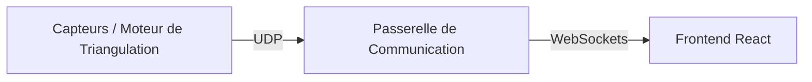

# Intégration UDP vers Frontend (WebSockets) - PAVOIS

Ce document récapitule l'architecture, le fonctionnement et les protocoles mis en œuvre pour intercepter les flux de détection UDP (provenant des caméras ou du moteur de triangulation) et les propager en temps réel vers l'interface utilisateur (frontend) via des WebSockets.

---

## 1. Vue d'ensemble de l'Architecture

Pour assurer une visualisation en temps réel à faible latence sans surcharger le navigateur par du polling, le système s'appuie sur une architecture de type **pont (bridge)** :
1. **Source (Détection C++ / Simulateur)** ➔ émet des paquets de données légers via **UDP** (sans connexion, ultra-rapide).
2. **Serveur / Passerelle (Python ou NestJS)** ➔ écoute les paquets UDP, les valide/parse et les convertit au format JSON structuré.
3. **Frontend (Application React)** ➔ se connecte en **WebSockets** à la passerelle pour recevoir les événements de détection au fil de l'eau.



---

## 2. Solutions Implémentées

Deux solutions fonctionnelles ont été développées pour répondre à différents contextes de déploiement :

### Option A : Script Autonome Python (`udp_listener.py`)
Un script minimaliste conçu pour le prototypage rapide et les environnements légers (ex: Raspberry Pi).
- **Technologie** : Python 3 (`asyncio`, `websockets`, `socket`).
- **Ports par défaut** : 
  - Écoute UDP : `5000`
  - WebSocket Server : `3000`
- **Avantages** : Très faible empreinte mémoire, aucun framework lourd requis, démarrage instantané.

### Option B : Service Backend Intégré NestJS (`vps/`)
Un service backend complet prêt pour la production et le déploiement sur VPS.
- **Technologie** : TypeScript, NestJS, `@nestjs/websockets` (WebSocket natif via le package `ws`), module NodeJS `dgram`.
- **Ports par défaut** :
  - Écoute UDP : `41234` (configurable via la variable d'environnement `UDP_PORT`)
  - WebSocket Server : Géré directement par la passerelle NestJS (`EventsGateway`).
- **Avantages** : Intégration facile avec la base de données (Prisma/PostgreSQL), persistance possible des trajectoires de drones, gestion simplifiée du cycle de vie de l'application et authentification.

---

## 3. Format des Messages & Protocole de Parsing

Les deux passerelles (Python et NestJS) appliquent la même logique de décodage et de transmission :

### A. Détections 2D Brutes (Caméras)
* **Format UDP (Chaîne CSV)** : `raw,cameraId,frameIndex,timestamp,x,y,size,confidence`
* **Exemple** : `raw,cam0,275,19128667926,551.93,638.21,2619,0.986`
* **Événement WS émis** : `"raw_detection"`
* **Payload JSON** :
  ```json
  {
    "type": "raw_detection",
    "cameraId": "cam0",
    "frameIndex": 275,
    "timestamp": 19128667926.0,
    "x": 551.93,
    "y": 638.21,
    "size": 2619.0,
    "confidence": 0.986
  }
  ```

### B. Mises à Jour de Pistes 3D (Triangulation / GPS)
* **Format UDP (Chaîne CSV)** : `trackId,latitude,longitude,altitude,timestamp` *(avec trackId commençant par `obj`)*
* **Exemple** : `obj2,48.8260444,2.3659956,34.78,1782465675417840`
* **Événement WS émis** : `"track_update"`
* **Payload JSON** :
  ```json
  {
    "type": "track_update",
    "trackId": "obj2",
    "lat": 48.8260444,
    "lng": 2.3659956,
    "alt": 34.78,
    "timestamp": 1782465675417840.0
  }
  ```

### C. Attitude IMU (orientation live)
* **Format UDP (Chaîne CSV)** : `att,cameraId,timestamp,heading_deg,elevation_deg,roll_deg`
* **Exemple** : `att,jean,1782465675417840,164.20,-1.50,0.30`
* **Événement WS émis** : `"camera_positions"` (liste complète, `headingDeg` mis à jour)
* Émis ~5 fois par seconde tant que le BNO055 fournit un échantillon valide.

### D. Messages Génériques / JSON brut (Fallback)
* **Format UDP** : Tout message ne respectant pas les formats ci-dessus.
* **Événement WS émis** : `"generic_udp"`
* **Payload JSON** : Transmet la chaîne brute dans `raw` et, si possible, le contenu parsé en JSON dans `data`.

---

## 4. Axes d'Amélioration & Next Steps

Pour amener ce système à un niveau industriel (militarisable/robuste), plusieurs chantiers sont à mener :

### 🛠️ Connexion Effective du Frontend
Actuellement, l'application React utilise des données simulées via une horloge locale (`simStore.ts`). 
* **Action** : Écrire un hook React ou un middleware Zustand (`useWebSocket`) se connectant à l'URL WebSocket du serveur (`ws://localhost:3000` ou le port NestJS du VPS) pour mettre à jour l'état de l'application dynamiquement avec les vraies pistes GPS.

### 🔒 Sécurisation des Flux
* **UDP sans authentification** : N'importe quel équipement sur le réseau peut injecter de fausses détections sur le port UDP. 
  * *Amélioration* : Ajouter une signature cryptographique légère (HMAC) dans le payload UDP ou restreindre l'écoute UDP à des adresses IP sources pré-configurées (white-listing).
* **Sécurité des WebSockets** : La connexion WS est ouverte à tous.
  * *Amélioration* : Mettre en œuvre une poignée de main (handshake) authentifiée via token (JWT) ou clé d'API.

### ⏱️ Résilience Réseau & Qualité de Service (QoS)
* **Mécanisme de Ping/Pong** : Détecter rapidement les coupures réseau côté client WebSocket et implémenter une reconnexion automatique exponentielle.
* **Limitation de débit (Rate Limiting) et Agrégation** : Si le moteur optique produit 60 détections par seconde par caméra, le canal WebSocket peut saturer.
  * *Amélioration* : Mettre en place un tampon (buffer) côté passerelle pour agréger les détections rapides et n'envoyer que des résumés périodiques (ex: toutes les 100ms) si nécessaire.

### 📈 Passage à l'Échelle (Scalability)
* Actuellement, la liste des connexions WebSocket et la diffusion (`broadcast`) sont gérées en mémoire vive sur une seule instance. 
  * *Amélioration* : Si la passerelle NestJS est déployée en plusieurs instances derrière un Load Balancer, utiliser un adaptateur Pub/Sub (comme **Redis**) pour synchroniser la diffusion des détections à tous les clients connectés, peu importe le serveur sur lequel ils se situent.
