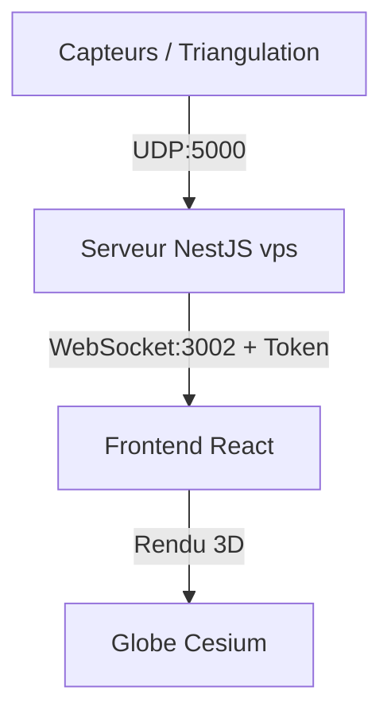

# Rapport Technique : Intégration et Sécurisation des Flux UDP / WebSockets - PAVOIS

Ce document récapitule l'ensemble de l'architecture, du protocole de parsing, des dispositifs de sécurité mis en place, et de l'intégration temps réel côté Frontend pour le projet PAVOIS.

---

## 1. Architecture Générale du Flux de Données

Afin de permettre un suivi en temps réel à très faible latence sans surcharger l'interface par du polling, le pipeline de données est structuré sous forme de pont :

1. **Source (Détection C++ / Simulateur)** : Émet des coordonnées géodésiques brutes (Latitude, Longitude, Altitude, Timestamp) via des paquets légers en **UDP** sur le port `5000` (ou `57346`).
2. **Passerelle Applicative (NestJS)** : Écoute les paquets UDP entrants, filtre les adresses IP, valide et décode le contenu, puis le convertit en JSON structuré.
3. **Diffusion WebSocket (WSS)** : Diffuse instantanément les messages aux clients Frontend connectés et authentifiés sur le port `3002`.
4. **Visualisation Frontend (React + Cesium)** : Écoute le flux WebSocket et dessine dynamiquement les trajectoires de vol en 3D sur le globe.



---

## 2. Protocoles et Spécifications des Messages

Le serveur de passerelle applique des règles strictes de parsing pour les trames reçues :

### A. Pistes 3D GPS (Cibles confirmées)
* **Format UDP (CSV)** : `trackId,latitude,longitude,altitude,timestamp` *(le trackId commence par `obj`)*
* **Exemple** : `objLive,34.0522,-118.2437,150.0,1782465675417840`
* **Événement WebSocket diffusé** : `"track_update"`
* **Payload JSON** :
  ```json
  {
    "type": "track_update",
    "trackId": "objLive",
    "lat": 34.0522,
    "lng": -118.2437,
    "alt": 150.0,
    "timestamp": 1782465675417840
  }
  ```

### B. Détections 2D Caméras (Brutes)
* **Format UDP (CSV)** : `raw,cameraId,frameIndex,timestamp,x,y,size,confidence`
* **Exemple** : `raw,cam0,275,19128667926,551.93,638.21,2619,0.986`
* **Événement WebSocket diffusé** : `"raw_detection"`

---

## 3. Sécurisation de la Passerelle (NestJS)

Nous avons mis en place cinq couches de protection dans le service [events.gateway.ts](file:///c:/Users/Lucli/drone/Pavois/vps/src/events.gateway.ts) pour blinder les WebSockets :

### 1. Liste blanche d'adresses IP (IP Whitelist)
Le serveur lit le paramètre `ALLOWED_IPS` dans le fichier `.env`. Si cette liste est définie, toute tentative de connexion provenant d'une IP externe non répertoriée est immédiatement déconnectée avec le code `4403 Forbidden IP`.
* *Exemple de configuration dans `vps/.env`* :
  ```ini
  ALLOWED_IPS=127.0.0.1,192.168.137.1
  ```

### 2. Authentification obligatoire par Token
Le client doit fournir le jeton d'accès correspondant à `WS_AUTH_TOKEN` (défini dans le `.env` du serveur, par défaut `dev-pavois-token`). Le token peut être transmis de deux façons :
* Dans la requête de connexion sous forme de paramètre d'URL : `?token=mon-token`.
* Via les cookies de session (`token`, `session_token`, ou `access_token`).
* *En cas d'échec* : Fermeture de la socket avec le code standard `4001 Unauthorized`.

### 3. Limitation du nombre de connexions simultanées par IP
Afin d'éviter la saturation des sockets par une IP malveillante (attaque DoS), chaque adresse IP est limitée à un maximum de **5 connexions simultanées**.

### 4. Limitation de débit des messages (Rate Limiting)
Pour éviter la surcharge du processeur par l'envoi de messages abusifs, le débit de messages entrants envoyés par un client est limité à **10 messages par seconde**. Tout dépassement coupe automatiquement la connexion de la socket.

### 5. Validation structurelle des messages
Le serveur valide le format JSON de chaque message reçu et effectue un contrôle de type (ex: vérification que le champ `event` est bien une chaîne de caractères) pour éviter les crashs applicatifs.

---

## 4. Intégration Côté Frontend (React)

L'application Frontend a été modifiée pour s'interfacer avec ce flux sécurisé :

* **Zustand Store ([simStore.ts](file:///c:/Users/Lucli/drone/Pavois/frontend/src/store/simStore.ts))** :
  * Ajout de l'état `liveTracks` pour stocker les trajectoires réelles.
  * Ajout de l'action `addLiveTrackUpdate` qui maintient un historique glissant des 50 dernières positions de vol de chaque drone détecté.
  * Gestion du cycle de vie de la cible : si aucune mise à jour n'est reçue pendant 10 secondes, la cible est marquée comme "perdue" (couleur grise). Après 30 secondes d'inactivité, elle est nettoyée de l'écran.
* **Hook WebSocket ([useWebSocket.ts](file:///c:/Users/Lucli/drone/Pavois/frontend/src/hooks/useWebSocket.ts))** :
  * Établit la connexion sur `ws://localhost:3002?token=dev-pavois-token` dès le démarrage.
  * Gère la reconnexion automatique en cas de défaillance réseau.
* **Moteur de rendu Cesium ([MapViewer.tsx](file:///c:/Users/Lucli/drone/Pavois/frontend/src/components/MapViewer.tsx))** :
  * Écoute l'état `liveTracks` et dessine les marqueurs 3D et le tracé des trajectoires réelles en temps réel à partir des véritables coordonnées GPS reçues.
