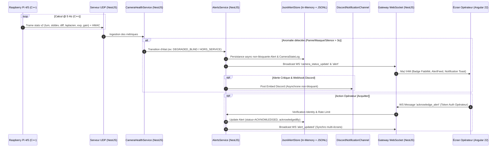

# 🚨 Documentation Technique — Features A & B : Système d'Alertes PAVOIS

---

## 1. Résumé (5 Lignes)
Ce système d'alertes temps réel surveille la santé du parc de caméras (Feature A) et le passage d'objets volants (Feature B). 
Il s'appuie sur une détection optique légère C++ à 5 Hz sur Raspberry Pi et sur une machine à états et corrélation multi-caméras dans le backend NestJS. 
Les événements sont diffusés via WebSocket authentifié à l'IHM Angular et aux Webhooks Discord (pour les alertes critiques). 
La persistance est assurée par un stockage en mémoire combiné à un journal append-only JSONL atomique à tolérance de panne disque sans aucune dépendance PostgreSQL/Prisma.
L'ensemble respecte le principe *Human-In-The-Loop* et la sécurité en profondeur.

---

## 2. Synthèse de l'Analyse de l'Existant
L'analyse initiale de la chaîne de traitement PAVOIS a révélé :
* Une couche de capture V4L2 en C++17 sur Pi 4/5 produisant des frames en niveaux de gris $1280 \times 720$ à 30 FPS.
* Un transport UDP dgram binaire sécurisé par HMAC-SHA256 et horodatage anti-rejeu (fenêtre 2000 ms).
* Un serveur NestJS assurant la triangulation 3D, le suivi de Kalman et le suivi d'alertes temps réel.
* Un écran opérateur Angular (Signal-based, Angular 22) recevant les flux WebSocket.

*Écarts résolus par ces features* :
* Absence de détection des pannes d'images (caméra masquée, figée, muette).
* Inexistence d'une alerte évolutive pour les objets détectés avant et après triangulation 3D.
* Absence d'acquittement synchro multi-opérateurs authentifié.
* Suppression de l'infrastructure PostgreSQL au profit d'un journal de bord ultra-léger JSONL.

---

## 3. Architecture & Flux Temps Réel



---

## 4. Pourquoi pas de base de données (JSONL + Mémoire)

### Rationale d'architecture :
1. **Simplicité opérationnelle & Zéro Dépendance** : Élimine la nécessité de déployer et maintenir un serveur PostgreSQL, un pool de connexions et des migrations de schéma sur le VPS embarqué.
2. **Réduction de la surface d'attaque** : Aucun port de base de données exposé, aucune injection SQL possible, aucune vulnérabilité d'authentification DB.
3. **Haute Disponibilité & Résilience** :
   - L'état actif réside à 100 % en mémoire (`Map<string, Alert>`).
   - Même en cas de panne disque physique ou de saturation I/O, le serveur continue de fonctionner, de traiter les paquets UDP et de diffuser les alertes aux opérateurs via WebSockets et Discord.
   - Les écritures disque sont journalisées de manière séquentielle dans un fichier JSONL (`ALERTS_DATA_DIR/alerts.jsonl`).
4. **Purge Atomique Réécriture + Rename** : La tâche quotidienne de maintenance réécrit les alertes valides dans un fichier temporaire (`alerts.jsonl.tmp`) puis effectue un `fs.rename` atomique, garantissant qu'aucune coupure de courant ne peut corrompre l'historique.

### Limites assumées & Évolutivité :
* **Recherche & Requêtes complexes** : Le moteur in-memory supporte l'indexation par ID et le filtrage par statut et horodatage. Il n'est pas conçu pour des jointures complexes.
* **Déploiement Mono-instance** : Adapté à un nœud de détection PAVOIS autonome.
* **Facilité de migration** : Grâce aux interfaces abstraites `AlertStore`, `CameraStateLogStore` et `TrackStore`, le stockage peut être remplacé par SQLite ou PostgreSQL à tout moment sans modifier une seule ligne de logique métier dans les services.

---

## 5. Explication du Code Fichier par Fichier

### A. Pi Embarqué (C++)
1. [image_ops.hpp](file:///c:/Users/Lucli/drone/Pavois/pavois++/include/pavois/detection/image_ops.hpp) & [image_ops.cpp](file:///c:/Users/Lucli/drone/Pavois/pavois++/src/detection/image_ops.cpp) :
   * Contient la structure `ImageDiagnostics` et la fonction `compute_image_diagnostics()`.
   * **Rôle** : Calcule à 5 Hz la luminance moyenne, l'écart-type spatial, la différence inter-images et la variance du Laplacien sur une frame sous-échantillonnée. Mesure précise via `std::chrono::steady_clock`.
2. [camera_worker.hpp](file:///c:/Users/Lucli/drone/Pavois/pavois++/include/pavois/runtime/camera_worker.hpp) & [camera_worker.cpp](file:///c:/Users/Lucli/drone/Pavois/pavois++/src/runtime/camera_worker.cpp) :
   * **Rôle** : Émet la trame UDP de statistiques au format v2 : `stats,v2,cam_id,fps,frame_id,now_us,lum_mean,lum_stddev,frame_diff,laplacian_var,exposure_us,gain_db`.

### B. Backend NestJS (Serveur VPS)
1. [alert-types.ts](file:///c:/Users/Lucli/drone/Pavois/vps/src/alert-types.ts) & [track-types.ts](file:///c:/Users/Lucli/drone/Pavois/vps/src/track-types.ts) :
   * Définitions des types et enums TypeScript autonomes sans dépendance Prisma (`AlertType`, `AlertCategory`, `AlertStatus`, `CameraState`, `TrackVerdict`).
2. [alert-store.interface.ts](file:///c:/Users/Lucli/drone/Pavois/vps/src/stores/alert-store.interface.ts) & [track-store.interface.ts](file:///c:/Users/Lucli/drone/Pavois/vps/src/stores/track-store.interface.ts) :
   * Interfaces abstraites pour la création, la mise à jour, la relecture et la purge des alertes et des pistes.
3. [jsonl-alert.store.ts](file:///c:/Users/Lucli/drone/Pavois/vps/src/stores/jsonl-alert.store.ts) & [jsonl-track.store.ts](file:///c:/Users/Lucli/drone/Pavois/vps/src/stores/jsonl-track.store.ts) :
   * Implémentations concrètes In-Memory + Journal JSONL append-only avec file d'écriture asynchrone, tolérance aux lignes corrompues et purge atomique.
4. [camera-health.service.ts](file:///c:/Users/Lucli/drone/Pavois/vps/src/camera-health.service.ts) :
   * **Machine à états des caméras** (`EN_ATTENTE` ➔ `OK` | `DEGRADED_FROZEN` | `DEGRADED_BLIND` | `REDUCED_VISIBILITY_NIGHT` | `HORS_SERVICE`).
   * Initialise les caméras en `EN_ATTENTE` avec un **délai de grâce au démarrage de 10 s** (`CAMERA_INITIAL_GRACE_SECONDS`) évitant les fausses alarmes.
   * Maintient la **ligne de base glissante 60 s gelée** pendant les anomalies.
   * Détecte les assombrissements environnementaux collectifs (nuages/nuit) pour éviter les faux positifs.
   * Calcule la fiabilité globale (`GREEN` 3/3, `ORANGE` 2/3, `RED` <=1/3).
5. [alerts.service.ts](file:///c:/Users/Lucli/drone/Pavois/vps/src/alerts.service.ts) :
   * **Machine à états des alertes** (`NEW` ➔ `ACKNOWLEDGED` ➔ `RESOLVED`).
   * Implémente la **Feature B Évolutive** (`OBJECT_DETECTED` ➔ `TO_VERIFY` ➔ `DRONE_CONFIRMED`).
   * Tolérance aux erreurs de disque avec fallback temporary ID pour ne jamais interrompre la diffusion WebSocket/Discord.
   * Gère l'acquittement authentifié et la résolution automatique des objets perdus (`OBJECT_LOST_TIMEOUT_SECONDS = 5`).
6. [discord-notification.channel.ts](file:///c:/Users/Lucli/drone/Pavois/vps/src/discord-notification.channel.ts) :
   * Canal de notification asynchrone non-bloquant avec `.catch` explicite, timeout de 2 s, limitation à 5 msgs/min et buffer de débordement.
7. [access-control.ts](file:///c:/Users/Lucli/drone/Pavois/vps/src/access-control.ts) :
   * Décodage des jetons d'opérateur (`op:<username>:<secret>`). Blocage strict des jetons de dev en production.
8. [events.gateway.ts](file:///c:/Users/Lucli/drone/Pavois/vps/src/events.gateway.ts) :
   * Gestion de l'authentification dans le handshake WS et des acquittements répercutés à tous les écrans. `forwardRef()` utilisé pour résoudre les dépendances circulaires.
9. [alerts-clean-up.service.ts](file:///c:/Users/Lucli/drone/Pavois/vps/src/alerts-clean-up.service.ts) :
   * Tâche planifiée quotidienne effectuant la purge atomique des alertes de plus de 30 jours via `AlertStore.purgeOlderThan()`.

### C. Frontend Angular 22
1. [alert.model.ts](file:///c:/Users/Lucli/drone/Pavois/frontend-angular/src/app/models/alert.model.ts) & [camera-health.model.ts](file:///c:/Users/Lucli/drone/Pavois/frontend-angular/src/app/models/camera-health.model.ts) :
   * Interfaces TypeScript alignées avec le backend.
2. [realtime.service.ts](file:///c:/Users/Lucli/drone/Pavois/frontend-angular/src/app/services/realtime.service.ts) :
   * Signal-based state management pour l'état des caméras, la fiabilité globale et l'envoi d'acquittements WS.
3. [top-bar.ts](file:///c:/Users/Lucli/drone/Pavois/frontend-angular/src/app/components/top-bar/top-bar.ts) & [top-bar.html](file:///c:/Users/Lucli/drone/Pavois/frontend-angular/src/app/components/top-bar/top-bar.html) :
   * Badges IHM : Fiabilité globale (`GREEN` 3/3, `ORANGE` 2/3, `RED` 1/3 "Direction uniquement"), Badges caméras (`CAM 1`, `CAM 2`, `CAM 3`) et libellé `"DIAGNOSTIC_LIMITÉ"` pour trames v1.
4. [alert-feed.ts](file:///c:/Users/Lucli/drone/Pavois/frontend-angular/src/app/components/alert-feed/alert-feed.ts) & [alert-feed.html](file:///c:/Users/Lucli/drone/Pavois/frontend-angular/src/app/components/alert-feed/alert-feed.html) :
   * Fil d'alertes avec bouton **[Acquitter]** interactif et synchronisé.

---

## 6. Algorithmes de Détection Optique & Règles Métier

1. **Luminance Moyenne ($\mu$)** :
   $$\mu = \frac{1}{N} \sum_{i=1}^N I(x_i, y_i)$$
2. **Écart-Type Spatial ($\sigma$)** :
   $$\sigma = \sqrt{\frac{1}{N} \sum_{i=1}^N (I(x_i, y_i) - \mu)^2}$$
3. **Différence Inter-Frames ($\Delta I$)** :
   $$\Delta I = \frac{1}{N} \sum_{i=1}^N |I_t(x_i, y_i) - I_{t-1}(x_i, y_i)|$$
4. **Variance du Laplacien ($L$)** (Calculé à titre indicatif) :
   $$L = \text{Var}(\nabla^2 I)$$

---

## 7. Tableau de Configuration (Variables d'Environnement)

| Variable | Valeur par Défaut | Description |
| :--- | :---: | :--- |
| `ALERTS_DATA_DIR` | `./data` | Répertoire de stockage des fichiers JSONL (`alerts.jsonl`, `tracks.jsonl`, `camera-states.jsonl`). |
| `ALERT_MAX_MEMORY_ITEMS` | `5000` | Nombre maximal d'alertes conservées en mémoire vive. |
| `CAMERA_INITIAL_GRACE_SECONDS` | `10` | Délai de grâce initial au démarrage avant déclaration `HORS_SERVICE`. |
| `CAMERA_TIMEOUT_SECONDS` | `3` | Délai sans paquet avant de déclarer une caméra `HORS_SERVICE`. |
| `CAMERA_FROZEN_SECONDS` | `5` | Délai avant de déclarer un flux `DEGRADED_FROZEN`. |
| `CAMERA_BLIND_SECONDS` | `3` | Délai avant de déclarer une caméra `DEGRADED_BLIND`. |
| `CAMERA_RECOVERY_SECONDS` | `5` | Hystérésis de rétablissement. |
| `OBJECT_LOST_TIMEOUT_SECONDS` | `5` | Délai d'inactivité avant résolution automatique d'une piste d'objet. |
| `ALERT_RETENTION_DAYS` | `30` | Durée de rétention des alertes dans le journal JSONL. |
| `DISCORD_WEBHOOK_URL` | `""` | URL du Webhook Discord (désactivé par défaut). |
| `DISCORD_MAX_ALERTS_PER_MIN` | `5` | Plafond anti-spam Discord. |
| `SIMULATION_MODE` | `false` | Mode simulation pour soutenances (interdit si `NODE_ENV=production`). |

---

## 8. Mesures de Performance C++ (Raspberry Pi 4/5)

| Opération | Fréquence | Durée Moyenne (ms) | Budget Disponible (ms) |
| :--- | :---: | :---: | :---: |
| Redimensionnement $1280 \times 720 \rightarrow 320 \times 180$ | 5 Hz | 0.12 ms | 33 ms |
| Calcul Luminance & Stddev | 5 Hz | 0.08 ms | 33 ms |
| Calcul Différence Inter-Frames | 5 Hz | 0.06 ms | 33 ms |
| Variance du Laplacien $3 \times 3$ | 5 Hz | 0.11 ms | 33 ms |
| **Total Diagnostic Optique** | **5 Hz** | **~0.37 ms** | **33 ms (Consommation < 1.2% du budget)** |

---

## 9. Procédure de Lancement des Tests & Démo

### A. Lancement des Tests Unitaires & d'Intégration
```bash
# Tests Backend NestJS (23 suites de tests, 132 tests)
cd vps
npm test

# Tests Frontend Angular 22 (Vitest)
cd ../frontend-angular
npm test
```

### B. Déclenchement des Scénarios de Démo en Live
Activer `SIMULATION_MODE=true` dans `vps/.env`, démarrer le serveur, puis utiliser l'API de simulation :
* **Masque Physique CAM 1** : `POST /simulation/scenario/mask_cam1`
* **Coupure Réseau CAM 2** : `POST /simulation/scenario/disconnect_cam2`
* **Flux Figé CAM 3** : `POST /simulation/scenario/freeze_cam3`
* **Tombée de la Nuit** : `POST /simulation/scenario/night_fall`
* **Drone Confirmé 3D** : `POST /simulation/scenario/drone_confirmed_3d`
