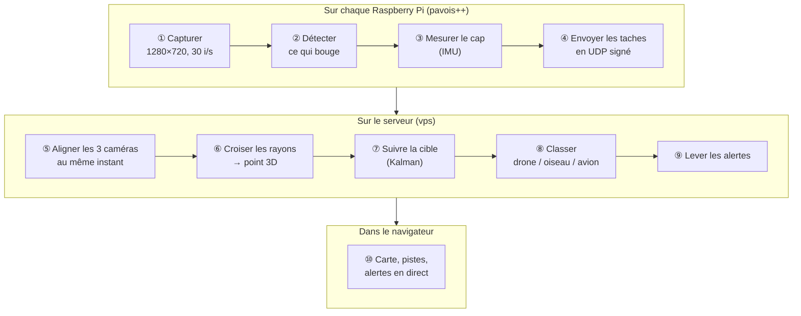
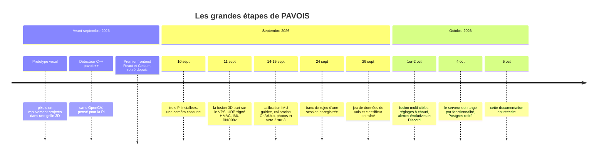

[🏠 Accueil](README.md) · [Architecture →](02-architecture.md)

# 🛸 Découvrir PAVOIS

> *Projection Avancée de Voxels pour l'Observation et l'Identification de Signatures.*
> Le nom date du premier prototype à base de voxels. L'objectif n'a pas changé :
> **voir un petit objet volant avec des caméras passives et dire où il est.**

---

## 🎯 Le problème

Un petit drone est léger, rapide et discret. Un radar coûte cher, émet (il se
fait donc repérer) et voit mal les petits objets près du sol. Une caméra, elle,
est bon marché et silencieuse, mais elle ne voit qu'une **direction** : rien ne
dit si la tache dans l'image est un drone à 20 m ou un oiseau à 3 m.

PAVOIS répond à cette ambiguïté en combinant **plusieurs caméras qui regardent
la même zone depuis des points différents**.

## 💡 L'idée : un pixel, c'est un rayon

Un pixel qui bouge ne donne pas de profondeur. Il définit une **demi-droite**
qui part de la caméra : l'objet est *quelque part* dessus. Avec deux caméras
ou plus, les rayons qui visent le même objet **se croisent**, et le croisement
donne la position 3D.

```text
   Une seule caméra : on sait dans quelle direction, pas à quelle distance

        📷 ─────────────●─────────────●─────────────●──────────▶
                    oiseau à 3 m ?  drone à 20 m ?  avion à 300 m ?

   Trois caméras : les rayons se croisent sur la cible

        📷 tanel ─────╮
                       ╲
        📷 jean  ───────✦  ← position 3D (x, y, z)
                       ╱
        📷 walid ─────╯
```

Tout le reste du système sert à rendre ce croisement **fiable** : détecter la
bonne tache, savoir exactement où regarde chaque caméra, ramener les images au
même instant, refuser les croisements fantômes et suivre la cible dans le temps.

## 🔄 Ce que fait le système, du capteur à l'écran



| Étape | Où | Détail |
|---|---|---|
| ① – ④ | Pi | [Le détecteur sur les Pi](03-detecteur-pi.md) |
| ⑤ – ⑧ | VPS | [La fusion 3D](04-fusion-3d.md) |
| ⑨ | VPS | [Le serveur VPS](05-serveur-vps.md) |
| ⑩ | Navigateur | [L'interface opérateur](06-interface-operateur.md) |

## 🧰 Le matériel

| Élément | Détail |
|---|---|
| **3 nœuds caméra** | `jean` (Raspberry Pi 5), `tanel` et `walid` (Raspberry Pi 4), sous Debian 13 ARM64 |
| **Caméras** | Module CSI OV5647 sur chaque Pi, capturé localement par `rpicam-vid`, champ horizontal réglé à 65° par défaut |
| **Orientation** | Centrale inertielle compatible BNO08x en I2C (`0x4a`) sur chaque Pi, lue par `pavois-imu.service`. Le détecteur sait aussi lire un BNO055 (`0x28`/`0x29`) |
| **Serveur** | VPS OVH avec Docker Compose : backend NestJS + interface Angular derrière nginx |
| **Banc d'essai** | Rail modulaire V5 imprimé en 3D, 1 m de large : `tanel` à gauche, `jean` au centre (origine), `walid` à droite, environ 43 cm entre deux caméras voisines ([mounts/](../mounts/README.md)) |
| **Calibration** | Mire ChArUco 7 × 5 imprimée en A4 ([calibration/](../calibration/CALIBRATION-PLAN.md)) |

## 🔢 Les chiffres clés

Toutes ces valeurs sont les **défauts du code**. La plupart se changent par
configuration ou à chaud depuis le panneau « Réglages ».

| Grandeur | Valeur | Source |
|---|---|---|
| Image traitée | 1280 × 720 à 30 i/s demandées | `pavois++/deploy/pavois.conf.example` |
| Débit mesuré sur Pi 4 | 20 à 30 i/s selon la scène (mesure du 15/09/2026) | `pavois++/DEPLOYMENT_PI.md` |
| Exposition | mode `sport`, 750 µs, gain 4 | `pavois.conf.example` |
| Confirmation d'une tache | vue dans 2 des 3 dernières images | `confirm_m` / `confirm_n` |
| Cap IMU envoyé | toutes les 200 ms | `imu.emit_interval_ms` |
| Aperçu vidéo | 2 i/s, 320 px de large, JPEG qualité 55 | `preview.*` |
| Cadence de fusion | un calcul toutes les 33 ms (une image à 30 i/s) | `FUSION_INTERVAL_MS` |
| Attente des autres Pi | 80 ms au plus | `FUSION_LATENCY_MS` |
| Parallaxe minimale | 2° entre deux rayons | `FUSION_MIN_PARALLAX_DEG` |
| Erreur de reprojection tolérée | 120 px par rayon (banc non calibré) | `FUSION_MAX_RESIDUAL_PX` |
| Portée | de 0,5 m à 60 m | `FUSION_MIN_RANGE_M`, `FUSION_MAX_RANGE_M` |
| Piste confirmée | après 3 mises à jour | `FUSION_TRACK_CONFIRM` |
| Piste perdue | après 1,2 s sans mesure | `FUSION_TRACK_MAX_COAST_MS` |
| Fenêtre anti-rejeu UDP | 2 s dans le passé, 1 s dans le futur | `vps/src/udp/udp.service.ts` |
| Caméra « hors service » | plus de 3 s sans paquet | `CAMERA_TIMEOUT_SECONDS` |

> [!NOTE]
> Sur la batterie de scènes **synthétiques** de `pavois_accuracy`, le pipeline
> complet atteint environ **93 %** de précision globale, un F1 de détection
> d'environ 99 % et une erreur 3D moyenne d'environ 1,7 m à 25 m, sans fausse
> alarme (chiffres de [`pavois++/README.md`](../pavois++/README.md)). Ce sont des
> mesures en simulation, pas sur le terrain. Voir [Tests et outils](12-tests-et-outils.md).

## 🚧 Ce que PAVOIS n'est pas (encore)

- **Pas un radar.** La portée et la précision dépendent de la lumière, du
  contraste et de l'écart entre les caméras. De nuit, la caméra voit peu.
- **Pas un classifieur par réseau de neurones.** Le classement « drone / oiseau /
  avion » repose sur des seuils de vitesse, d'accélération et d'altitude, et sur
  un contrôle OpenCV des photos. Les seuils ne sont pas calibrés.
- **Pas encore réglé pour le terrain.** Les essais se font surtout sur le banc
  rail, à 2–3 m. Les positions GPS des Pi en extérieur restent à recaler.

Le détail, vérifié dans le code, est dans [État et limites](13-etat-et-limites.md).

## ⏳ D'où vient le projet



---

[🏠 Accueil](README.md) · [Architecture →](02-architecture.md)
