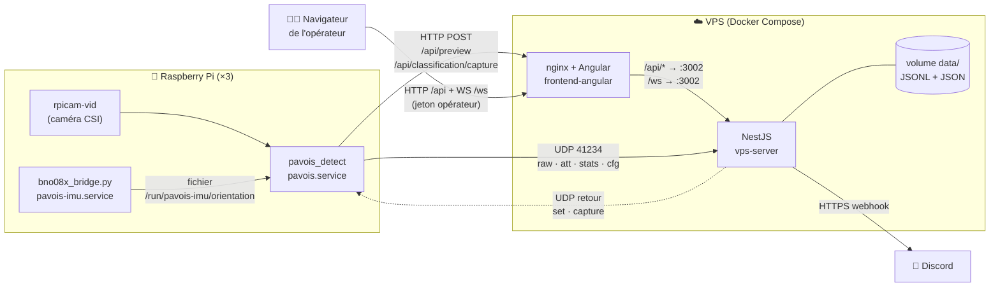
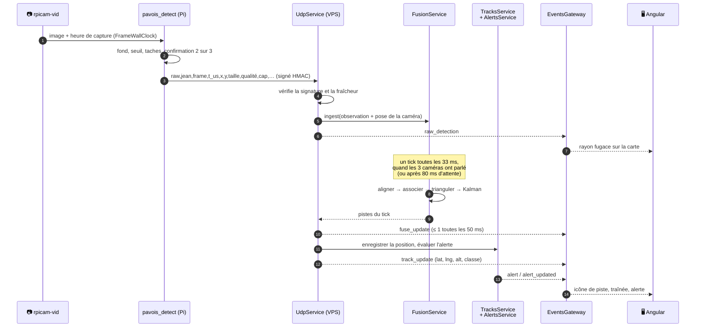
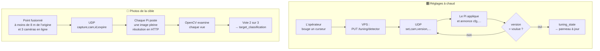

[← Découvrir PAVOIS](01-decouvrir-pavois.md) · [🏠 Accueil](README.md) · [Le détecteur sur les Pi →](03-detecteur-pi.md)

# 🧱 Architecture

> Trois programmes, trois rôles : **la Pi voit**, **le VPS comprend**, **le
> navigateur montre**. Ils ne partagent rien d'autre que des messages.

---

## 🧩 Les trois composants

| Composant | Langage | Tourne sur | Rôle | Dossier |
|---|---|---|---|---|
| **`pavois++`** | C++17, sans OpenCV | Chaque Raspberry Pi (service systemd) | Capturer la caméra, détecter ce qui bouge, lire l'IMU, envoyer les taches 2D | [`pavois++/`](../pavois++/) |
| **`vps`** | TypeScript, NestJS 11 | Le VPS (conteneur Docker) | Recevoir l'UDP, fusionner en 3D, suivre, classer, alerter, diffuser | [`vps/`](../vps/) |
| **`frontend-angular`** | TypeScript, Angular 22 | Le navigateur, servi par nginx | Carte, pistes, alertes, réglages, vue 3D du banc | [`frontend-angular/`](../frontend-angular/) |

Autour d'eux gravitent des outils : scripts d'installation et de calibration
(`scripts/`, `calibration/`), modèles 3D des supports (`mounts/`), page de
contrôle des Pi (`pi/`) et film de présentation (`animation/`).

## 🌐 Qui parle à qui, et sur quel port



| Flux | Protocole | Port (prod / staging) | Authentification |
|---|---|---|---|
| Pi → VPS : détections, cap, stats, réglages appliqués | UDP | `41234` / `41234` et `41235` | HMAC-SHA256 (voir [Sécurité](11-securite.md)) |
| VPS → Pi : nouveaux réglages, demande de photo | UDP, vers le port source du Pi | — | HMAC-SHA256 |
| Pi → VPS : aperçu JPEG, photo de la cible | HTTP via nginx | `8080` / `8081` | aucune (voir [limites](11-securite.md#-ce-qui-nest-pas-encore-protégé)) |
| Navigateur → interface | HTTP | `8080` / `8081` | — |
| Navigateur → API | HTTP `/api/…` via nginx | `8080` / `8081` | `Authorization: Bearer <jeton>` |
| Navigateur → temps réel | WebSocket `/ws` via nginx | `8080` / `8081` | `?token=` ou cookie |
| API directe (debug) | HTTP + WebSocket | `3002` / `3003` | jeton opérateur |
| VPS → Discord | HTTPS | 443 | URL secrète du webhook |

> [!NOTE]
> Le VPS renvoie les commandes **vers l'adresse et le port d'où viennent les
> paquets du Pi**. Le Pi n'a donc aucun port entrant à ouvrir : c'est sa propre
> socket d'émission qui reçoit la réponse.

## 🚀 Le voyage d'une détection

Du photon à l'écran, voici ce qui se passe quand un drone traverse le champ.



Chaque étape est détaillée dans sa page : [détection](03-detecteur-pi.md),
[fusion](04-fusion-3d.md), [serveur](05-serveur-vps.md),
[interface](06-interface-operateur.md), [messages](07-protocoles.md).

## 🔁 Les deux boucles de retour

Le VPS ne fait pas qu'écouter. Il pilote aussi les Pi par deux boucles.



- **Réglages** : la commande est renvoyée chaque seconde tant que le Pi
  n'annonce pas la bonne version. Une commande perdue ou un Pi qui redémarre se
  rattrapent seuls. Voir [Le serveur VPS](05-serveur-vps.md#-réglages-à-chaud).
- **Photos** : un épisode par passage de cible. Voir
  [Le serveur VPS](05-serveur-vps.md#-classification-par-photos).

## 📂 Le dépôt en un coup d'œil

```text
Pavois/
├── pavois++/            Détecteur C++ des Pi (CMake, tests, outils, fichiers systemd)
├── vps/                 Backend NestJS (un dossier par fonctionnalité) + classifieur Python
├── frontend-angular/    Interface opérateur (Angular, Leaflet, three.js) + serveur mock
├── scripts/             Installation des Pi, déploiement, durcissement, calibration, banc de rejeu
├── calibration/         Mires ChArUco et damier, script de calibration hors ligne
├── mounts/              Supports caméra et banc rail V5 (OpenSCAD, STL, 3MF)
├── pi/                  Page web de contrôle caméra + IMU, flux MJPEG (outils de banc)
├── animation/           Film de présentation Blender (V1, V2, V3)
├── documentation/       ← tu es ici
├── docker-compose.yml           Pile « production » : interface 8080, API 3002
├── docker-compose.staging.yml   Pile « staging » : interface 8081, API 3003
└── .github/workflows/   Déploiement des Pi, déploiement du VPS, analyses de sécurité
```

## 🧭 Les décisions d'architecture

Chaque décision ci-dessous est en vigueur dans le code. Elle explique *pourquoi*
le système a cette forme.

### D1 — La fusion 3D tourne sur le VPS *(11 septembre 2026, SCRUM-56)*

| | |
|---|---|
| **Question** | Où croiser les rayons des trois caméras ? |
| **Options** | ① sur le VPS ; ② sur une Pi « maîtresse » ; ③ dans un binaire C++ à côté du VPS |
| **Décision** | **① le VPS.** Il reçoit déjà les trois flux et parle déjà à l'écran. |
| **Pourquoi** | Chemin le plus court vers l'écran ; une Pi en panne laisse deux caméras utiles (avec ②, la perte de la maîtresse coupe toute la 3D) ; un service de moins à maintenir qu'avec ③. |
| **Prix payé** | La triangulation et le Kalman de `pavois++` ont été **portés en TypeScript** (`vps/src/fusion/`). Le C++ garde sa propre fusion pour les tests et le mode multi-caméras local. |

### D2 — Une caméra par Pi, la Pi n'envoie que du 2D

Quand un seul flux est activé dans la configuration, `pavois_detect` émet une
ligne `raw` par tache confirmée (`pavois++/src/runtime/camera_worker.cpp`). Sa
fusion interne n'a alors qu'une caméra et ne produit rien. Les lignes `obj…`
(pistes 3D déjà fusionnées) n'apparaissent qu'en mode multi-caméras local,
utile pour les scènes synthétiques.

### D3 — UDP pour la télémétrie, renvoi pour les commandes

Une détection perdue est remplacée par la suivante 33 ms plus tard : un
protocole sans connexion suffit et ne bloque jamais la capture. Ce qui doit
arriver (les réglages) est **renvoyé jusqu'à confirmation** au lieu de compter
sur le transport. Chaque datagramme est signé et daté (HMAC + fenêtre anti-rejeu).

### D4 — Pas de base de données

Alertes, pistes et changements d'état des caméras vivent **en mémoire** et sont
écrits en **JSONL** (une ligne JSON par événement) dans `data/`. Le service
continue à tourner si le disque sature, il n'y a ni port de base à exposer ni
migration à gérer. Le stockage passe par une interface
(`alert-store.interface.ts`, `track-store.interface.ts`) : on peut le remplacer
sans toucher aux services. L'ancien Postgres a été retiré le 4 octobre 2026.

### D5 — Pas d'OpenCV sur la Pi

`pavois++` fait sa propre algèbre, ses opérations d'image et l'encodage JPEG de
ses aperçus. Le binaire reste petit, se compile sur la Pi et ne se lie qu'aux
threads et à la partie crypto d'OpenSSL (signature HMAC). À l'exécution, il
pilote `rpicam-vid` et `ffmpeg` comme processus séparés pour obtenir les images.
OpenCV n'apparaît que côté outils : calibration
(`scripts/pavois_camera_calib.py`) et classifieur de photos sur le VPS
(`vps/classifier/classify_target.py`).

### D6 — Une seule table des réglages

Les réglages modifiables à chaud sont décrits **une fois** dans
`vps/src/tuning/tuning.params.ts` : bornes, pas, libellés, aide. L'API s'en sert
pour valider, le frontend la reçoit telle quelle pour dessiner ses curseurs. Côté
Pi, `pavois++/src/config/live_tuning.cpp` reprend les mêmes clés et bornes et
borne lui-même ce qu'il reçoit.

---

[← Découvrir PAVOIS](01-decouvrir-pavois.md) · [🏠 Accueil](README.md) · [Le détecteur sur les Pi →](03-detecteur-pi.md)
