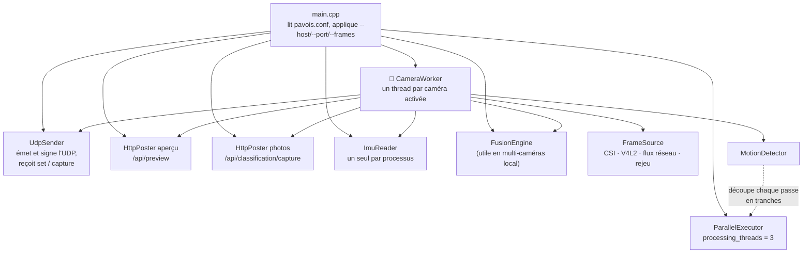
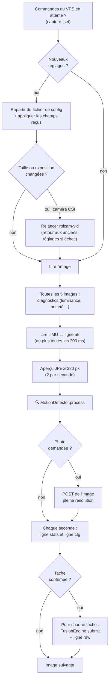
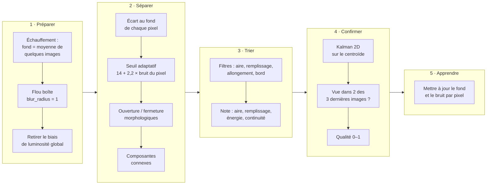
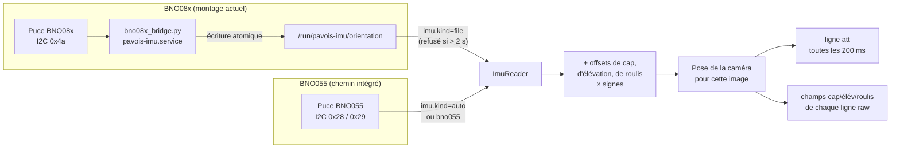

[← Architecture](02-architecture.md) · [🏠 Accueil](README.md) · [La fusion 3D →](04-fusion-3d.md)

# 🍓 Le détecteur sur les Pi (`pavois++`)

> Sur chaque Raspberry Pi, un seul programme, `pavois_detect`, regarde la caméra
> trente fois par seconde et ne garde que ce qui **bouge et dure** : quelques
> coordonnées de pixels, envoyées au VPS en moins d'une milliseconde de calcul
> réseau.

Code : [`pavois++/`](../pavois++/) · Service : `pavois.service` ·
Configuration : `/etc/pavois/pavois.conf` ·
Installation : [Déploiement](10-deploiement.md#-installer-une-pi)

---

## 🧵 Ce qui tourne dans le processus

- **Un thread par caméra.** Sur le terrain, chaque Pi n'a qu'une caméra, donc un
  seul `CameraWorker`.
- **Une seule IMU par processus.** L'ouvrir une fois par caméra réinitialiserait
  la puce à chaque ouverture (le commentaire est dans `main.cpp`).
- **Trois tranches de calcul.** Chaque passe d'image pleine résolution est
  découpée entre le thread de la caméra et deux aides persistantes
  (`processing_threads=3` est la largeur totale). Le quatrième cœur de la Pi
  reste à la capture et au système.

## 📷 D'où viennent les images

`camera.N.device` choisit la source (`pavois++/src/capture/frame_source.cpp`).

| Valeur | Source | Détail |
|---|---|---|
| `csi:0` | **Caméra CSI locale** (le cas terrain) | `rpicam-vid` capture ; par défaut en MJPEG décodé par `ffmpeg` en niveaux de gris. Avec `capture_format=yuv420` (à l'essai), le détecteur lit directement le plan de luminance, sans JPEG ni FFmpeg. L'heure de chaque image est le `FrameWallClock` de libcamera, prise **à la capture** |
| `/dev/video0` | Webcam V4L2 | Reconnexion automatique (`reconnect_max_attempts`, `reconnect_backoff_ms`) |
| `rtsp://…`, `http(s)://…` | Flux réseau (ex. iPhone) | Décodé par `ffmpeg` avec des options de faible latence |
| un dossier, ou `replay:<dossier>` | **Rejeu** d'images `.pgm` | Rythme d'origine (`fps.txt`), boucle par défaut. Sert aux tests et au [banc de rejeu](12-tests-et-outils.md#-banc-de-rejeu) |

> [!TIP]
> Le journal dit toujours quel mode de capture tourne vraiment :
> `capture yuv420 1280x720, stride 1280`, ou
> `yuv420 capture refused, using mjpeg: …` si la largeur ne convient pas.

## 🔁 La vie d'une image

Ce que fait `CameraWorker` (`pavois++/src/runtime/camera_worker.cpp`) pour
chaque image, dans l'ordre :

Toutes les 120 images, une ligne de journal fait le point :
`camera jean f=120 emitted=… | <état de la fusion locale>`. C'est la preuve que
la caméra capture vraiment (un service `active` ne le prouve pas).

## 🔍 Le détecteur de mouvement

`MotionDetector` (`pavois++/src/detection/motion_detector.cpp`) transforme une
image en **zéro, une ou plusieurs taches** (*blobs*). C'est une soustraction de
fond, durcie pour le plein air.

| Étape | Ce qui se passe | Réglages (défauts) |
|---|---|---|
| Échauffement | Le fond est appris sur une **moyenne de plusieurs images**. Partir d'une seule figerait un objet présent au démarrage en « fantôme » permanent | — |
| Biais de luminosité | L'écart moyen signé sur toute l'image est retiré : une variation d'exposition ou de balance des blancs ne crée pas de taches | — |
| Saut d'éclairage | Si une trop grande part de l'image change d'un coup, l'image est ignorée et le fond rattrape vite | `illumination_hot_ratio` = 0,45 |
| Seuil adaptatif | Un pixel est « au premier plan » si son écart dépasse `diff_threshold + adaptive_k × σ` du pixel | 14 niveaux, k = 2,2 |
| Morphologie | Ouverture (efface les grains) puis fermeture (bouche les trous) | `morph_open` = 1, `morph_close` = 2 |
| Filtres | Aire minimale, aire maximale (part de l'image), remplissage de la boîte, allongement, marge au bord **jugée sur le centroïde** pour garder une cible qui entre dans le champ | 12 px, 12 %, 0,10, 6, 6 px |
| Kalman 2D | Lisse le centroïde et estime sa vitesse en pixels | `centroid_process_noise` = 600, `centroid_meas_noise` = 2 |
| Confirmation | Tache vue dans **M** des **N** dernières images | M = 2, N = 3 |
| Qualité | Soutien temporel, remplissage, rapport signal/bruit, resserrement du filtre. Une tache coupée par le bord vaut moins | — |
| Fond | Moyenne glissante rapide hors cible, **très lente sous une tache** pour ne pas absorber une cible en vol stationnaire ; au-delà d'un délai, le changement est considéré comme du décor | 0,05 / 0,002, 90 à 1800 images |

> [!NOTE]
> Toutes les taches valides d'une image sont envoyées, pas seulement la
> meilleure. C'est le VPS qui décide laquelle correspond à quelle cible
> ([association multi-cibles](04-fusion-3d.md#-associer-les-taches-aux-cibles)).

Pour régler à l'œil, `--debug-dir /tmp/pavois_debug` écrit `*_raw.pgm`,
`*_mask.pgm` et `*_overlay.pgm` toutes les 15 images (`debug_every`).
**Arrêter le service avant** : un seul programme peut tenir la caméra.

## 🧭 L'orientation : l'IMU

La fusion a besoin de savoir **où regarde chaque caméra**. Le cap, l'élévation et
le roulis viennent de l'IMU à chaque image ; la configuration ne sert que de
valeur de repli.

- **Lecture ratée** : le Pi renvoie la dernière pose connue avec `valid = 0`. Le
  VPS ne fait alors pas tourner le cône de la caméra sur la carte.
- **Sans IMU** (`imu.kind=none` ou puce absente) : la pose du fichier
  (`camera.0.heading_deg`…) fait foi et part avec `valid = 1`.
- **Niveau de calibration** : 4 caractères `SGAM` (système, gyroscope,
  accéléromètre, magnétomètre), de `0` à `3`, ou `-` si inconnu. Le BNO08x ne
  remonte que le magnétomètre, par exemple `---3`.
- **Cap faux ?** Ne pas éditer `imu.heading_offset_deg` à la main : utiliser
  l'outil guidé décrit dans [Calibration](09-calibration.md#-le-cap-de-limu).

## 📤 Ce que le Pi envoie

| Message | Quand | Contenu |
|---|---|---|
| `raw` (UDP) | une ligne par tache confirmée | caméra, numéro d'image, heure de capture, centroïde, aire, qualité, pose, optique, et la pose rail si calibrée |
| `att` (UDP) | au plus toutes les 200 ms | cap, élévation, roulis, niveau de calibration, validité |
| `stats,v2` (UDP) | chaque seconde | i/s mesurées, luminance moyenne et écart-type, différence entre images, netteté, exposition et gain réels |
| `cfg` (UDP) | chaque seconde, et juste après un réglage | taille d'image et réglages réellement appliqués, avec leur version |
| `obj…` (UDP) | en multi-caméras local uniquement | piste 3D fusionnée par la Pi |
| aperçu (HTTP) | 2 par seconde | JPEG gris de 320 px de large, abandonné au-delà de 60 000 octets |
| photo (HTTP) | sur demande `capture` du VPS | image pleine résolution, qualité 90, avec la boîte de la meilleure tache |

Le format exact de chaque ligne est dans [Protocoles](07-protocoles.md).

## 🔧 Les réglages à chaud, côté Pi

Le Pi accepte du VPS une commande `set,<caméra>,<version>,clé=valeur,…`.

1. **Refusée** si `UDP_HMAC_SECRET` n'est pas défini sur le Pi : un réglage
   n'est jamais pris d'un expéditeur non authentifié.
2. Le Pi **repart toujours de son fichier** de configuration et y applique le
   jeu complet reçu. Le résultat ne dépend jamais des commandes précédentes.
3. La version `0` rend la main au fichier.
4. Chaque valeur est **bornée** par `pavois++/src/config/live_tuning.cpp` (mêmes
   clés et bornes que le VPS). Une clé inconnue est refusée et comptée dans le
   journal : `camera jean live settings v7, 1 refused`.
5. Si la **taille d'image ou l'exposition** changent, `rpicam-vid` est relancé
   (une demi-seconde pour libérer la caméra). Si la nouvelle capture ne livre
   rien, le Pi revient aux réglages précédents. Une source qui n'est pas CSI
   ignore ces deux réglages.
6. La ligne `cfg` suivante annonce la nouvelle version : le VPS arrête de
   renvoyer la commande.

## 📝 La configuration

Fichier : `/etc/pavois/pavois.conf` sur la Pi, modèle commenté dans
[`pavois++/deploy/pavois.conf.example`](../pavois++/deploy/pavois.conf.example).
Format `clé=valeur`, une par ligne, `#` pour les commentaires.

| Groupe | Clés principales |
|---|---|
| **Général** | `frames` (−1 = sans fin), `processing_threads`, `debug_dir`, `debug_every`, `observation_log` |
| **Sortie** | `output_host`, `output_port` (41234) |
| **Caméra** `camera.0.*` | `id` (nom unique de la Pi), `device`, `width`, `height`, `fps`, `capture_format`, `capture_stride`, `sensor_mode`, `fov_deg` |
| **Exposition** | `exposure_mode`, `shutter_us`, `analogue_gain`, `auto_exposure`, `ev`, `awb_red_gain`, `awb_blue_gain` |
| **Détection** | `diff_threshold`, `adaptive_k`, `blur_radius`, `morph_open`, `morph_close`, `min_blob_area`, `max_blob_area_ratio`, `min_blob_fill_ratio`, `max_blob_aspect`, `border_ignore_px`, `confirm_m`, `confirm_n`, `bg_learn_rate`, `bg_learn_rate_fg`, `bg_hold_frames`, `illumination_hot_ratio` |
| **Optique** (écrite par la calibration) | `fx`, `fy`, `cx`, `cy`, `k1`, `k2`, `p1`, `p2`, `k3` |
| **Pose** | `heading_deg`, `elevation_deg`, `roll_deg` (repli sans IMU) ; `gps_lat`, `gps_lon`, `gps_alt` ; `rail_pose_enabled`, `rail_x/y/z`, `rail_heading_deg`… (écrits par la calibration rail) |
| **IMU** `imu.*` | `enabled`, `kind` (`auto`, `bno055`, `file`, `none`), `file`, `i2c_dev`, `i2c_address`, `emit_interval_ms`, `heading_offset_deg`, `heading_sign`, `elevation_offset_deg`, `elevation_sign`, `roll_offset_deg`, `axis_map`, `axis_sign`, `calib_file` |
| **Aperçu** `preview.*` | `enabled`, `fps`, `width`, `quality`, `host`, `http_port` (8081 staging, 8080 prod), `http_path` |
| **Photos** `classification.*` | `enabled`, `quality`, `host`, `http_port`, `http_path` |
| **Fusion locale** (multi-caméras) | `fusion_window_ms`, `fusion_min_parallax_deg`, `fusion_max_residual_m`, `fusion_min/max_range_m`, `fusion_ransac_iterations`, `track_*`, `reference_lat/lon/alt` |

Le secret HMAC n'est **pas** dans ce fichier : il est dans
`/etc/pavois/telemetry.env` (`UDP_HMAC_SECRET=…`, root, mode 0600), chargé par
systemd.

## 🔨 Les programmes produits

`cmake -S pavois++ -B build && cmake --build build` construit :

| Binaire | Rôle |
|---|---|
| `pavois_detect` | Le détecteur. Options : `--config`, `--host`, `--port`, `--frames`, `--debug-dir`, `--help` |
| `pavois_selftest` | Plus de 150 contrôles unitaires et d'intégration (CTest) |
| `pavois_accuracy` | Score de précision sur 16 scènes synthétiques, échoue sous les seuils (CTest) |
| `pavois_csi_test` | Découpage des images CSI, pixels, fin de flux (CTest) |
| `pavois_gen_scene` | Génère une scène synthétique à 3 caméras et sa configuration |
| `pavois_detector_bench` | Mesure le temps du détecteur |

Voir [Tests et outils](12-tests-et-outils.md) pour leur usage.

---

[← Architecture](02-architecture.md) · [🏠 Accueil](README.md) · [La fusion 3D →](04-fusion-3d.md)
