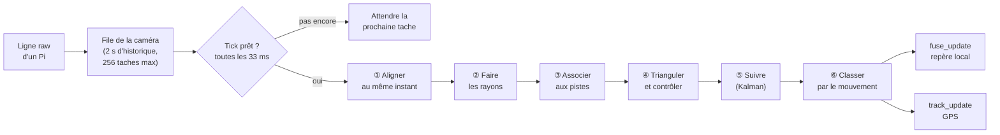
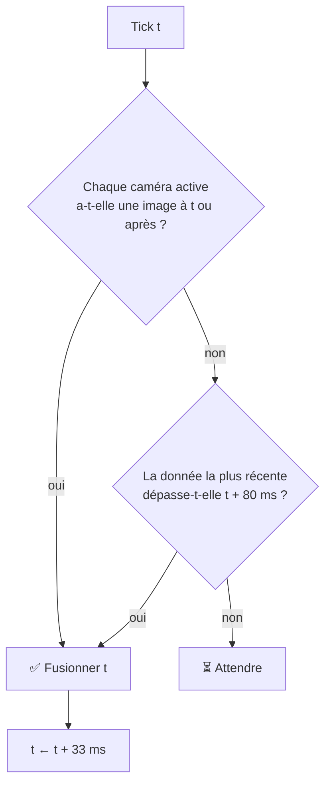
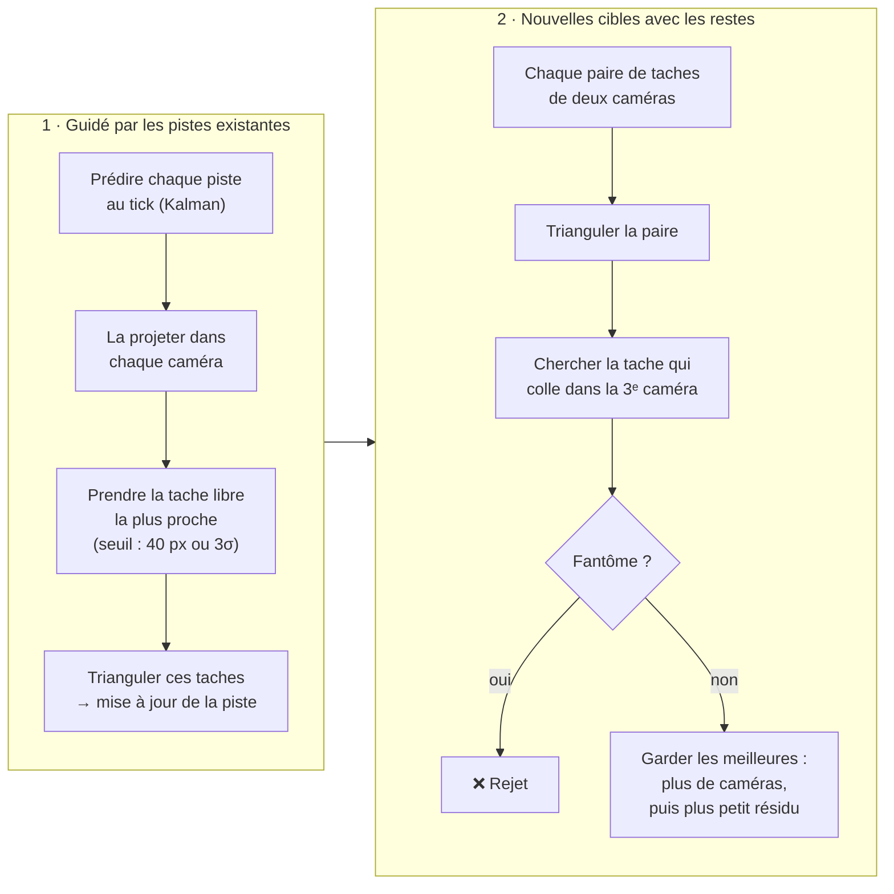
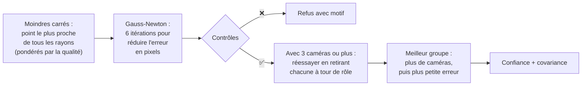
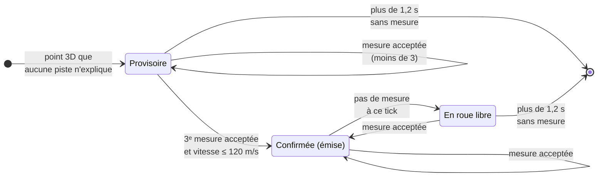

[← Le détecteur sur les Pi](03-detecteur-pi.md) · [🏠 Accueil](README.md) · [Le serveur VPS →](05-serveur-vps.md)

# 🧮 La fusion 3D

> Trois caméras envoient chacune des taches 2D, à leur rythme, avec leurs propres
> horloges. La fusion en fait **des cibles 3D suivies dans le temps**, et rejette
> au passage les croisements qui ne correspondent à rien.

Code : [`vps/src/fusion/`](../vps/src/fusion/) · Point d'entrée :
`FusionService.ingest()` (`vps/src/fusion/fusion.service.ts`) ·
Les équations sont dans [Les mathématiques](08-mathematiques.md).

---

## 👀 Vue d'ensemble



| Dossier | Rôle |
|---|---|
| `fusion.service.ts` | L'état du moteur et l'ordre des étapes |
| `config/` | Lecture des variables d'environnement, valeurs par défaut |
| `observation/` | Préparer une tache : pose, optique, purge de l'historique |
| `alignment/` | Ramener les taches de chaque caméra à l'instant du tick |
| `geometry/` | Vecteurs, repère de la caméra, pixel → rayon, GPS ↔ ENU |
| `association/` | Quelle tache va avec quelle cible, création des nouvelles cibles |
| `triangulation/` | Le point 3D, ses contrôles, sa confiance et sa covariance |
| `tracking/` | Kalman à vitesse constante, cycle de vie des pistes, classement |
| `reporting/` | Mise en forme des résultats pour l'interface |
| `simulation/` | Simulateur de scènes et rejeu d'une session enregistrée |

## ⏰ La grille de temps

Les Pi ne capturent pas au même instant, et leurs paquets n'arrivent pas dans
l'ordre. Fusionner « dès qu'une tache arrive » mélangerait des images décalées.
La fusion avance donc sur une **grille fixe** : un *tick* toutes les
`FUSION_INTERVAL_MS` (33 ms, une image à 30 i/s).

```text
temps de capture ─────────────────────────────────────────────────────────▶

jean    ●─────────●─────────●─────────●─────────●
tanel      ●─────────●─────────●─────────●─────────●
walid    ●─────────●──────────────────────●─────────●   ← walid a raté une image

ticks   │         │         │         │         │
       t₀        t₁        t₂        t₃        t₄     (pas de 33 ms)

À chaque tick t, chaque caméra est ramenée à t en interpolant entre
l'image juste avant et l'image juste après : on interpole, on n'extrapole pas.
```

Un tick n'est traité que lorsqu'il est **prêt** :



- Une caméra **muette depuis plus de 80 ms** (`FUSION_LATENCY_MS`) n'est pas
  attendue : la cible est peut-être simplement hors de son champ.
- Après un **long silence**, la grille saute près des données récentes au lieu
  de rejouer tous les ticks vides.
- Un seul message ne déclenche jamais plus de 64 ticks, pour absorber les rafales.

## ① Aligner au même instant

`alignCandidates()` (`alignment/fusion-align.ts`) prend, pour chaque caméra, les
deux images qui **encadrent** le tick, puis :

1. associe chaque tache de l'image la plus proche à la tache libre la plus
   proche dans l'autre image, à moins de 60 px (`FUSION_PAIR_GATE_PX`) ;
2. **interpole** la position de chaque paire au tick ;
3. garde telle quelle une tache sans partenaire, ou une caméra qui n'a qu'une
   image, si elle est à moins de 20 ms du tick (`FUSION_WINDOW_MS`), avec sa
   confiance multipliée par 0,8.

Chaque caméra garde ensuite ses 8 taches les plus sûres au plus
(`FUSION_MAX_BLOBS_PER_CAMERA`). Il faut **au moins deux caméras** pour
continuer.

## ② Faire les rayons

`toTriObs()` (`observation/fusion-observation.ts`) transforme chaque tache en
rayon, avec :

- **le cap, l'élévation et le roulis** envoyés par le Pi dans la ligne `raw`
  (à défaut, le cap enregistré pour la caméra). **Sans cap, la tache est
  écartée** : un rayon supposé plein Nord est pire que pas de rayon du tout ;
- **la position de la caméra** : sa pose sur le banc rail si elle est calibrée,
  sinon sa position GPS (`cameras.json`, avec des valeurs de site par défaut
  pour `jean`, `tanel` et `walid`) convertie en mètres autour d'une
  **origine**. Une caméra inconnue du VPS et sans pose rail n'a pas de
  position : ses taches sont écartées ;
- **l'optique** : `fx`, `fy`, `cx`, `cy` et la distorsion envoyés par le Pi,
  sinon une focale déduite du champ de vision (65° par défaut) sur une image de
  1280 × 720.

> [!IMPORTANT]
> L'origine du repère local est **la première observation qui porte une
> position GPS**, et elle ne bouge plus ensuite. C'est elle qui permet de
> convertir les pistes en latitude et longitude : sans origine, la fusion
> fonctionne en repère local (`fuse_update`) mais **n'émet aucun
> `track_update`**. Changer ensuite la position GPS d'une caméra depuis
> l'interface ne déplace pas l'origine : elle ne change qu'au redémarrage du
> serveur.

## ③ Associer les taches aux cibles

Avec plusieurs cibles, chaque caméra voit plusieurs taches : laquelle va avec
laquelle ? `association/fusion-association.ts` répond en deux temps.



**Le test du fantôme.** Deux rayons finissent toujours par passer près l'un de
l'autre quelque part. Une paire est rejetée si une **autre caméra**, qui envoie
des taches à ce tick et dont l'image contient le point, n'a **aucune** tache qui
s'accorde avec lui. Une caméra qui n'a rien envoyé ne prouve rien.

Le seuil d'association d'une piste est le plus grand de 40 px
(`FUSION_ASSOC_GATE_PX`) et de trois fois son incertitude projetée dans
l'image : une piste mal connue cherche plus loin. Au plus 8 cibles sont suivies
en même temps (`FUSION_MAX_TARGETS`).

## ④ Trianguler et contrôler

`triangulate()` (`triangulation/fusion-triangulate.ts`) calcule le point d'un
groupe de rayons en quatre temps.



| Contrôle | Règle | Réglage (défaut) |
|---|---|---|
| Devant la caméra | le point doit être devant **chaque** objectif | — |
| Portée | entre 0,5 m et 60 m de **chaque** caméra. Un croisement collé à une caméra est géométriquement impossible ici et apparaîtrait posé dessus sur la carte | `FUSION_MIN_RANGE_M`, `FUSION_MAX_RANGE_M` |
| Parallaxe | le plus petit angle entre deux rayons doit dépasser 2°. Des rayons presque parallèles se croisent n'importe où | `FUSION_MIN_PARALLAX_DEG` |
| Reprojection | **chaque** rayon doit tomber à moins de 120 px du point reprojeté, pas seulement la moyenne : c'est ce qui écarte une tache fausse isolée | `FUSION_MAX_RESIDUAL_PX` |
| Distance au rayon | optionnel, en mètres (0 = désactivé) | `FUSION_MAX_RESIDUAL_M` |

> [!TIP]
> 120 px est large : c'est ce qu'accepte le banc rail **non calibré** (environ
> 110 px d'erreur). Une fois les poses calibrées, descendre vers 25 px élimine
> les pistes fantômes nées de fausses taches.

**Le « RANSAC » simplifié.** Avec trois caméras ou plus, le moteur essaie aussi
chaque groupe privé d'une caméra. Une seule tache fausse ne peut donc pas tirer
le point : le groupe sans elle gagne.

**La confiance** (entre 0 et 0,99) mélange le nombre de caméras, l'erreur en
pixels, la parallaxe et la qualité des taches. **La covariance** (l'ellipsoïde
d'incertitude du point) vient du bruit attendu sur le centroïde (1,5 px) et sur
la pose (0,5°), agrandie si les rayons s'accordent moins bien que prévu. Elle
est transmise au Kalman.

Quand rien ne passe, la dernière fusion porte un motif lisible dans
`GET /fusion` et dans `fuse_update` :

| Motif | Signification |
|---|---|
| `need >= 2 observations` | Moins de deux caméras ont une tache utilisable à ce tick |
| `no subset passed parallax/residual gates` | Aucun groupe de caméras ne passe les contrôles |

## ⑤ Suivre dans le temps (Kalman)

`Tracker` (`tracking/fusion-tracker.ts`) donne à chaque cible un **filtre de
Kalman à vitesse constante** en 3D (position + vitesse) et gère son cycle de vie.



| Règle | Détail | Réglage (défaut) |
|---|---|---|
| **Porte physique** | la mesure doit être à une distance que la cible a pu parcourir : `vitesse max × Δt + 6 m` | `FUSION_TRACK_MAX_SPEED_MPS` = 120, `FUSION_TRACK_MATCH_M` = 6 |
| **Porte statistique** | distance de Mahalanobis² ≤ 11,34 (χ² à 3 degrés de liberté, 99 %) | `FUSION_TRACK_GATE_CHI2` |
| **Piste provisoire** | doit en plus rester à moins de 6 m de sa prédiction. Sa vitesse de départ est très incertaine, donc la 2ᵉ mesure passe facilement, mais la 3ᵉ doit déjà coller à une vitesse constante : des paires de taches au hasard s'enchaînent rarement trois fois | — |
| **Confirmation** | après 3 mesures | `FUSION_TRACK_CONFIRM` |
| **Émission** | une piste confirmée n'est envoyée que si elle a été mesurée dans les 220 dernières ms | — |
| **Oubli** | supprimée après 1,2 s sans mesure | `FUSION_TRACK_MAX_COAST_MS` |
| **Reprise d'identité** | une piste qui vient d'être confirmée là où une piste confirmée a été perdue (à moins de 18 m) **reprend son numéro** : un trou ne change pas l'identité | — |
| **Bruits** | bruit de modèle 200 (accélération blanche), bruit de mesure 2,5 m, plancher de 5 cm ajouté à chaque covariance | `FUSION_TRACK_PROCESS_NOISE`, `FUSION_TRACK_MEAS_NOISE`, `FUSION_TRACK_MEAS_FLOOR_M` |

Les pistes s'appellent `obj1`, `obj2`… dans l'interface.

## ⑥ Classer par le mouvement

À chaque mesure, `classifyKinematics()` (`tracking/fusion-classify.ts`) donne des
points à quatre classes selon le mouvement lissé de la piste. **La classe qui a
le plus de points gagne.** C'est une heuristique réglée à la main, pas un modèle
appris.

| Critère | Points |
|---|---|
| Vitesse > 85 m/s | ✈️ avion +4 |
| 45 – 85 m/s | 🛸 drone +3 |
| 12 – 45 m/s | 🛸 drone +2, 🐦 oiseau +2 |
| 5 – 12 m/s | 🐦 oiseau +3, ❔ autre +1 |
| < 5 m/s | ❔ autre +4, 🐦 oiseau −2 |
| Accélération > 15 m/s² | 🛸 drone +3, 🐦 oiseau +1, ✈️ avion −3 |
| Accélération < 3 m/s² et vitesse > 50 m/s | ✈️ avion +2 |
| Altitude > 120 m | ✈️ avion +3, 🐦 oiseau −3, ❔ autre −2 |
| Altitude < 60 m et vitesse < 5 m/s | ❔ autre +2 |
| Altitude < 60 m et vitesse 5 – 25 m/s | 🐦 oiseau +2 |
| Virage > 90°/s | 🛸 drone +3, 🐦 oiseau +1, ✈️ avion −4 |
| Quasi immobile (< 3 m/s) après une forte accélération (> 10 m/s²) | 🛸 drone +3 |
| Quasi immobile sans forte accélération | ❔ autre +3, 🐦 oiseau −2 |

- En cas d'égalité, l'ordre de préférence est autre, puis avion, puis oiseau,
  puis drone.
- Une piste naît en `other` ; la vitesse et l'accélération sont lissées
  (coefficients 0,25 et 0,2) pour éviter les à-coups.
- L'altitude utilisée est **l'altitude GPS de l'origine + z**.

Un second avis, **visuel** cette fois, vient des photos prises par les trois Pi :
voir [Classification par photos](05-serveur-vps.md#-classification-par-photos).
Un modèle appris sur des vols réels peut aussi être entraîné hors ligne : voir
[Tests et outils](12-tests-et-outils.md#-classifieur-de-pistes-appris).

## 📤 Ce qui sort de la fusion

| Sortie | Repère | Cadence | Contenu |
|---|---|---|---|
| `fuse_update` (WebSocket) | local, en mètres | au plus une toutes les 50 ms (`FUSE_BROADCAST_MS`) | dernière fusion (point, résidu, parallaxe, motif de refus), croisements bruts, pistes confirmées |
| `track_update` (WebSocket) | GPS | à chaque tick, par piste émise | `obj<n>`, latitude, longitude, altitude, horodatage, classe |
| `GET /fusion` (HTTP) | local | à la demande | photo complète du moteur : caméras actives, files, dernière fusion, pistes |

Les **croisements bruts** (`rawIntersections`) sont toutes les paires de rayons
des images les plus proches, calculées **avant** tout contrôle. Ce ne sont
jamais des cibles : la vue 3D du banc rail les montre pour juger la géométrie
d'un coup d'œil.

## 🔧 Tous les réglages de la fusion

Les variables d'environnement donnent les valeurs de démarrage
(`vps/.env.example`). La plupart se changent ensuite **à chaud** depuis le
panneau « Réglages » sans perdre les pistes en cours.

| Variable | Clé à chaud | Défaut | Rôle |
|---|---|---|---|
| `FUSION_HISTORY_MS` | — | 2000 | Historique gardé par caméra |
| `FUSION_STALE_MS` | — | 2000 | Âge au-delà duquel une caméra n'est plus « active » |
| `FUSION_WINDOW_MS` | — | 20 | Écart toléré entre une tache seule et le tick |
| `FUSION_INTERVAL_MS` | `intervalMs` | 33 | Pas de la grille de temps |
| `FUSION_LATENCY_MS` | `latencyMs` | 80 | Attente maximale des autres Pi |
| `FUSION_PAIR_GATE_PX` | `pairGatePx` | 60 | Appariement d'une tache entre deux images |
| `FUSION_ASSOC_GATE_PX` | `assocGatePx` | 40 | Association tache ↔ piste prédite |
| `FUSION_MAX_BLOBS_PER_CAMERA` | `maxBlobsPerCamera` | 8 | Taches gardées par caméra et par tick |
| `FUSION_MAX_TARGETS` | `maxTargets` | 8 | Cibles suivies en même temps |
| `FUSION_MIN_PARALLAX_DEG` | `minParallaxDeg` | 2 | Angle minimal entre deux rayons |
| `FUSION_MAX_RESIDUAL_PX` | `maxResidualPx` | 120 | Erreur de reprojection maximale par rayon |
| `FUSION_MAX_RESIDUAL_M` | — | 0 | Variante en mètres (0 = désactivée) |
| `FUSION_MIN_RANGE_M` / `FUSION_MAX_RANGE_M` | `minRangeM` / `maxRangeM` | 0,5 / 60 | Portée acceptée |
| `FUSION_PIXEL_SIGMA` | — | 1,5 | Bruit du centroïde (px) pour la covariance |
| `FUSION_POSE_SIGMA_DEG` | — | 0,5 | Bruit de pose (°) pour la covariance |
| `FUSION_TRACK_CONFIRM` | `confirmUpdates` | 3 | Mesures pour confirmer une piste |
| `FUSION_TRACK_MAX_COAST_MS` | `maxCoastMs` | 1200 | Durée de vie sans mesure |
| `FUSION_TRACK_GATE_CHI2` | `gateChi2` | 11,34 | Porte statistique |
| `FUSION_TRACK_MATCH_M` | `matchDistanceM` | 6 | Porte en mètres |
| `FUSION_TRACK_MAX_SPEED_MPS` | `maxSpeedMps` | 120 | Vitesse plausible maximale |
| `FUSION_TRACK_PROCESS_NOISE` | `processNoise` | 200 | Bruit de modèle du Kalman |
| `FUSION_TRACK_MEAS_NOISE` | — | 2,5 | Bruit de mesure par défaut (m) |
| `FUSION_TRACK_MEAS_FLOOR_M` | — | 0,05 | Incertitude minimale d'une mesure |
| `FUSE_BROADCAST_MS` | `broadcastMs` | 50 | Intervalle minimal entre deux `fuse_update` |

## 📼 Enregistrer et rejouer

Avec `FUSION_RECORD_PATH=/data/fusion-session.jsonl`, chaque observation reçue
est écrite en JSONL. Elle peut ensuite être rejouée hors ligne, avec une vérité
terrain pour mesurer l'erreur :

```bash
cd vps && npm run build
node dist/fusion/simulation/fusion-replay.js session.jsonl --truth x,y,z
```

Pour rejouer une session **vidéo** complète dans toute la chaîne (Pi simulés,
VPS et interface), voir le [banc de rejeu](12-tests-et-outils.md#-banc-de-rejeu).

---

[← Le détecteur sur les Pi](03-detecteur-pi.md) · [🏠 Accueil](README.md) · [Le serveur VPS →](05-serveur-vps.md)
