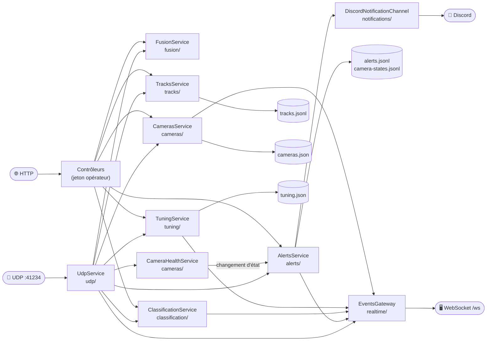
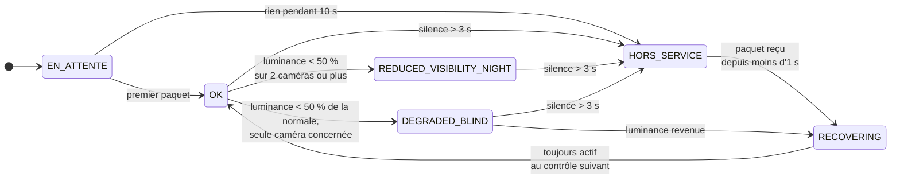
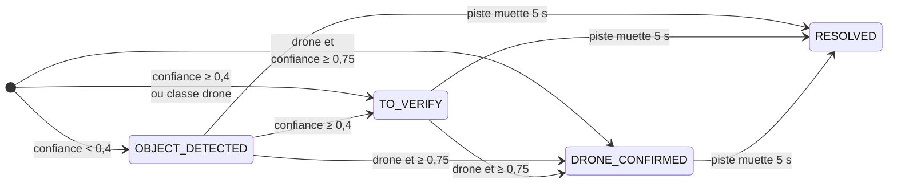
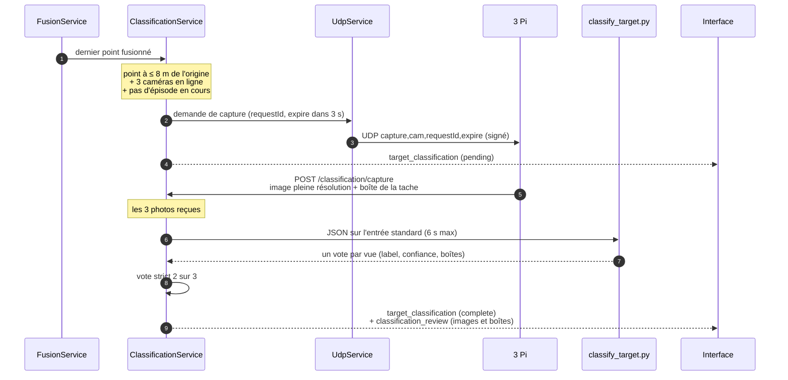

[← La fusion 3D](04-fusion-3d.md) · [🏠 Accueil](README.md) · [L'interface opérateur →](06-interface-operateur.md)

# 🖧 Le serveur VPS

> Le VPS est le **chef d'orchestre** : il écoute les trois Pi, calcule la 3D,
> surveille la santé des caméras, décide des alertes, prévient Discord et
> pousse tout à l'écran en direct.

Code : [`vps/src/`](../vps/src/) · Organisation dossier par dossier :
[`vps/README.md`](../vps/README.md) · La fusion a sa propre page :
[La fusion 3D](04-fusion-3d.md)

---

## 🧩 Les services et leurs liens

`UdpService` est le **point de passage** : chaque ligne reçue d'un Pi est
reconnue (`udp/udp-route.ts`) puis confiée au bon service.

| Ligne reçue | Ce que fait le VPS | Événements diffusés |
|---|---|---|
| `raw` | Note l'adresse du Pi et son activité, met à jour la pose rail si elle est jointe, **fusionne**, envisage une photo, enregistre et alerte sur les pistes | `raw_detection`, `fuse_update`, `track_update`, `alert` |
| `att` | Diffuse le cap ; si `valid = 1`, tourne le cône de la caméra | `imu_update`, `camera_positions` |
| `stats,v2` | Met à jour la santé de la caméra | `camera_stats`, `camera_status_update` |
| `cfg` | Note ce que le détecteur applique, **renvoie** la commande s'il n'est pas à jour | `tuning_state` |
| `obj…` | Piste déjà fusionnée (mode multi-caméras local) : diffusée, enregistrée, alertée | `track_update` |
| autre chose | Diffusée telle quelle pour le débogage | `generic_udp` |

## 🚦 Au démarrage

`vps/src/main.ts`, dans l'ordre :

1. Avec `NODE_ENV=production`, **refuse de démarrer** si `WS_AUTH_TOKEN` est
   absent ou vaut une valeur d'exemple du dépôt (`change-me`,
   `dev-pavois-token`, `staging-token-change-me`).
2. Pose les en-têtes de sécurité HTTP (Helmet) et un **CORS strict**
   (`ALLOWED_ORIGINS`, jamais `*`).
3. Valide chaque corps de requête contre son DTO et **rejette les champs
   inconnus** (`whitelist`, `forbidNonWhitelisted`).
4. Limite chaque client à **100 requêtes par minute** (`ThrottlerGuard` global ;
   les aperçus et les photos des Pi en sont exemptés).
5. Écoute HTTP + WebSocket sur `HOST:PORT` (`0.0.0.0:3002`) et UDP sur
   `UDP_HOST:UDP_PORT` (`0.0.0.0:41234`).

> [!WARNING]
> Aucun fichier de déploiement ne définit `NODE_ENV` aujourd'hui. Sans lui, le
> contrôle du point 1 est sauté : un `WS_AUTH_TOKEN` absent retombe sur
> `dev-pavois-token`, et les valeurs d'exemple sont acceptées. Voir
> [Sécurité](11-securite.md#-ce-qui-nest-pas-encore-protégé).

## 📷 Les caméras

`CamerasService` (`cameras/cameras.service.ts`) tient la liste des caméras :
position GPS, cap, champ de vision, portée affichée.

- **Positions** : valeurs de site par défaut pour `jean`, `tanel` et `walid`,
  remplacées par ce que l'opérateur règle dans l'interface
  (`PUT /cameras/:id/position`) et gardées dans `cameras.json` (`CAMERAS_FILE`).
- **Cap** : chaque ligne `att` valide met à jour le cap, et la carte reçoit la
  liste complète (`camera_positions`).
- **Banc rail** : quand un Pi joint sa pose rail calibrée aux lignes `raw`, le
  VPS l'adopte comme position locale exacte de la caméra (`rail_bench`).
- **Aperçus** : `PreviewService` reçoit les JPEG des Pi (`POST /preview`), en
  garde le dernier par caméra et le diffuse en base64 (`camera_preview`), au plus
  un toutes les 150 ms par caméra (`PREVIEW_MIN_INTERVAL_MS`).

## 🩺 La santé des caméras

`CameraHealthService` (`cameras/camera-health.service.ts`) évalue chaque caméra
**toutes les secondes**, à partir des paquets reçus et des lignes `stats`.

- **La « normale »** est la médiane de la luminance sur les 60 dernières
  secondes, mise à jour **seulement** quand la caméra est `OK` ou en visibilité
  réduite. Une caméra masquée ne fait donc pas baisser sa propre référence.
- **Masque ou nuit ?** Si une seule caméra s'assombrit d'un coup, c'est un
  masque (`DEGRADED_BLIND`). Si deux ou plus s'assombrissent ensemble, c'est
  l'environnement : nuage ou tombée de la nuit (`REDUCED_VISIBILITY_NIGHT`).
- **Pas de sortie automatique de la nuit.** Le code ne prévoit aucun retour de
  `REDUCED_VISIBILITY_NIGHT` vers `OK` quand la lumière revient : l'état ne
  change qu'après un silence ou un masque. Voir
  [État et limites](13-etat-et-limites.md#-écarts-repérés-dans-le-code).
- `DEGRADED_FROZEN` (image figée) existe dans les types et dans les alertes,
  mais aucune règle ne le déclenche encore.

La **fiabilité globale** résume l'ensemble (une caméra en visibilité réduite
compte comme valide, une caméra dégradée non) :

| Caméras valides | Fiabilité | Message | Ce que ça veut dire |
|:-:|---|---|---|
| 3 | 🟢 `GREEN` | 3D nominale | Triangulation avec redondance |
| 2 | 🟠 `ORANGE` | 3D dégradée | Triangulation possible, sans redondance |
| 0 – 1 | 🔴 `RED` | **Système aveugle** | Direction seulement, pas de position 3D |

## 🚨 Les alertes

`AlertsService` (`alerts/alerts.service.ts`) gère deux familles d'alertes.

| Catégorie | Gravité | Déclencheur |
|---|---|---|
| `OBJECT_DETECTED` | ℹ️ INFO | Nouvelle piste, confiance < 0,4 et pas un drone |
| `TO_VERIFY` | ⚠️ WARNING | Nouvelle piste avec confiance ≥ 0,4, ou classée drone |
| `DRONE_CONFIRMED` | 🛑 CRITICAL | Piste classée drone **et** confiance ≥ 0,75 |
| `CAMERA_STATUS` | 🛑 / ⚠️ / ℹ️ | Une caméra passe `HORS_SERVICE` ou masquée (CRITICAL), figée (WARNING), en visibilité réduite (INFO) |
| `CAMERA_RECOVERED` | ℹ️ INFO | Retour à `OK` : l'alerte d'incident ouverte est résolue (un message Discord avec la durée est prévu, voir les [limites](13-etat-et-limites.md#-écarts-repérés-dans-le-code)) |
| `SYSTEM_BLIND` | 🛑 CRITICAL | La fiabilité globale passe au rouge (≤ 1 caméra valide) ; résolue quand elle remonte |

**Une alerte de piste ne redescend jamais.** Elle naît au niveau que justifie
la première mesure, puis peut monter (`OBJECT_DETECTED` → `TO_VERIFY` →
`DRONE_CONFIRMED`), jamais l'inverse.

> [!WARNING]
> Aujourd'hui, le chemin UDP transmet à `AlertsService` le numéro et la classe de
> la piste, **pas sa confiance** : la valeur par défaut 0,5 s'applique. En
> pratique, chaque piste ouvre une alerte `TO_VERIFY` et `DRONE_CONFIRMED`
> n'est jamais atteint par les pistes fusionnées. Voir
> [État et limites](13-etat-et-limites.md#-écarts-repérés-dans-le-code).

- **Acquittement** : par le bouton de l'interface (message WebSocket
  `acknowledge_alert`) ou `POST /alerts/:id/acknowledge`. Le nom de l'opérateur
  est enregistré et tous les écrans sont mis à jour (`alert_updated`).
- **Résolution** : une alerte de piste passe `RESOLVED` quand la piste n'a plus
  été vue depuis 5 s (`OBJECT_LOST_TIMEOUT_SECONDS`).
- **Rétention** : les alertes de plus de 30 jours sont purgées au démarrage puis
  toutes les 24 h (`ALERT_RETENTION_DAYS`).

## 💬 Les notifications Discord

`DiscordNotificationChannel` (`notifications/`) envoie les alertes importantes
sur un salon Discord par webhook.

| Réglage | Défaut | Rôle |
|---|---|---|
| `DISCORD_WEBHOOK_URL` | — | **Secret.** Sans URL valide, le canal est désactivé |
| `DISCORD_ENABLED` | `true` | `false` coupe tout |
| `DISCORD_CATEGORIES` | `CAMERA_MASKED,CAMERA_DOWN,SYSTEM_BLIND,DRONE_CONFIRMED,CAMERA_RECOVERED` | Catégories envoyées |
| `DISCORD_MAX_ALERTS_PER_MIN` | 5 | Débit maximal |
| `DISCORD_MENTION_ROLE_ID` | — | Rôle à mentionner sur les alertes critiques |
| `DISCORD_INCLUDE_POSITION` | `true` | Joindre la position de la cible |
| `DISCORD_ENV_LABEL` | `VPS-PROD` | Étiquette de l'environnement dans le message |
| `OPERATOR_URL` | — | Lien vers l'interface dans le message |

Les envois passent par une **file** (100 messages au plus), avec un délai de 5 s
par requête, 3 nouvelles tentatives sur erreur réseau et le respect des
réponses `429` de Discord. Un envoi raté ne bloque jamais le traitement des
détections. `npm run test:discord` envoie un message d'essai.

## 📸 Classification par photos

En plus du classement par le mouvement, le VPS peut demander **une photo à
chaque Pi** quand une cible passe près du banc, puis faire voter un examen
OpenCV sur les trois vues.

- **Le vote** : `human` ou `drone` gagne si **au moins deux vues** le donnent
  avec une confiance ≥ 0,5. Sinon : `unknown`.
- **Le classifieur** (`vps/classifier/classify_target.py`) est volontairement
  prudent : les détecteurs de personnes d'OpenCV (HOG, visage) mettent leur
  veto, puis une zone de mouvement nette est acceptée comme drone possible. Un
  modèle de drone dédié pourrait le remplacer sans changer le protocole des Pi.
- **Un épisode par passage** : une nouvelle photo n'est demandée qu'après 2 s
  sans cible proche (`CLASSIFICATION_RESET_MS`). Une photo manquante après 3 s
  clôt l'épisode en `unknown`.
- Sur la page « Test rail », une cible dont le verdict n'est pas `drone` est
  masquée.

## 🔧 Réglages à chaud

`TuningService` (`tuning/tuning.service.ts`) garde les réglages **voulus** pour
les détecteurs et la fusion, et les compare à ce que chaque détecteur **annonce
appliquer**.

| Concept | Détail |
|---|---|
| **Table des réglages** | `tuning/tuning.params.ts` : 21 réglages de détecteur (seuils, morphologie, filtres, confirmation, fond, taille d'image, exposition) et 17 de fusion, avec bornes, pas et aide |
| **Voulu / annoncé** | Chaque détecteur a une version voulue ; tant que sa ligne `cfg` annonce une autre version, la commande `set` lui est renvoyée (à chaque `cfg`, donc chaque seconde) |
| **Retour au fichier** | `DELETE /tuning/detector` envoie la version `0` : chaque Pi reprend son propre fichier |
| **Préréglages** | Quatre fournis : *Défaut*, *Sensible* (petites cibles, faible contraste), *Strict* (moins de fausses pistes), *Multi-cibles*. L'opérateur peut enregistrer les siens |
| **Persistance** | `tuning.json` (`TUNING_FILE`) : survit au redémarrage du VPS |
| **Condition** | Sans `UDP_HMAC_SECRET`, l'état l'indique : les détecteurs refusent toute commande non signée |

Les réglages de fusion s'appliquent **entre deux ticks**, sans perdre les pistes.
Chaque changement est diffusé à tous les écrans (`tuning_state`).

## 💾 Le stockage

Tout est dans le dossier `data/` (`ALERTS_DATA_DIR`, monté en volume Docker
`pavois-data` → `/app/data`).

| Fichier | Contenu | Écrit par |
|---|---|---|
| `alerts.jsonl` | Une ligne par création ou mise à jour d'alerte | `JsonlAlertStore` |
| `camera-states.jsonl` | Chaque changement d'état d'une caméra, avec sa luminance, son exposition et son gain | `JsonlAlertStore` |
| `tracks.jsonl` | Chaque position de piste, et le verdict de l'opérateur (`PATCH /tracks/:id` : `CONFIRMED`, `FALSE_POSITIVE`, `UNSURE`) | `JsonlTrackStore` |
| `cameras.json` | Positions des caméras réglées depuis l'interface | `CamerasService` |
| `tuning.json` | Réglages à chaud et préréglages personnalisés | `TuningService` |

- L'état actif vit **en mémoire** ; le disque n'est qu'un journal. Si l'écriture
  échoue, le service continue et diffuse quand même.
- La purge réécrit le fichier dans un `.tmp` puis le **renomme**, ce qui est
  atomique : une coupure de courant ne corrompt pas l'historique.

## 🧪 Bancs d'essai

| Outil | Détail |
|---|---|
| **Banc rail** (`bench/`) | `POST /bench/rail` active la géométrie du rail V5 (largeur, distance de la cible, élévation…), `DELETE` l'arrête. Diffusé en `rail_bench` et affiché par la page « Test rail » |
| **Mode simulation** (`bench/simulation.service.ts`) | Avec `SIMULATION_MODE=true` (refusé si `NODE_ENV=production`), le service sait s'envoyer des trames signées pour jouer un masque, un flux figé, une tombée de la nuit ou un drone. Aucune route ne déclenche encore ces scénarios |

## 🔑 Variables d'environnement

Modèle complet et commenté : [`vps/.env.example`](../vps/.env.example). Les
variables de fusion sont dans [La fusion 3D](04-fusion-3d.md#-tous-les-réglages-de-la-fusion).

| Variable | Défaut | Rôle |
|---|---|---|
| `PORT`, `HOST` | 3002, `0.0.0.0` | HTTP + WebSocket |
| `UDP_PORT`, `UDP_HOST` | 41234, `0.0.0.0` | Réception des Pi |
| `WS_AUTH_TOKEN` | `dev-pavois-token` hors production | Jeton opérateur (HTTP et WebSocket). **À définir partout** |
| `NODE_ENV` | — | `production` active le refus des jetons d'exemple et interdit `SIMULATION_MODE` |
| `UDP_HMAC_SECRET` | — | Clé partagée avec les Pi. `UDP_SECRET_KEY` est accepté comme ancien nom |
| `UDP_REQUIRE_HMAC` | `false` | `true` rejette tout paquet non signé ou mal signé |
| `UDP_VERBOSE` | `false` | Journalise chaque paquet |
| `ALLOWED_ORIGINS` | localhost | Origines autorisées (CORS et WebSocket) |
| `ALLOWED_IPS` | toutes | Liste blanche d'IP pour le WebSocket |
| `CAMERAS_FILE`, `TUNING_FILE`, `ALERTS_DATA_DIR` | `data/…` | Fichiers de données |
| `CAMERA_TIMEOUT_SECONDS` | 3 | Silence avant `HORS_SERVICE` |
| `CAMERA_INITIAL_GRACE_SECONDS` | 10 | Délai de grâce au démarrage |
| `OBJECT_LOST_TIMEOUT_SECONDS` | 5 | Silence avant de résoudre une alerte de piste |
| `ALERT_RETENTION_DAYS` | 30 | Durée de conservation des alertes |
| `ALERT_MAX_MEMORY_ITEMS` | — | Plafond d'alertes gardées en mémoire |
| `CLASSIFICATION_ENABLED` | `true` | Photos et vote |
| `CLASSIFICATION_CAMERA_IDS` | `jean,tanel,walid` | Les trois caméras à photographier |
| `CLASSIFICATION_NEAR_M` | 8 | Distance de déclenchement (à l'origine) |
| `CLASSIFICATION_RESET_MS` | 2000 | Fin d'épisode sans cible proche |
| `CLASSIFICATION_CAPTURE_TIMEOUT_MS` | 3000 | Attente des photos |
| `CLASSIFICATION_PYTHON_TIMEOUT_MS` | 6000 | Durée maximale du classifieur |
| `CLASSIFIER_PYTHON`, `CLASSIFIER_SCRIPT` | `python3`, `/app/classifier/classify_target.py` | Interpréteur et script |
| `PREVIEW_MIN_INTERVAL_MS` | 150 | Intervalle minimal entre deux aperçus diffusés |
| `DISCORD_*`, `OPERATOR_URL` | voir plus haut | Notifications |
| `SIMULATION_MODE` | `false` | Trames de démonstration (jamais en production) |

---

[← La fusion 3D](04-fusion-3d.md) · [🏠 Accueil](README.md) · [L'interface opérateur →](06-interface-operateur.md)
