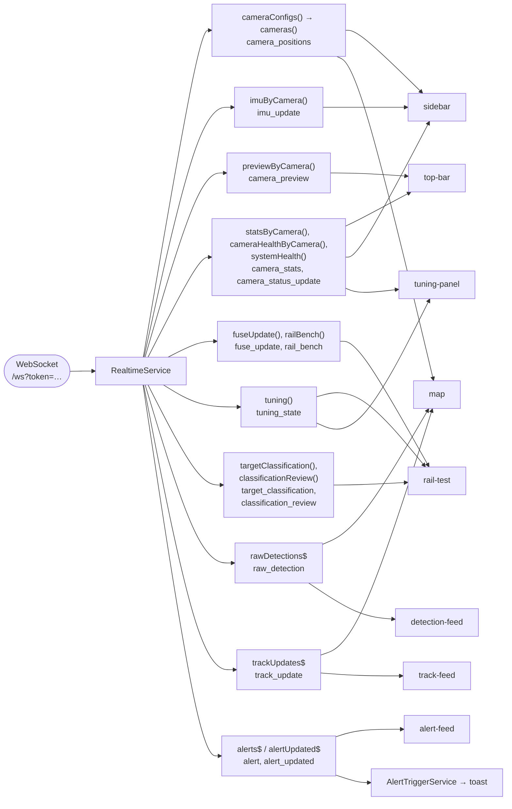
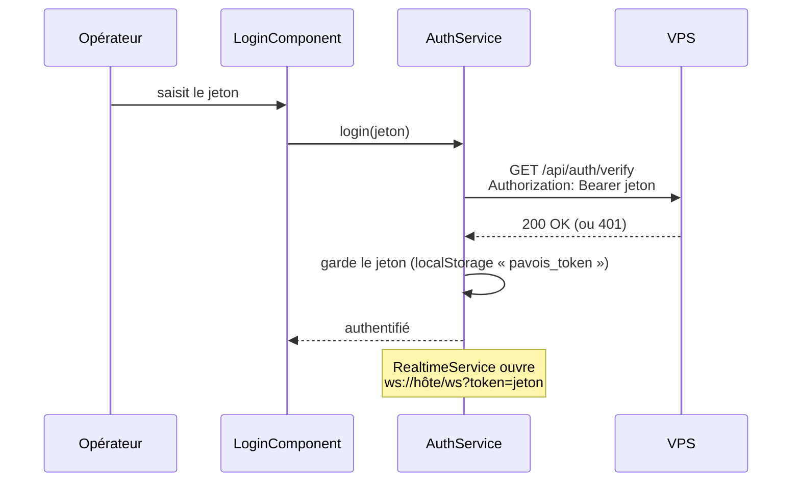

[← Le serveur VPS](05-serveur-vps.md) · [🏠 Accueil](README.md) · [Protocoles →](07-protocoles.md)

# 💻 L'interface opérateur

> Une seule page ouverte en permanence : la carte, les pistes, les détections et
> les alertes **en direct**, plus un banc 3D pour les essais sur rail.

Code : [`frontend-angular/`](../frontend-angular/) · Angular 22 (composants
autonomes, *signals*), Leaflet pour la carte, three.js pour la vue 3D, Vitest
pour les tests.

---

## 🪟 À quoi ça ressemble

```text
┌──────────────────────────────────────────────────────────────────────────────────┐
│ ⬡ PAVOIS   Carte · Test rail     🟢 3/3 OK (3D Nominal)   CAM 1 ● CAM 2 ● CAM 3 ● │ ← app-top-bar
├───────────────┬──────────────────────────────────────────────────────────────────┤
│ CAMÉRAS       │                                                                  │
│ ┌───────────┐ │                    🗺️  CARTE (Leaflet + OSM)                     │
│ │ jean      │ │                                                                  │
│ │ 48.82…    │ │         📷◥  cône de vision qui tourne avec l'IMU               │
│ │ IMU ✓ cap │ │                  ╲                                               │
│ │ [modifier]│ │                   ╲ rayon brut fugace                            │
│ └───────────┘ │                    ✦ 🛸 obj3 ─ ─ ─ traînée                       │
│ ┌───────────┐ │                                                                  │
│ │ tanel …   │ │   [déplacer caméras] [rayons bruts] [réinitialiser la vue]       │ ← app-map
│ └───────────┘ ├──────────────────────┬──────────────────────┬────────────────────┤
│ ┌───────────┐ │ PISTES — GPS         │ DÉTECTIONS BRUTES    │ ALERTES            │
│ │ walid …   │ │ obj3  DRONE          │ CONF. MIN ━━●── 50 % │ ⚠️ À VÉRIFIER obj3 │
│ └───────────┘ │ 48.826…, 2.365…      │ jean  x 640 y 360    │      [Acquitter]   │
│ app-sidebar   │ app-track-feed       │ app-detection-feed   │ app-alert-feed     │
└───────────────┴──────────────────────┴──────────────────────┴────────────────────┘
                                           + toasts en bas, + panneau de la piste sélectionnée
```

## 🧭 Les pages

| Route | Page | Pour quoi faire |
|---|---|---|
| `/` | **Carte** (`DashboardPage`) | La surveillance : carte, pistes GPS, détections brutes, alertes |
| `/test-rail` | **Test rail** (`RailTestPage`) | Les essais sur le banc : vue 3D du volume, pistes, croisements bruts, état des Pi, verdict des photos, panneau de réglages |
| tout le reste | → `/` | |

Tant que l'opérateur n'est pas connecté, seule la page **Connexion** s'affiche.

## 🧱 Les composants

| Composant | Rôle |
|---|---|
| `login` | Demande le jeton opérateur, le vérifie (`GET /auth/verify`) avant d'ouvrir l'interface |
| `top-bar` | Navigation, **badge de fiabilité** (🟢 3/3, 🟠 2/3, 🔴 aveugle), une pastille d'état par caméra, nombre d'aperçus vivants |
| `sidebar` | Une carte par caméra : position GPS, azimut, champ, portée, **bloc IMU** (qualité, calibration, âge, cap, élévation, roulis), **luminosité de l'image** avec sa jauge et l'exposition réelle, aperçu vidéo, formulaire pour corriger la position |
| `map` | Carte Leaflet (tuiles OpenStreetMap) : caméras et **cônes de vision**, **rayons bruts** de chaque détection (fondu rapide), icônes de pistes par classe avec traînée. Les caméras peuvent être **déplacées à la souris** |
| `track-feed` | Dernières positions GPS par piste, avec leur classe |
| `detection-feed` | Flux des détections brutes avec un **filtre de confiance minimale** |
| `alert-feed` | Alertes en cours, bouton **Acquitter** |
| `track-detail` | Panneau de la piste sélectionnée : classe, latitude, longitude, altitude… |
| `toast` | Notifications passagères (nouvelle alerte, erreurs) |
| `tuning-panel` | Panneau **Réglages** : curseurs générés depuis la table du VPS, préréglages, retour au fichier des Pi ; pour chaque caméra, l'exposition réelle et la luminosité de l'image |
| `rail-test` + `rail-volume` | Page du banc : scène three.js orbitale avec les trois caméras, la cible attendue, une sphère et une traînée par piste |
| `rail-order` | Pense-bête en haut de la page du banc : **quelle Pi va où sur le rail**, vu de derrière les caméras (`tanel` à gauche, `jean` au centre, `walid` à droite), l'écart entre elles et le contrôle à faire. L'ordre vient du même calcul que la fusion (`railLayout()` dans `config/rail-bench.ts`) |

## 🔌 Le temps réel : `RealtimeService`

Un seul service (`services/realtime.service.ts`) tient **la** connexion
WebSocket et range chaque événement dans un *signal* ou un flux que les
composants lisent.



- **Connexion** dès que l'opérateur est authentifié ; **reconnexion
  automatique** 2 s après une coupure.
- **Acquitter** une alerte envoie `{"event":"acknowledge_alert","data":{"alertId":…}}`
  sur la même socket.
- **Luminosité de l'image** : chaque ligne `stats` porte la luminosité moyenne
  (0 = noir, 255 = blanc). La barre latérale l'affiche avec une jauge dont la
  bande verte marque la plage visée, **90 à 150** ; en dessous de 70 l'image est
  « trop sombre », au-dessus de 180 « trop claire » (`utils/luminance.ts`).
  C'est le repère pour régler le temps de pose et le gain.
- **Les alertes sont décidées par le serveur.** `AlertTriggerService` ne fait que
  relayer l'événement `alert` vers un toast : un onglet fermé au moment de
  l'événement ne perd rien, l'alerte est persistée côté VPS.

## 🔐 La connexion



Au rechargement, le jeton gardé est **revérifié** avant de rouvrir l'interface.
En local (`localhost`), un jeton de développement peut être pré-rempli.

## 📝 La configuration à l'exécution

L'image Docker sert un fichier `env.js` généré **au démarrage du conteneur**
(`docker-entrypoint.d/40-env-js.sh`) depuis trois variables :

| Variable | Si vide |
|---|---|
| `PAVOIS_API_URL` | `<origine de la page>/api` (nginx relaie vers le serveur) |
| `PAVOIS_WS_BASE_URL` | `ws(s)://<hôte de la page>/ws` (nginx relaie vers le serveur) |
| `PAVOIS_DEV_TOKEN` | jeton pré-rempli seulement sur `localhost` |

Le même build fonctionne donc en production, en staging et en local : seule
l'adresse de la page change.

## 🧪 Développer sans les Pi

```bash
cd frontend-angular
npm install

npm start                # ng serve sur :4200, /api relayé vers localhost:3002
npm test                 # tests Vitest
npm run build            # build de production dans dist/
```

> [!NOTE]
> Le proxy de développement (`proxy.conf.json`) ne relaie que `/api`. Le
> WebSocket vise par défaut `ws://localhost:4200/ws`, que `ng serve` ne relaie
> pas. Pour brancher le temps réel sur un `vps` local, déposer un
> `public/env.js` (ignoré par Git de préférence) qui fixe
> `window.__PAVOIS_ENV__ = { wsBaseUrl: "ws://localhost:3002" }`, ou utiliser le
> serveur mock ci-dessous.

**Le serveur mock** (`mock-server/server.mjs`) pousse des événements
WebSocket sur le port 3000 sans aucun VPS :

| Mode | Commande | Ce qu'il émet | Fidèle au terrain ? |
|---|---|---|---|
| **demo** | `npm run mock:ws` | IMU, détections brutes, **pistes classées toutes les 200 ms**, aperçus | ❌ Pour le design (icônes, alertes, listes) |
| **terrain** | `npm run mock:ws:terrain` | IMU et détections brutes de `jean`, `tanel`, `walid` | ✅ Comme une Pi : pas de piste 3D, la carte reste à 0 piste |

```bash
npm run mock:ws          # terminal 1
npm run start:mock       # terminal 2 → http://localhost:4200, branché sur ws://localhost:3000
```

> [!WARNING]
> Le mode **demo** invente des pistes. Ne pas s'en servir pour juger que la
> fusion marche.

---

[← Le serveur VPS](05-serveur-vps.md) · [🏠 Accueil](README.md) · [Protocoles →](07-protocoles.md)
