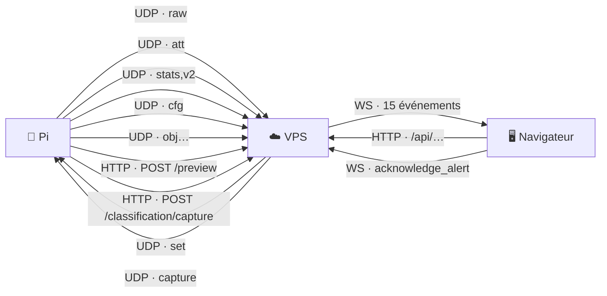

[← L'interface opérateur](06-interface-operateur.md) · [🏠 Accueil](README.md) · [Les mathématiques →](08-mathematiques.md)

# 📡 Protocoles

> La référence de **chaque message** qui circule dans PAVOIS : lignes UDP entre
> les Pi et le VPS, routes HTTP, événements WebSocket. Si tu ajoutes ou changes
> un champ, c'est cette page qu'il faut mettre à jour.

Analyseurs côté VPS : `vps/src/udp/udp-route.ts` et un fichier par type de ligne
(`udp-raw.ts`, `udp-attitude.ts`, `udp-stats.ts`, `udp-config.ts`). Émission côté
Pi : `pavois++/src/runtime/camera_worker.cpp`.

---

## 📬 Carte des messages



Conventions communes aux lignes UDP :

- texte UTF-8, champs séparés par des **virgules**, une ligne par datagramme
  terminée par `\n` ;
- horodatages en **microsecondes Unix** (`_us`) ;
- angles en degrés : **cap** depuis le Nord dans le sens horaire, **élévation**
  positive vers le haut ;
- pixels comptés depuis le coin haut-gauche de l'image.

## 🔏 L'enveloppe signée

Quand `UDP_HMAC_SECRET` est défini, **chaque** datagramme (dans les deux sens)
est emballé ainsi :

```text
 octet 0          8                                       40
       ┌──────────┬────────────────────────────────────────┬──────────────────────────┐
       │ horodat. │ HMAC-SHA256 (32 octets)                │ ligne CSV + "\n"         │
       │ ms Unix  │ = HMAC(clé, horodatage ‖ ligne)        │ (UTF-8)                  │
       │ 8 octets │                                        │                          │
       │ big-end. │                                        │                          │
       └──────────┴────────────────────────────────────────┴──────────────────────────┘
```

À la réception, le paquet est **refusé** si :

1. il fait moins de 40 octets ;
2. son horodatage a **plus de 2 s de retard** ou **plus de 1 s d'avance** sur
   l'horloge locale (anti-rejeu : les Pi attendent la synchro NTP au démarrage) ;
3. la signature ne correspond pas (comparaison à temps constant).

| Configuration du VPS | Paquet signé valide | Paquet non signé ou invalide |
|---|---|---|
| pas de `UDP_HMAC_SECRET` | lu tel quel (l'en-tête rend la ligne illisible) | ✅ accepté |
| `UDP_HMAC_SECRET` défini | ✅ accepté | ⚠️ **accepté quand même**, lu en clair |
| `UDP_HMAC_SECRET` + `UDP_REQUIRE_HMAC=true` | ✅ accepté | ❌ rejeté et journalisé |

Côté Pi, une commande `set` est **toujours** refusée si le Pi n'a pas de clé.
Une commande `capture` non signée est acceptée par un Pi sans clé.

## 📤 Du Pi vers le VPS (UDP)

### `raw` — une tache détectée

Une ligne par tache confirmée et par image.

```text
raw,jean,275,1791158400123456,551.93,638.21,2619,0.986,164.20,-1.50,0.30,1012.345,1012.345,640.000,360.000,65.000,0.01200000,-0.03400000,0.00000000,0.00000000,0.00000000
```

| # | Champ | Unité | Exemple |
|:-:|---|---|---|
| 0 | `raw` | — | |
| 1 | identifiant de la caméra | — | `jean` |
| 2 | numéro d'image | — | `275` |
| 3 | heure de capture | µs Unix | `1791158400123456` |
| 4–5 | centroïde x, y | px | `551.93`, `638.21` |
| 6 | aire de la tache | px | `2619` |
| 7 | qualité | 0–1 | `0.986` |
| 8–10 | cap, élévation, roulis de la caméra | ° | `164.20`, `-1.50`, `0.30` |
| 11–14 | `fx`, `fy`, `cx`, `cy` | px | |
| 15 | champ de vision horizontal | ° | `65.000` |
| 16–20 | distorsion `k1`, `k2`, `p1`, `p2`, `k3` | — | |
| 21–26 | *(si `rail_pose_enabled`)* position rail x, y, z (m), cap, élévation, roulis (°) | | |

Seuls les 8 premiers champs sont obligatoires. Toutes les taches d'une même
image partagent le même numéro et la même heure.
Événement WebSocket : `raw_detection`.

### `att` — l'orientation de la caméra

Au plus toutes les 200 ms, y compris quand la lecture de l'IMU échoue.

```text
att,jean,1791158400123456,164.20,-1.50,0.30,---3,1
```

| # | Champ | Détail |
|:-:|---|---|
| 1 | caméra | |
| 2 | heure | µs Unix |
| 3–5 | cap, élévation, roulis | ° |
| 6 | calibration `SGAM` | 4 caractères (système, gyro, accéléro, magnéto), `0`–`3` ou `-` ; `-` seul sans IMU |
| 7 | validité | `1` = angles frais ; `0` = lecture ratée, dernière pose connue |

L'ancienne trame à 6 champs (sans calibration ni validité) reste acceptée.
Événements : `imu_update` toujours, `camera_positions` si `valid = 1`.
Équivalent HTTP : `POST /attitude` (JSON, jeton opérateur).

### `stats,v2` — la santé de l'image

Chaque seconde.

```text
stats,v2,jean,29.80,1042,1791158400123456,112.40,38.20,1.35,215.60,750.00,12.04
```

| # | Champ | Détail |
|:-:|---|---|
| 2 | caméra | |
| 3 | images par seconde mesurées | sur la dernière seconde |
| 4 | numéro d'image | |
| 5 | heure | µs Unix |
| 6–7 | luminance moyenne, écart-type | niveaux de gris |
| 8 | différence moyenne entre images | |
| 9 | variance du laplacien | netteté |
| 10 | temps de pose réel | µs (0 si inconnu, par ex. en rejeu) |
| 11 | gain analogique réel | dB |

La version 1 (`stats,<caméra>,<fps>,<image>,<heure>`) reste lue.
Événements : `camera_stats`, et `camera_status_update` si l'état change.

### `cfg` — ce que le détecteur applique vraiment

Chaque seconde, et juste après un nouveau réglage.

```text
cfg,jean,1791158400123456,7,width=1280,height=720,diff_threshold=14,adaptive_k=2.2,…
```

| # | Champ | Détail |
|:-:|---|---|
| 1 | caméra | |
| 2 | heure | µs Unix |
| 3 | version des réglages | `0` = le Pi suit son fichier |
| 4+ | `clé=valeur` | taille d'image, puis **chaque** réglage modifiable à chaud, bornes appliquées |

Événement : `tuning_state` si l'annonce change. Le VPS renvoie la commande `set`
si la version annoncée n'est pas celle qu'il veut.

### `obj…` — une piste déjà fusionnée

Seulement quand un même processus `pavois_detect` gère plusieurs caméras (scènes
synthétiques, tests). Sur le terrain, chaque Pi n'a qu'une caméra et n'en émet
pas.

```text
obj2,48.8260444,2.3659956,34.78,1791158400123456,drone
```

`obj<n>,latitude,longitude,altitude,heure_us[,classe]` (avec une référence GPS
dans la configuration ; sinon `x,y,z` locaux). Événement : `track_update`.

## 📥 Du VPS vers le Pi (UDP)

Envoyés vers l'adresse et le port d'où le Pi a parlé en dernier.

| Commande | Format | Effet |
|---|---|---|
| `set` | `set,<caméra>,<version>,clé=valeur,…` | Applique ce jeu de réglages par-dessus le fichier. `set,<caméra>,0` rend la main au fichier. **Exige une signature** |
| `capture` | `capture,<caméra>,<requestId>,<expire_ms>` | Demande une photo pleine résolution de l'image suivante, avant l'heure d'expiration (ms Unix) |

## 🌐 HTTP

Derrière nginx, toutes les routes sont préfixées par `/api` (nginx retire le
préfixe). « Jeton » = `Authorization: Bearer <WS_AUTH_TOKEN>`.

| Méthode | Route | Auth | Corps | Rôle |
|---|---|---|---|---|
| `GET` | `/` | — | | Réponse de vie |
| `GET` | `/auth/verify` | jeton | | Vérifier le jeton opérateur |
| `GET` | `/cameras` | jeton | | Liste des caméras |
| `PUT` | `/cameras/:id/position` | jeton | `{lat, lon, alt}` | Corriger la position d'une caméra |
| `POST` | `/attitude` | jeton | JSON comme `att` | Cap d'une caméra (repli HTTP) |
| `POST` | `/preview?cameraId=…` | — | JPEG brut, ≤ 64 Ko | Aperçu d'un Pi |
| `POST` | `/classification/capture?cameraId=…&requestId=…` (+ `capturedUs`, `frameId`, `cx`, `cy`, `x0`, `y0`, `x1`, `y1`, `area`) | — | JPEG brut, ≤ 1 Mo | Photo demandée par `capture` |
| `GET` | `/fusion` | jeton | | État complet du moteur de fusion |
| `GET` | `/tracks?limit=&before=&classification=&verdict=` | jeton | | Historique des positions |
| `PATCH` | `/tracks/:id` | jeton | `{verdict}` : `CONFIRMED`, `FALSE_POSITIVE`, `UNSURE` | Verdict de l'opérateur |
| `GET` | `/alerts?limit=&before=&status=` | jeton | | Historique des alertes |
| `POST` | `/alerts/:id/acknowledge` | jeton | | Acquitter |
| `GET` | `/tuning` | jeton | | Réglages voulus, annoncés, préréglages, table des paramètres |
| `PUT` / `DELETE` | `/tuning/detector` | jeton | valeurs (+ caméras visées) | Régler les détecteurs / rendre la main aux fichiers |
| `PUT` / `DELETE` | `/tuning/fusion` | jeton | valeurs | Régler la fusion / revenir aux valeurs de démarrage |
| `POST` | `/tuning/presets` | jeton | nom + valeurs | Enregistrer un préréglage |
| `DELETE` | `/tuning/presets/:id` | jeton | | Supprimer un préréglage personnalisé |
| `POST` | `/tuning/presets/:id/apply` | jeton | | Appliquer un préréglage |
| `GET` / `POST` / `DELETE` | `/bench/rail` | jeton | options du banc | Lire, lancer, arrêter le banc rail |

Les corps JSON sont limités à 32 Ko et validés contre leur DTO (champs inconnus
rejetés). Chaque client a droit à 100 requêtes par minute, aperçus et photos
exceptés.

## 🔌 WebSocket

**Connexion** : `ws(s)://<hôte>/ws?token=<jeton>` (ou cookie `token`,
`session_token` ou `access_token`). Chaque message est un objet
`{"event": "<nom>", "data": <contenu>}`.

À la connexion, le serveur envoie tout de suite `camera_positions` et `rail_bench`.

### Codes de fermeture

| Code | Motif | Cause |
|---|---|---|
| `4001` | `Unauthorized` | Jeton absent ou faux |
| `4003` | `Forbidden Origin` | En-tête `Origin` hors de `ALLOWED_ORIGINS` |
| `4403` | `Forbidden IP` | IP hors de `ALLOWED_IPS` |
| `4429` | `Too Many Connections from this IP` | Plus de 5 connexions simultanées depuis la même IP |
| `4429` | `Rate Limit Exceeded` | Plus de 10 messages par seconde envoyés par le client |

### Du serveur vers l'écran

| Événement | Quand | Contenu principal |
|---|---|---|
| `camera_positions` | connexion, cap IMU valide, position modifiée, pose rail | liste des caméras : id, lat, lon, alt, cap, champ, portée |
| `imu_update` | chaque `att` | caméra, cap, élévation, roulis, heure, calibration, validité |
| `camera_preview` | chaque aperçu (≥ 150 ms d'écart) | caméra, `jpegBase64`, `mime`, heure |
| `camera_stats` | chaque `stats` | i/s, image, luminance, netteté, exposition, gain |
| `camera_status_update` | changement d'état d'une caméra | état, raison, et fiabilité globale |
| `raw_detection` | chaque `raw` | la tache décodée (tous les champs de la ligne) |
| `fuse_update` | au plus toutes les 50 ms | dernière fusion, croisements bruts, pistes en repère local |
| `track_update` | chaque piste émise | `trackId`, `lat`, `lng`, `alt`, `timestamp`, `classification` |
| `alert` | nouvelle alerte | l'alerte complète |
| `alert_updated` | alerte montée, acquittée ou résolue | l'alerte complète |
| `tuning_state` | réglage changé ou annonce d'un Pi | réglages voulus et annoncés, préréglages, état de synchro |
| `rail_bench` | connexion, banc lancé ou arrêté, pose rail | `{active, bench}` |
| `target_classification` | début et fin d'un épisode photo | statut, verdict, confiance, votes |
| `classification_review` | fin d'un épisode photo | les trois images et leurs boîtes |
| `generic_udp` | ligne UDP non reconnue | ligne brute, JSON décodé si possible, expéditeur |

### De l'écran vers le serveur

| Message | Effet |
|---|---|
| `{"event":"acknowledge_alert","data":{"alertId":"…"}}` | Acquitte l'alerte au nom de l'opérateur connecté |

Tout autre message est ignoré ; un message qui n'est pas du JSON reçoit
`{"event":"error","data":"Format de message invalide"}`.

---

[← L'interface opérateur](06-interface-operateur.md) · [🏠 Accueil](README.md) · [Les mathématiques →](08-mathematiques.md)
