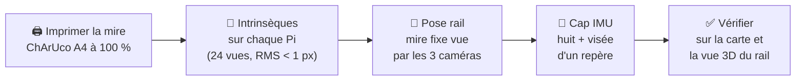
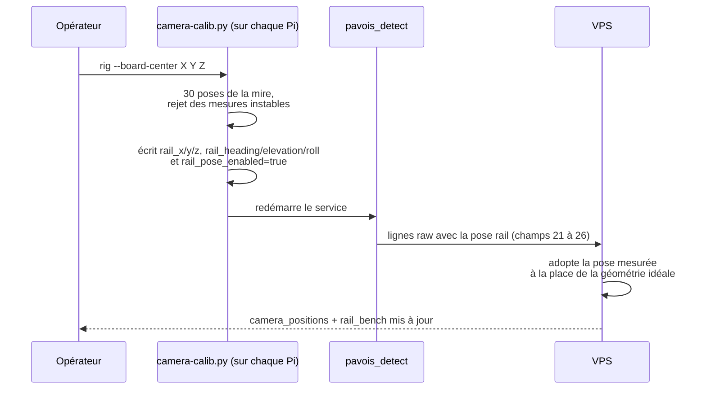
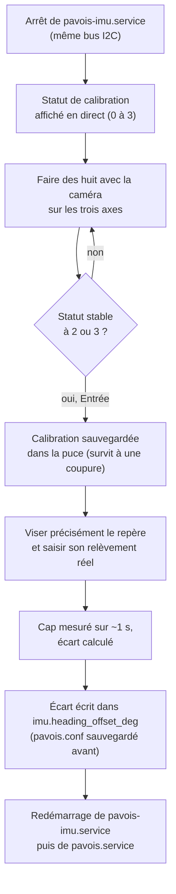

[← Les mathématiques](08-mathematiques.md) · [🏠 Accueil](README.md) · [Déploiement →](10-deploiement.md)

# 🎯 Calibration

> La triangulation ne vaut que ce que valent les rayons. Un rayon juste exige
> trois choses : **l'optique** de la caméra, **sa position** et **son
> orientation**. Cette page explique comment mesurer chacune.

| Quoi | Pourquoi | Outil | Fréquence |
|---|---|---|---|
| 🔭 Optique (intrinsèques) | Savoir dans quelle direction regarde chaque pixel | `camera-calib.py intrinsics` + mire ChArUco | Une fois par caméra, à refaire après tout changement d'objectif, de mise au point ou de résolution |
| 📏 Pose sur le rail | Position et orientation exactes de chaque caméra dans le repère du banc | `camera-calib.py rig` + mire ChArUco | Après tout déplacement d'une caméra sur le banc |
| 🧭 Cap de l'IMU | Aligner le nord de la puce sur l'axe de la caméra | `pavois_imu_calib.py` + un repère de relèvement connu | À l'installation, et si le cap dérive |
| 📍 Position GPS | Placer chaque caméra sur la carte (terrain) | Interface : formulaire de la barre latérale ou glisser-déposer | À chaque installation sur un site |



---

## 🏁 La mire

- Fichier : [`calibration/charuco-board-a4.html`](../calibration/charuco-board-a4.html),
  à imprimer en **A4 paysage à 100 %**.
- Vérifier au réglet que l'image mesure **245 × 175 mm**, puis la coller sur un
  support parfaitement **plat et rigide**.
- ChArUco **7 × 5**, dictionnaire `DICT_5X5_100`, cases de **35 mm**, marqueurs
  de **26 mm**. Ne pas changer ces dimensions sans modifier le script.

> [!TIP]
> Une ChArUco reste détectable même partiellement cachée ou coupée par le bord de
> l'image, contrairement à un damier classique. C'est ce qui permet de couvrir
> les coins de l'image, là où la distorsion est la plus forte.

## 🔭 L'optique de chaque caméra

Sur `jean`, `tanel`, puis `walid` :

```bash
sudo /usr/bin/python3 /opt/pavois/bin/camera-calib.py intrinsics
```

1. L'outil arrête `pavois.service` le temps de la mesure (un seul programme
   peut tenir la caméra), puis le relance. Il capture dans le **mode exact de
   production** (capteur 1920 × 1080, image traitée 1280 × 720).
2. Déplacer lentement la mire au centre, sur les bords et dans les coins, avec
   plusieurs inclinaisons.
3. Il choisit tout seul **24 vues distinctes** (14 au minimum), affiche sa
   progression et **refuse un résultat au-delà de 1 px RMS**.
4. Il écrit `fx`, `fy`, `cx`, `cy`, `k1`, `k2`, `p1`, `p2`, `k3` et le champ
   horizontal dans `/etc/pavois/pavois.conf`, après en avoir sauvegardé une copie.
5. Rapport : `/var/lib/pavois/camera-intrinsics-<id>.json`.

Ces valeurs partent ensuite dans chaque ligne `raw` : le VPS utilise l'optique
réelle de chaque caméra au lieu d'une focale déduite du champ de vision.

## 📏 La pose sur le rail

Placer la mire **verticale, immobile, visible par les trois caméras**. Mesurer
la position de son centre dans le repère du banc : **X vers la droite, Y devant
le rail, Z vers le haut**, en mètres. Sans bouger la mire, lancer sur chaque Pi :

```bash
sudo /usr/bin/python3 /opt/pavois/bin/camera-calib.py rig --board-center 0 2.5 0.4
```



- **Critère** : dispersion inférieure à **3 cm RMS** sur les 30 poses.
- Rapport : `/var/lib/pavois/camera-rail-pose-<id>.json`.
- Tant qu'une caméra n'est pas calibrée, le VPS utilise la géométrie idéale du
  banc V5 : `tanel` à gauche, `jean` au centre, `walid` à droite, environ 43 cm
  entre deux voisines, 20° d'élévation.

> [!WARNING]
> Une pose non calibrée laisse une erreur de reprojection d'environ 110 px sur le
> banc. C'est pour cela que `FUSION_MAX_RESIDUAL_PX` vaut 120 par défaut. Une
> fois les trois poses mesurées, le resserrer vers **25 px** pour éliminer les
> pistes fantômes.

## 🧭 Le cap de l'IMU

**Ne pas éditer `imu.heading_offset_deg` à la main.** L'outil guidé
`pavois_imu_calib` mesure et écrit l'écart lui-même, de façon reproductible
d'une Pi à l'autre.

Prérequis : `pavois-imu.service` installé (`scripts/setup_bno08x.sh`), un
**repère visuel** dont le relèvement réel depuis la caméra est connu (carte,
boussole, ou calcul GPS vers un point fixe), et `sudo` sur la Pi.

```bash
sudo /opt/pavois/imu-venv/bin/python /opt/pavois/pavois_imu_calib.py
```



- Pour **recaler seulement le cap** d'une caméra déjà calibrée, sans refaire les
  huit : `--skip-chip-calibration`.
- **Vérifier** dans l'interface : le bloc IMU de la caméra (barre latérale) doit
  afficher le relèvement visé, à quelques degrés près.

### Les autres réglages d'orientation

| Réglage | Quand l'utiliser |
|---|---|
| `imu.heading_sign=-1` | Le cône de la carte tourne à gauche quand la caméra tourne à droite |
| `imu.elevation_sign=-1` | La puce est montée à l'envers : l'élévation est inversée |
| `imu.elevation_offset_deg`, `imu.roll_offset_deg` | Petits écarts de montage constants |
| `imu.axis_map`, `imu.axis_sign` | **BNO055 seulement.** Écrits dans les registres de remappage d'axes de la puce. Un décalage d'angle ne peut pas corriger une puce montée à plat sur une Pi et sur la tranche sur une autre ; seul le remappage le peut. Ne changer les défauts (`0x24`, `0x00`) qu'après vérification physique du montage |

> [!NOTE]
> Les trois Pi actuelles portent une puce compatible **BNO08x** (`0x4a`), lue par
> `bno08x_bridge.py`. Ce lecteur ne remonte que le niveau de calibration du
> magnétomètre : le bloc IMU affiche par exemple `---3`.

## 📍 La position GPS (terrain)

Sur le terrain, chaque caméra se place sur la carte :

- **Formulaire** : bouton « modifier » sur la carte de la caméra, dans la barre
  latérale (latitude, longitude, altitude).
- **Glisser-déposer** : activer le déplacement des caméras sur la carte, puis
  les faire glisser.

Les positions sont envoyées au VPS (`PUT /cameras/:id/position`) et gardées dans
`cameras.json`. Elles ne sont **pas** recopiées dans la configuration des Pi :
c'est le VPS qui s'en sert pour trianguler.

> [!TIP]
> Pour rejouer une session enregistrée sur le banc rail, le VPS doit connaître
> la géométrie du rail et non celle du terrain.
> [`scripts/lib/pavois_bench_align_cameras.py`](../scripts/lib/pavois_bench_align_cameras.py)
> réécrit les trois positions autour de l'origine courante ; le
> [banc de rejeu](12-tests-et-outils.md#-banc-de-rejeu) l'appelle tout seul.

## 🧰 Outil hors ligne

[`calibration/calibrate.py`](../calibration/calibrate.py) calibre une caméra
**depuis un dossier de photos** d'un damier 10 × 7 (cases de 25 mm,
[`checkerboard-a4.html`](../calibration/checkerboard-a4.html)) et écrit
`camera_calibration.json` (matrice K, distorsion, champ). Pratique pour une
caméra qui n'est pas sur une Pi ; sur les Pi, préférer `camera-calib.py`.

---

[← Les mathématiques](08-mathematiques.md) · [🏠 Accueil](README.md) · [Déploiement →](10-deploiement.md)
