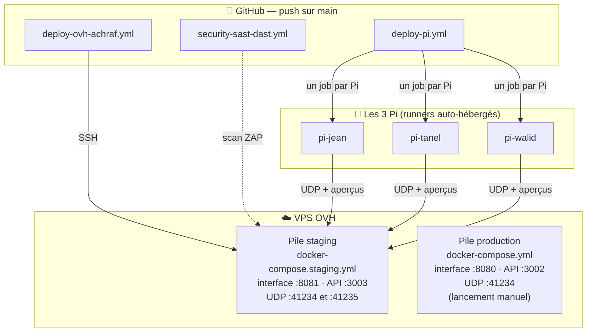
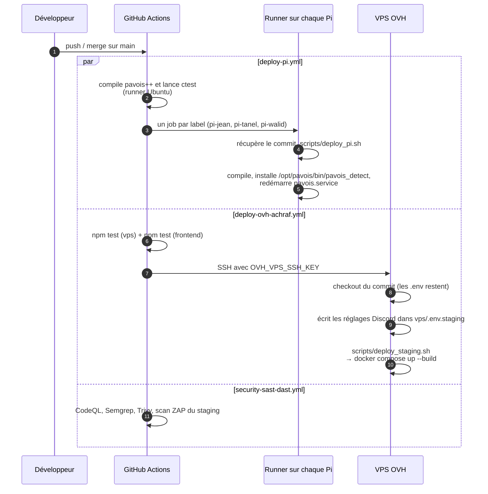
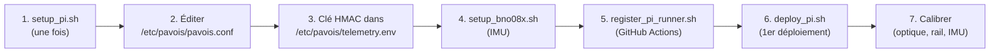

[← Calibration](09-calibration.md) · [🏠 Accueil](README.md) · [Sécurité →](11-securite.md)

# 🚀 Déploiement

> Un `git push` sur `main` suffit : les trois Pi recompilent leur détecteur, le
> VPS reconstruit ses conteneurs. Cette page explique ce qui se passe, comment
> installer une machine neuve, et quoi regarder quand ça coince.

---

## 🌍 Les environnements



| | Staging | Production |
|---|---|---|
| Fichier | `docker-compose.staging.yml` | `docker-compose.yml` |
| Déploiement | **automatique** à chaque push sur `main` | manuel : `./scripts/deploy_vps.sh` |
| Interface | port **8081** | port **8080** |
| API directe | port 3003 | port 3002 |
| UDP | 41234 et 41235 | 41234 |
| Variables | `vps/.env.staging` | `vps/.env` + `.env` à la racine |
| Volume de données | `pavois-staging-data` | `pavois-data` |

> [!IMPORTANT]
> Aujourd'hui, **les Pi visent la pile staging** du VPS OVH : leurs aperçus
> partent sur le port 8081 (`preview.http_port`). C'est donc elle qui sert
> d'environnement de travail réel.

## 🔁 Ce que fait un push sur `main`



- **Les déploiements des Pi sont indépendants** : une Pi éteinte ne bloque pas
  les autres. Elle recevra son job quand son runner se reconnectera.
- Les déploiements d'une même Pi sont **sérialisés** sans interrompre celui en
  cours ; GitHub peut remplacer un job en attente par un plus récent.
- Pour ne viser que certaines Pi : variable de dépôt
  `PI_RUNNERS = ["pi-tanel", "pi-walid"]`.
- Chaque workflow peut aussi être lancé à la main (`workflow_dispatch`).

## 🍓 Installer une Pi

Matériel : Raspberry Pi 4 ou 5 sous Debian 13 ARM64, caméra CSI, IMU en I2C.



**1. Préparer le système** (depuis une copie du dépôt, sous le compte de la Pi) :

```bash
sudo bash scripts/setup_pi.sh "$(id -un)"
```

Le script installe les dépendances (`cmake`, `rpicam-apps-lite`, `ffmpeg`,
`libssl-dev`, `i2c-tools`, OpenCV Python…), crée le compte de service `pavois`,
les dossiers `/opt/pavois/bin`, `/etc/pavois` et `/var/lib/pavois`, installe
`pavois.service` et la règle udev I2C, désactive l'ancien
`pavois-camstream.service`, et autorise le compte de déploiement à **redémarrer
uniquement** ce service via `sudo`. Le relancer est sans danger :
`/etc/pavois/pavois.conf` est conservé.

**2. Configurer** `/etc/pavois/pavois.conf` :

```ini
output_host=<adresse du VPS>
output_port=41234
camera.0.id=jean          # unique par Pi : jean, tanel, walid
camera.0.device=csi:0     # voir rpicam-hello --list-cameras
preview.http_port=8081    # 8081 = staging, 8080 = production
```

**3. Partager la clé HMAC** avec le VPS :

```bash
echo 'UDP_HMAC_SECRET=<la même clé que sur le VPS>' | sudo tee /etc/pavois/telemetry.env
sudo chown root:root /etc/pavois/telemetry.env && sudo chmod 600 /etc/pavois/telemetry.env
```

**4. Installer le lecteur d'IMU** (BNO08x) : `sudo bash scripts/setup_bno08x.sh`.
Il installe `pavois-imu.service` et règle `imu.kind=file`,
`imu.file=/run/pavois-imu/orientation`.

**5. Enregistrer le runner GitHub** : *Settings → Actions → Runners → New
self-hosted runner*, Linux ARM64, copier le jeton temporaire, puis :

```bash
bash scripts/register_pi_runner.sh pi-jean    # label unique par Pi
```

> [!WARNING]
> Chaque Pi doit avoir son **propre label**. Un label partagé enverrait le job à
> n'importe quel runner libre, pas à toutes les Pi. Et ne jamais exécuter de
> code de PR externe sur ces runners.

**6. Premier déploiement** : `bash scripts/deploy_pi.sh`. Le binaire est
compilé dans un dossier temporaire neuf, installé dans
`/opt/pavois/bin/pavois_detect`, puis le service redémarre. La configuration
n'est jamais écrasée.

**7. Calibrer** : voir [Calibration](09-calibration.md).

**Vérifier** :

```bash
systemctl is-active pavois.service
sudo journalctl -u pavois.service -f      # chercher « camera jean f=120 »
```

> [!TIP]
> `active` ne prouve pas que la caméra capture. La ligne `camera <id> f=120`
> dans le journal, si. Côté VPS, le journal affiche `Première trame raw pour jean`.

## 🐳 Installer le VPS

1. Installer Docker et Docker Compose, cloner le dépôt.
2. Créer les fichiers d'environnement :
   ```bash
   cp .env.example .env                 # production
   cp vps/.env.example vps/.env         # production
   cp vps/.env.staging.example vps/.env.staging   # staging (fait par deploy_staging.sh)
   ```
3. Renseigner au minimum :
   - **`WS_AUTH_TOKEN`** : un jeton secret long et aléatoire ;
   - **`NODE_ENV=production`** : sans lui, le serveur accepte un jeton absent
     (repli sur `dev-pavois-token`) ou une valeur d'exemple ;
   - **`UDP_HMAC_SECRET`** (et idéalement `UDP_REQUIRE_HMAC=true`) ;
   - **`ALLOWED_ORIGINS`** avec l'adresse exacte de l'interface (sinon le
     WebSocket est fermé en `Forbidden Origin`).
4. Lancer :
   ```bash
   ./scripts/deploy_vps.sh          # production
   ./scripts/deploy_staging.sh      # staging
   ```

Le détail de la pile Docker est aussi dans [`DEPLOYMENT.md`](../DEPLOYMENT.md).

### Les conteneurs

| Conteneur | Image | Contenu |
|---|---|---|
| `pavois-vps-server` / `pavois-vps-staging` | `node:22-alpine` + `python3` + `py3-opencv` | Le backend compilé et le classifieur Python. Tourne sous l'utilisateur `node` |
| `pavois-frontend-angular` / `pavois-frontend-staging` | nginx | L'interface compilée, `env.js` généré au démarrage, relais `/api` et `/ws` vers le backend |

Durcissement appliqué à **chaque** conteneur :

| Mesure | Effet |
|---|---|
| `read_only: true` | Système de fichiers en lecture seule ; seuls le volume `data` et des `tmpfs` sont inscriptibles |
| `cap_drop: ALL` | Aucune capacité noyau, sauf celles réajoutées une à une |
| `no-new-privileges` | Pas d'escalade de privilèges (setuid) |
| `mem_limit`, `cpus` | 512 Mo / 1 CPU pour le backend, 256 Mo / 0,5 CPU pour l'interface |
| `restart: unless-stopped` | Redémarrage automatique |

nginx résout le nom du backend **toutes les 10 s** (résolveur Docker) : un
redéploiement qui change l'adresse du conteneur ne laisse pas l'interface en
erreur 502.

### Durcir la machine

Trois scripts, à lancer dans l'ordre sur un VPS neuf :

| Script | Ce qu'il fait |
|---|---|
| `scripts/hardening-level1.sh` | Vérifie qu'une clé SSH est installée (anti-verrouillage), interdit root et les mots de passe en SSH, durcit le noyau (`sysctl`), pare-feu UFW en refus par défaut, propose CrowdSec |
| `scripts/hardening-level2.sh` | Applique et vérifie le durcissement Docker (isolation, non-root, lecture seule) |
| `scripts/hardening-level3.sh` | Audite la sécurité applicative : en-têtes Helmet, CORS, limitation de débit, validation, HMAC UDP |

## 🔐 Secrets et variables GitHub

*Settings → Secrets and variables → Actions*

| Nom | Type | Rôle |
|---|---|---|
| `OVH_VPS_SSH_KEY` | secret | Clé privée SSH du compte de déploiement sur le VPS |
| `OVH_VPS_HOST`, `OVH_VPS_USER`, `OVH_VPS_PORT`, `OVH_VPS_APP_DIR` | secrets | Où se connecter et dans quel dossier (valeurs par défaut dans le workflow) |
| `DISCORD_WEBHOOK_URL` | secret | Webhook Discord, écrit dans `vps/.env.staging` à chaque déploiement |
| `DISCORD_ENABLED`, `DISCORD_CATEGORIES`, `DISCORD_MAX_ALERTS_PER_MIN`, `DISCORD_MENTION_ROLE_ID`, `DISCORD_INCLUDE_POSITION`, `DISCORD_ENV_LABEL`, `OPERATOR_URL` | variables | Réglages Discord |
| `PI_RUNNERS` | variable | Liste JSON des Pi à déployer (par défaut les trois) |

Les secrets propres aux machines (`WS_AUTH_TOKEN`, `UDP_HMAC_SECRET`) restent
dans les fichiers `.env` du VPS et `telemetry.env` des Pi, **jamais dans le dépôt**.

## 🩹 Quand ça coince

| Symptôme | Cause probable | Où regarder |
|---|---|---|
| L'interface reste « hors ligne » | WebSocket fermé en `4003 Forbidden Origin` : l'adresse de la page n'est pas dans `ALLOWED_ORIGINS` | Journal du backend : `[WS] Connexion refusée : Origine non autorisée` |
| Fermeture `4001` | Jeton opérateur faux ou absent | Se reconnecter avec le bon `WS_AUTH_TOKEN` |
| Le backend s'arrête au démarrage | Avec `NODE_ENV=production` : `WS_AUTH_TOKEN` absent ou valeur d'exemple | Journal : `[BOOT] …` |
| Rien n'arrive d'une Pi | Mauvais `output_host`/`output_port`, pare-feu, ou paquets rejetés | Journal du backend : `Première trame raw pour <id>` ; `[HMAC REJET]` si `UDP_REQUIRE_HMAC=true` |
| `[HMAC REJET] … Anti-Replay` | Horloge de la Pi décalée de plus de 2 s (rejet seulement avec `UDP_REQUIRE_HMAC=true`) | `timedatectl` sur la Pi (le service attend la synchro NTP au démarrage) |
| Une caméra reste `EN_ATTENTE` puis `HORS_SERVICE` | La Pi n'envoie rien, ou son `camera.0.id` est inconnu | Journal : `Identifiant caméra inconnu` |
| `IMU file missing or stale` | `pavois-imu.service` arrêté ou en erreur | `systemctl status pavois-imu.service` |
| Les réglages ne s'appliquent pas | Pas de `UDP_HMAC_SECRET` sur la Pi ou sur le VPS | Journal de la Pi : `set command refused` ; panneau « Réglages » |
| `yuv420 capture refused, using mjpeg` | Largeur non multiple de 128 | Donner `camera.0.capture_stride`, ou rester en MJPEG |
| Pistes fantômes sur le banc | Poses non calibrées, seuil de 120 px trop large | [Calibration](09-calibration.md#-la-pose-sur-le-rail) |
| Erreur 502 de l'interface | Backend en redémarrage | `docker compose ps`, `docker logs pavois-vps-staging` |

---

[← Calibration](09-calibration.md) · [🏠 Accueil](README.md) · [Sécurité →](11-securite.md)
