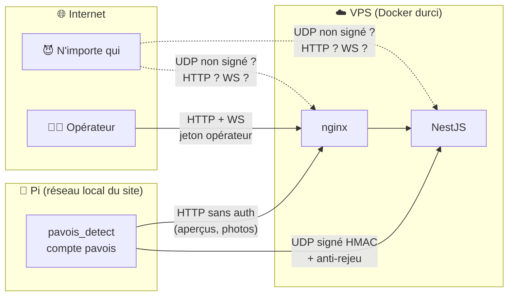
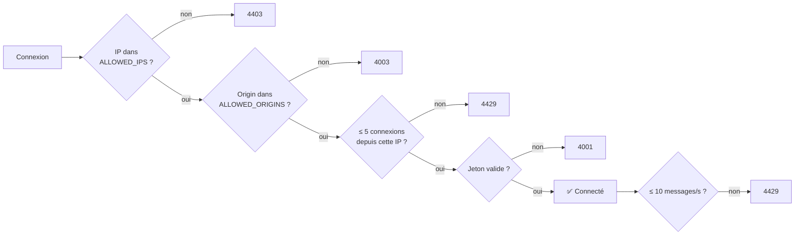

[← Déploiement](10-deploiement.md) · [🏠 Accueil](README.md) · [Tests et outils →](12-tests-et-outils.md)

# 🔒 Sécurité

> Un système de surveillance qu'on peut aveugler ou tromper ne surveille rien.
> Cette page dit **ce qui est protégé, comment, et ce qui ne l'est pas encore**,
> sans enjoliver.

---

## 🏰 Les frontières de confiance

## ✅ Ce qui est en place

### Le lien Pi ↔ VPS (UDP)

| Mesure | Détail | Code |
|---|---|---|
| **Signature HMAC-SHA256** | Chaque datagramme porte `horodatage ‖ HMAC(clé, horodatage ‖ ligne)` | `vps/src/udp/udp.service.ts`, `pavois++/src/transport/udp_sender.cpp` |
| **Anti-rejeu** | Refus si l'horodatage a plus de 2 s de retard ou 1 s d'avance | idem |
| **Comparaison à temps constant** | `timingSafeEqual` (Node), `CRYPTO_memcmp` (OpenSSL) | idem |
| **Commandes de réglage signées** | Un Pi sans clé refuse toute commande `set` | `udp_sender.cpp` |
| **Bornes côté Pi** | Chaque valeur reçue est bornée, chaque clé inconnue refusée | `pavois++/src/config/live_tuning.cpp` |
| **Clé hors du dépôt** | `/etc/pavois/telemetry.env` (root, 0600) sur les Pi, `.env` sur le VPS | — |

### L'API HTTP

| Mesure | Détail |
|---|---|
| **Jeton opérateur** | `Authorization: Bearer <jeton>` sur toutes les routes de l'interface (`AuthTokenGuard`) |
| **Identité de l'opérateur** | Un jeton de la forme `op:<nom>:<secret>` fait apparaître `<nom>` dans les acquittements ; sinon « opérateur-1 » |
| **En-têtes de sécurité** | Helmet |
| **CORS strict** | Seules les origines de `ALLOWED_ORIGINS` (jamais `*`) |
| **Validation** | DTO + `whitelist` + `forbidNonWhitelisted` : un champ inattendu fait échouer la requête |
| **Limitation de débit** | 100 requêtes par minute et par client |
| **Taille des corps** | JSON ≤ 32 Ko, aperçu ≤ 64 Ko, photo ≤ 1 Mo |
| **Liste blanche d'IP** | `ALLOWED_IPS` (optionnelle) |

### Le WebSocket

Contrôles appliqués à chaque connexion, dans l'ordre (`vps/src/realtime/events.gateway.ts`) :

Les seuls messages acceptés du navigateur sont des acquittements d'alerte,
attribués à l'opérateur authentifié.

### Les machines

| Où | Mesure |
|---|---|
| **Pi** | Détecteur sous un compte système `pavois` sans shell ; le compte de déploiement ne peut que **redémarrer** `pavois.service` via `sudo` ; pas de port entrant (le runner GitHub ouvre une connexion sortante) |
| **Conteneurs** | Lecture seule, `cap_drop: ALL`, `no-new-privileges`, mémoire et CPU limités, backend sous l'utilisateur `node` ([détail](10-deploiement.md#les-conteneurs)) |
| **VPS** | SSH par clé uniquement, root interdit, `sysctl` durci, UFW en refus par défaut, CrowdSec proposé (`scripts/hardening-level1.sh`) |
| **CI** | Clé SSH de déploiement en secret GitHub, connexion par clé uniquement |

### Les analyses automatiques

`security-sast-dast.yml` tourne à chaque push et PR sur `main`, et **chaque
lundi à 4 h UTC** :

| Outil | Type | Cible |
|---|---|---|
| **CodeQL** | Analyse statique | Le code du dépôt |
| **Semgrep** | Analyse statique | Le code, règles `auto`, sévérité ERROR |
| **Trivy** | Dépendances | Les paquets npm et autres |
| **OWASP ZAP** | Analyse dynamique (baseline) | L'interface staging en ligne |

## 🚧 Ce qui n'est pas encore protégé

Constaté dans le code au 5 octobre 2026. Chaque point est une piste de travail.

| # | Point faible | Conséquence | Piste |
|:-:|---|---|---|
| 1 | **`NODE_ENV` n'est défini nulle part** dans les fichiers de déploiement | Le refus des jetons d'exemple au démarrage est sauté ; un `WS_AUTH_TOKEN` absent retombe sur `dev-pavois-token`, et `staging-token-change-me` (copié depuis `vps/.env.staging.example` si le fichier manque) est accepté | Définir `NODE_ENV=production` dans les piles Docker, vérifier les jetons en place |
| 2 | **La signature UDP est facultative** tant que `UDP_REQUIRE_HMAC` n'est pas à `true` | Un paquet non signé est lu comme un paquet valide : n'importe qui peut injecter des détections ou de fausses pistes `obj…` | Mettre `UDP_REQUIRE_HMAC=true` une fois toutes les Pi équipées de la clé |
| 3 | **Aperçus et photos sans authentification** (`POST /preview`, `POST /classification/capture`) | N'importe qui peut pousser une image d'aperçu. Une fausse photo n'est acceptée que pendant un épisode ouvert, avec son `requestId` | Signer ces envois comme l'UDP |
| 4 | **HTTP en clair** sur les ports 8080/8081 | Le jeton opérateur et les données circulent sans chiffrement | Terminer TLS devant nginx (HTTPS, WSS) |
| 5 | **Un seul secret partagé** pour tous les opérateurs | Pas de révocation individuelle ; le nom dans `op:<nom>:<secret>` est déclaratif | Comptes nominatifs |
| 6 | **Jeton dans `localStorage` et dans l'URL du WebSocket** | Lisible par un script injecté ; peut apparaître dans des journaux de proxy | Cookie `HttpOnly` (déjà lu par la passerelle) |
| 7 | **Origines WebSocket non filtrées** si `ALLOWED_ORIGINS` est vide | Toute page web peut ouvrir la socket si elle connaît le jeton | Toujours renseigner `ALLOWED_ORIGINS` |
| 8 | **Semgrep et ZAP ne bloquent pas** (`\|\| true`, `fail_action: false`) | Une alerte de sécurité n'empêche pas un déploiement | Rendre bloquant après triage |

> [!IMPORTANT]
> Les points 1 et 2 se corrigent par **configuration**, sans toucher au code :
> `NODE_ENV=production` et `UDP_REQUIRE_HMAC=true`, avec un vrai
> `WS_AUTH_TOKEN` et un vrai `UDP_HMAC_SECRET` partagé avec les Pi.

## 🔑 Où vivent les secrets

| Secret | Où | Jamais dans |
|---|---|---|
| `WS_AUTH_TOKEN` | `vps/.env`, `vps/.env.staging` sur le VPS | le dépôt, l'image Docker |
| `UDP_HMAC_SECRET` | les mêmes `.env` + `/etc/pavois/telemetry.env` sur chaque Pi | le dépôt, `pavois.conf` |
| Webhook Discord | secret GitHub `DISCORD_WEBHOOK_URL`, recopié dans `vps/.env.staging` au déploiement | le dépôt |
| Clé SSH de déploiement | secret GitHub `OVH_VPS_SSH_KEY` | le dépôt |
| Jeton du runner GitHub | saisi une fois par `register_pi_runner.sh`, jamais affiché | partout ailleurs |

---

[← Déploiement](10-deploiement.md) · [🏠 Accueil](README.md) · [Tests et outils →](12-tests-et-outils.md)
