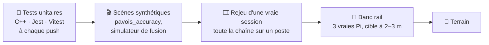
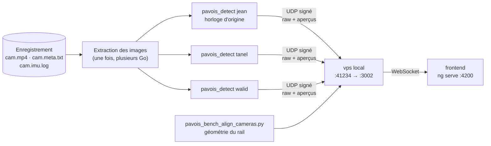

[← Sécurité](11-securite.md) · [🏠 Accueil](README.md) · [État et limites →](13-etat-et-limites.md)

# 🧪 Tests et outils

> On ne peut pas lancer un drone à chaque commit. PAVOIS se teste donc à quatre
> niveaux : **des tests unitaires**, **des scènes synthétiques notées**, **le
> rejeu de vols enregistrés** et **le banc rail**.



---

## 🧩 Lancer tous les tests

```bash
# Détecteur C++ (selftest + accuracy + csi)
cmake -S pavois++ -B build && cmake --build build
ctest --test-dir build --output-on-failure

# Backend
cd vps && npm install && npm test          # tests unitaires (Jest)
npm run test:e2e                            # démarre l'application et teste les routes

# Interface
cd frontend-angular && npm install && npm test   # Vitest
```

| Suite | Où | Quoi | En CI |
|---|---|---|---|
| `pavois_selftest` | `pavois++/tests/selftest.cpp` | Plus de 150 contrôles : algèbre, Kalman, opérations d'image, géométrie, triangulation, suivi, fusion, rejeu | ✅ `deploy-pi.yml` |
| `pavois_accuracy` | `pavois++/tests/accuracy.cpp` | Score de précision sur 16 scènes (voir plus bas) | ✅ `deploy-pi.yml` |
| `pavois_csi_test` | `pavois++/tests/csi_capture.cpp` | Découpage des images CSI, pixels, fin de flux | ✅ `deploy-pi.yml` |
| Jest | `vps/src/**/*.spec.ts` (30 fichiers) | Analyse des lignes UDP, fusion, triangulation, Kalman, classement, santé des caméras, alertes, Discord, réglages, banc rail, simulation | ✅ `deploy-ovh-achraf.yml` |
| Jest e2e | `vps/test/` | L'application complète et ses routes | — |
| Vitest | `frontend-angular/src/**/*.spec.ts` (6 fichiers) | Authentification, réglages, banc rail, qualité IMU… | ✅ `deploy-ovh-achraf.yml` |

Les tests se placent **à côté du fichier testé** (`fusion-kalman.ts` →
`fusion-kalman.spec.ts`).

## 🎬 Le score de précision synthétique

`pavois_accuracy` rend chaque scène dans trois caméras virtuelles (bruit,
dérive de lumière, distracteurs fixes), fait tourner **tout** le pipeline C++ et
le compare à la vérité terrain.

| Famille de scènes | Ce qu'elle éprouve |
|---|---|
| Bruit capteur, faible contraste | Le seuil adaptatif |
| Dérive de lumière, sauts d'exposition | Le retrait du biais et la gestion des sauts d'éclairage |
| Perte d'une caméra, deux caméras seulement | La fusion sans redondance |
| Cible rapide, cible en vol stationnaire | Le Kalman et la protection du fond |
| Cap mal calibré, distorsion de l'objectif | La robustesse aux erreurs de pose et d'optique |
| Trou d'occultation | La roue libre et la reprise d'identité |
| Géométrie lointaine, large ou serrée | La parallaxe |

Il note la **détection** (rappel, précision, centroïdes dans la tolérance), la
**fusion** (disponibilité, part des points à moins de 2 m et 5 m, précision
relative `1 − erreur/distance`), la **continuité** (un seul identifiant par
cible) et le **taux de fausses alarmes** sur une scène vide.

| Seuil (échec en CI si franchi) | Valeur |
|---|---|
| Score global | ≥ 85 % |
| Pire scène | ≥ 60 % |
| Fausses alarmes | ≤ 2 % |

Référence actuelle : **≈ 93 % global**, F1 de détection ≈ 99 %, erreur 3D moyenne
≈ 1,7 m vers 25 m, 0 % de fausse alarme. Ajouter une scène :
`pavois++/tests/scene_sim.hpp` et `pavois++/tests/accuracy.cpp`.

## 🎲 Le simulateur de fusion (VPS)

`vps/src/fusion/simulation/fusion-sim.ts` génère des observations à partir de
trajectoires connues et les fait passer **dans le vrai `FusionService`**. Il
mesure l'erreur, les faux points, les changements d'identifiant et la part du
temps couverte. Ses tests (`fusion-sim.spec.ts`) vérifient entre autres :

- un passage en ligne droite garde **un seul identifiant** ;
- une orbite rapide (12 m/s sur 6 m de rayon) est suivie ;
- deux cibles simultanées restent **séparées** ;
- la piste survit quand une caméra perd la cible ;
- les fausses taches sont rejetées quand le seuil de résidu correspond à la calibration.

## 📼 Banc de rejeu

`scripts/pavois_replay_bench.sh` monte **toute la chaîne sur un seul poste** à
partir d'une session enregistrée sur le banc, sans toucher aux Pi.



```bash
scripts/pavois_replay_bench.sh --recording /chemin/rec-AAAAMMJJ-HHMMSSZ-auto
```

| Option | Rôle |
|---|---|
| `--from`, `--duration` | Fenêtre de temps à rejouer |
| `--width`, `--height`, `--fov` | Taille d'image et champ de vision |
| `--pose jean=cap,élévation,roulis` | Forcer une pose ajustée pour une caméra |
| `--preview-fps` | Cadence des aperçus |
| `--skip-frontend` | Ne pas lancer l'interface |
| `--work-dir`, `--keep-frames` | Dossier de travail, garder les images extraites |

Chaque `pavois_detect` rejoue **une caméra** sur son **horloge de capture
d'origine** (`FrameWallClock` de chaque image), exactement comme une Pi : le VPS
fait la fusion entre caméras. Tous les processus lancés sont arrêtés à la sortie.

## 🧠 Classifieur de pistes appris

Le classement par le mouvement ([La fusion 3D](04-fusion-3d.md#-classer-par-le-mouvement))
est une heuristique. Deux scripts permettent d'apprendre les mêmes entrées à
partir de **vols réels** :

```bash
# 1. sessions enregistrées → tableur (avec des exemples d'oiseaux et d'avions synthétiques)
scripts/pavois_extract_features.py /chemin/rec-... --label drone \
    --synth-birds 120 --synth-airplanes 120 --out dataset.xlsx

# 2. tableur → modèle
scripts/pavois_train_classifier.py dataset.xlsx --out model.joblib

# 3. plus tard : ajouter une session puis réentraîner
scripts/pavois_extract_features.py /chemin/nouveau-rec --label drone --append --out dataset.xlsx
scripts/pavois_train_classifier.py dataset.xlsx --out model.joblib
```

Les colonnes d'entraînement sont **sans échelle** (vitesses angulaires, part de
vol stationnaire, rectitude, dynamique de la silhouette) : elles restent valables
tant que les poses du banc ne sont pas calibrées. `altitude_m` et `speed_mps` sont
écrites pour lecture mais **exclues de l'entraînement**.

> [!NOTE]
> Ce modèle s'entraîne et s'évalue hors ligne. Il n'est pas encore branché dans
> le VPS, qui utilise toujours `fusion-classify.ts`.

## 🔍 Déboguer en direct

| Outil | Usage |
|---|---|
| `pavois_detect --debug-dir DIR` | Écrit image brute, masque et superposition toutes les 15 images |
| `observation_log=<préfixe>` (config) | Une ligne CSV par image traitée et par caméra : tache, confirmation, qualité, SNR, candidates |
| `UDP_VERBOSE=true` (VPS) | Journalise chaque paquet reçu |
| `GET /api/fusion` | État complet du moteur : caméras actives, dernière fusion et motif de refus, pistes |
| Bouton « rayons bruts » de la carte | Un rayon par détection : des rayons qui convergent = cible probable ; qui divergent = cap de caméra mal réglé |
| Page « Test rail » | Croisements bruts, pistes en 3D, verdict des photos, réglages à chaud côte à côte |
| `FUSION_RECORD_PATH` + `fusion-replay.js` | Enregistrer les observations puis les rejouer hors ligne avec une vérité terrain ([détail](04-fusion-3d.md#-enregistrer-et-rejouer)) |
| `pavois_detector_bench` | Mesure le temps du détecteur |
| `pavois_gen_scene DIR N` | Génère une scène synthétique à 3 caméras et sa configuration, rejouable par `pavois_detect` |

## 🧰 Autres outils du dépôt

| Dossier / fichier | Rôle |
|---|---|
| `pi/pavois_web.py`, `pi/camstream.sh` | Page web de banc (flux MJPEG + IMU de chaque Pi, ports 8080 et 8081 **de la Pi**). Ils utilisent la caméra : **incompatibles** avec `pavois.service` en marche |
| `mounts/` | Supports caméra et banc rail V5 : sources OpenSCAD, STL, projets 3MF, scripts de vérification et de découpe ([README](../mounts/README.md)) |
| `animation/` | Film de présentation sous Blender, scripts reproductibles (V1, V2, V3) ([README](../animation/README.md)) |
| `scripts/pavois_camera_calib.py`, `scripts/pavois_imu_calib.py` | Calibration ([page dédiée](09-calibration.md)) |

---

[← Sécurité](11-securite.md) · [🏠 Accueil](README.md) · [État et limites →](13-etat-et-limites.md)
