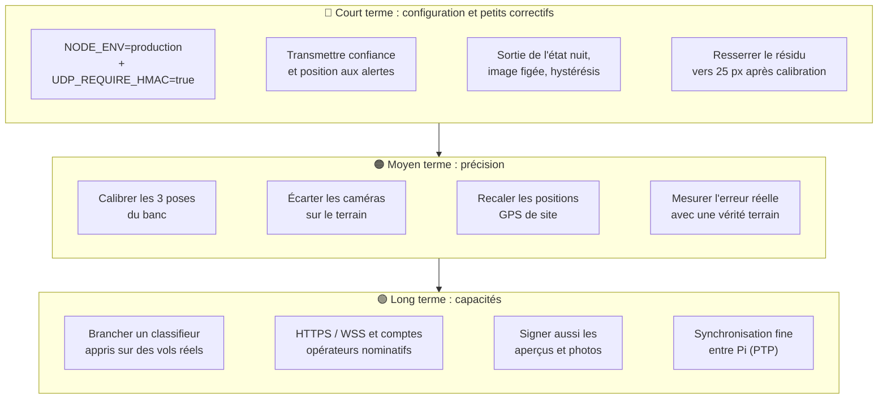

[← Tests et outils](12-tests-et-outils.md) · [🏠 Accueil](README.md) · [Glossaire →](glossaire.md)

# 🧭 État et limites

> Ce qui marche, ce qui ne marche pas encore, et pourquoi. Tout ce qui suit a été
> **vérifié dans le code le 5 octobre 2026** (commit `fea07b6`). Quand un point
> est corrigé, retirer sa ligne dans le même commit.

---

## ✅ Ce qui fonctionne aujourd'hui

| Domaine | État |
|---|---|
| **Chaîne complète** | Trois Pi capturent, détectent et envoient ; le VPS fusionne, suit, classe, alerte ; l'interface affiche tout en direct |
| **Détection** | Soustraction de fond adaptative, plusieurs taches par image, confirmation 2 sur 3, 20 à 30 i/s mesurées sur Pi 4 |
| **Transport** | UDP signé HMAC-SHA256 avec anti-rejeu, dans les deux sens |
| **Fusion** | Grille de temps à la cadence caméra, interpolation, association multi-cibles, test anti-fantôme, triangulation pixel avec covariance, RANSAC simplifié |
| **Suivi** | Kalman 3D à vitesse constante, portes physique et statistique, reprise d'identité |
| **Classement** | Heuristique cinématique sur chaque piste ; photos des trois Pi et vote 2 sur 3 |
| **Exploitation** | Santé des caméras, fiabilité globale, alertes évolutives, acquittement, Discord, réglages à chaud avec préréglages |
| **Calibration** | Outils guidés pour l'optique, la pose rail et le cap de l'IMU |
| **Outillage** | Score de précision synthétique en CI, simulateur de fusion, banc de rejeu de sessions réelles, banc rail 3D |
| **Livraison** | Déploiement automatique des Pi et du VPS à chaque push sur `main`, analyses de sécurité hebdomadaires |

## 🚦 Limites de conception

Ce sont des limites **assumées** de l'approche actuelle, pas des bugs.

### Voir

- **Différence de fond** : ombres, vibrations du support, feuillage et nuages
  qui bougent restent des sources de fausses taches. De nuit, la caméra voit peu.
- **Une seule caméra ne donne pas de profondeur.** Il faut au moins deux caméras
  qui voient la cible au même tick ; avec une caméra valide, le système est
  « aveugle » (direction seulement).

### Mesurer

- **La base du banc est courte** (≈ 43 cm entre deux caméras voisines). L'erreur
  en profondeur croît comme le carré de la distance : quelques centimètres à
  2,5 m, une dizaine de mètres à 25 m (voir
  [l'ordre de grandeur](08-mathematiques.md#57-ordre-de-grandeur-de-la-précision)).
  Pour le terrain, il faut **écarter les caméras**.
- **L'orientation domine l'erreur.** 0,5° d'erreur de cap vaut déjà ≈ 9 px, six
  fois le bruit du centroïde. La qualité de l'IMU et de sa calibration compte
  plus que celle du détecteur.
- **Synchronisation par NTP.** Les images sont datées à la capture
  (`FrameWallClock`), mais la cohérence entre Pi dépend de leur synchronisation
  NTP.
- **Seuil de reprojection large** (120 px) tant que les poses ne sont pas
  calibrées : il laisse passer des croisements douteux.

### Situer

- **Positions GPS de site par défaut.** Celles de `jean` et `tanel` sont à
  environ 1 m l'une de l'autre : sur le terrain, il faut les recaler depuis
  l'interface. Les positions réglées ne sont pas recopiées dans les Pi.
- **L'origine du repère est figée** à la première observation géolocalisée,
  jusqu'au redémarrage du VPS.

### Classer

- **Heuristique non calibrée.** Les seuils de vitesse, d'accélération et
  d'altitude sont réglés à la main ; une alerte « drone » peut partir sur un
  faux positif, et un vrai drone lent peut passer pour un oiseau.
- **Le classifieur photo est prudent** (veto « personne » d'OpenCV, puis zone
  de mouvement nette) : ce n'est pas un détecteur de drone appris.
- **Le modèle appris sur les vols** (`pavois_train_classifier.py`) n'est pas
  branché dans le VPS.

### Passer à l'échelle

- **Une seule instance du VPS**, état en mémoire. Plusieurs instances derrière un
  répartiteur demanderaient un bus partagé (Redis…) pour la diffusion.
- **Pas d'agrégation** : à forte cadence, chaque détection est diffusée.

## 🐛 Écarts repérés dans le code

Des comportements qui ne font **pas** ce que leur code ou leur documentation
laisse attendre. Chaque ligne indique où regarder.

| # | Écart | Effet | Où |
|:-:|---|---|---|
| 1 | Le chemin UDP passe à `AlertsService` le numéro et la classe de la piste, **sans sa confiance ni sa position** | La confiance par défaut (0,5) s'applique : chaque piste ouvre une alerte `TO_VERIFY`, **`DRONE_CONFIRMED` n'est jamais atteint** par une piste fusionnée, et Discord ne reçoit ni alerte drone ni position | `recordAndAlertTrack()` dans `vps/src/udp/udp.service.ts` ; `FusionTrackUpdate` ne porte pas la confiance |
| 2 | **Aucune sortie automatique** de `REDUCED_VISIBILITY_NIGHT` vers `OK` | Après une baisse de lumière collective, la caméra reste « visibilité réduite » jusqu'à un silence ou un masque | `evaluateCameraHealth()` dans `vps/src/cameras/camera-health.service.ts` |
| 3 | `DEGRADED_FROZEN` n'est **jamais déclenché** ; `CAMERA_FROZEN_SECONDS`, `CAMERA_BLIND_SECONDS` et `CAMERA_RECOVERY_SECONDS` sont lus mais **inutilisés** | Pas de détection d'image figée ; le retour à `OK` se fait au contrôle suivant, sans hystérésis | idem |
| 4 | Le message Discord « caméra rétablie » attend un état précédent `HORS_SERVICE` ou `DEGRADED_BLIND`, mais on n'arrive à `OK` que depuis `RECOVERING` | Le message de rétablissement ne part jamais | `processCameraStateChange()` dans `vps/src/alerts/alerts.service.ts` |
| 5 | Les scénarios de `SimulationService` ne sont **exposés par aucune route** | `SIMULATION_MODE=true` ouvre une socket mais rien ne déclenche les scénarios | `vps/src/bench/simulation.service.ts` |
| 6 | `NODE_ENV` n'est **défini nulle part** dans les déploiements | Le refus des jetons d'exemple est sauté ; jeton de repli `dev-pavois-token` | [Sécurité](11-securite.md#-ce-qui-nest-pas-encore-protégé), point 1 |
| 7 | La signature UDP est **facultative** sans `UDP_REQUIRE_HMAC=true` | Paquets non signés acceptés | [Sécurité](11-securite.md#-ce-qui-nest-pas-encore-protégé), point 2 |
| 8 | En développement, `ng serve` ne relaie que `/api`, pas `/ws` | Le temps réel ne se connecte pas tout seul contre un `vps` local | `frontend-angular/proxy.conf.json` ([contournement](06-interface-operateur.md#-développer-sans-les-pi)) |

## 🔮 Pistes, par ordre d'impact

---

[← Tests et outils](12-tests-et-outils.md) · [🏠 Accueil](README.md) · [Glossaire →](glossaire.md)
