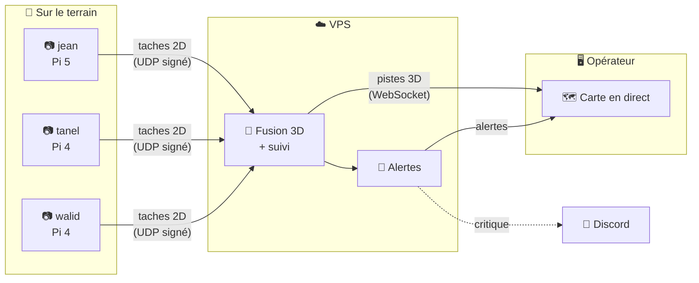
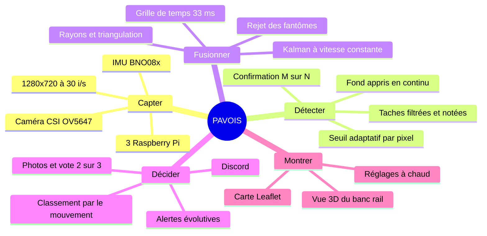

# 📚 Documentation PAVOIS

> **P.A.V.O.I.S.** : trois caméras ordinaires, trois Raspberry Pi et un serveur
> qui transforment de simples pixels en mouvement en **position 3D d'un drone**,
> suivie en direct sur une carte.

Cette documentation décrit le système **tel qu'il est dans le code aujourd'hui**.
Elle a été réécrite de zéro et vérifiée contre la branche `main` le
**5 octobre 2026** (commit `fea07b6`). Les anciens documents, devenus faux, ont
été supprimés. Ils restent consultables dans l'historique Git. Les livrables non
techniques (cadrage, marché, film) sont rangés dans les [annexes](annexes/).

---

## 🧭 Par où commencer ?

| Tu es… | Lis d'abord | Puis |
|---|---|---|
| 👋 **Nouveau sur le projet** | [Découvrir PAVOIS](01-decouvrir-pavois.md) | [Architecture](02-architecture.md) |
| 🔧 **Dev du détecteur C++** | [Le détecteur sur les Pi](03-detecteur-pi.md) | [Protocoles](07-protocoles.md), [Tests](12-tests-et-outils.md) |
| 🧮 **Curieux de la géométrie** | [Les mathématiques](08-mathematiques.md) | [La fusion 3D](04-fusion-3d.md) |
| 🖧 **Dev backend NestJS** | [Le serveur VPS](05-serveur-vps.md) | [La fusion 3D](04-fusion-3d.md), [Protocoles](07-protocoles.md) |
| 🎨 **Dev frontend Angular** | [L'interface opérateur](06-interface-operateur.md) | [Protocoles](07-protocoles.md) (événements WebSocket) |
| 🚀 **En charge du déploiement** | [Déploiement](10-deploiement.md) | [Sécurité](11-securite.md) |
| 📐 **Sur le terrain avec une mire** | [Calibration](09-calibration.md) | [Le détecteur sur les Pi](03-detecteur-pi.md) |
| 🧭 **Pour savoir ce qui marche vraiment** | [État et limites](13-etat-et-limites.md) | — |

## 📑 Plan de la documentation

| # | Page | Ce que tu y trouves |
|:-:|---|---|
| 01 | [Découvrir PAVOIS](01-decouvrir-pavois.md) | Le problème, l'idée des rayons qui se croisent, le matériel, les chiffres clés, l'historique |
| 02 | [Architecture](02-architecture.md) | Les trois composants, le réseau et ses ports, le voyage d'une détection, les décisions d'architecture |
| 03 | [Le détecteur sur les Pi](03-detecteur-pi.md) | `pavois++` : capture, détection de mouvement, IMU, messages émis, réglages à chaud |
| 04 | [La fusion 3D](04-fusion-3d.md) | Grille de temps, alignement, association, triangulation, Kalman, classement par le mouvement |
| 05 | [Le serveur VPS](05-serveur-vps.md) | NestJS : modules, santé des caméras, alertes, Discord, photos de la cible, stockage |
| 06 | [L'interface opérateur](06-interface-operateur.md) | Angular : écrans, composants, flux temps réel, serveur mock |
| 07 | [Protocoles](07-protocoles.md) | Référence de chaque ligne UDP, signature HMAC, routes HTTP, événements WebSocket |
| 08 | [Les mathématiques](08-mathematiques.md) | Repère ENU, modèle de caméra, distorsion, triangulation, covariance, Kalman, GPS |
| 09 | [Calibration](09-calibration.md) | Optique (ChArUco), pose sur le rail, cap de l'IMU |
| 10 | [Déploiement](10-deploiement.md) | Installation des Pi, Docker sur le VPS, CI/CD GitHub Actions, variables d'environnement |
| 11 | [Sécurité](11-securite.md) | Ce qui est protégé, comment, et ce qui ne l'est pas encore |
| 12 | [Tests et outils](12-tests-et-outils.md) | Tests unitaires, score de précision synthétique, banc de rejeu, simulateur, classifieur |
| 13 | [État et limites](13-etat-et-limites.md) | Ce qui fonctionne, les limites connues (vérifiées), les pistes d'amélioration |
| 📖 | [Glossaire](glossaire.md) | Tous les mots du projet, de *blob* à *watermark* |

## 🧠 Le projet en un coup d'œil

## 📝 Conventions de cette documentation

- **Langue** : français, comme le code commenté du projet. Les noms de code
  (`FusionService`, `raw`, `camera_positions`…) restent tels quels.
- **Repère** : toujours **ENU** (x = Est, y = Nord, z = Haut), en mètres. Le cap
  se compte depuis le Nord, dans le sens des aiguilles d'une montre.
- **Temps** : les horodatages des Pi sont en **microsecondes Unix** (`_us`), ceux
  du VPS en millisecondes (`Ms`).
- **Liens vers le code** : chemins relatifs à la racine du dépôt, par exemple
  `vps/src/fusion/fusion.service.ts`.
- **Encadrés** : `NOTE` pour le contexte, `TIP` pour les astuces, `WARNING` pour
  les pièges, `IMPORTANT` pour ce qu'il ne faut surtout pas rater.

> [!TIP]
> **Garder cette doc vraie.** Quand une PR change un comportement décrit ici
> (un message UDP, une route, un réglage, une valeur par défaut), elle met à
> jour la page concernée dans le même commit. Une doc fausse est pire qu'une
> doc absente.

## 📎 Documentation voisine

- [`README.md`](../README.md) à la racine : lancer chaque composant en deux commandes.
- [`vps/README.md`](../vps/README.md) : l'organisation du code serveur, dossier par dossier.
- [`pavois++/README.md`](../pavois++/README.md) et [`pavois++/DEPLOYMENT_PI.md`](../pavois++/DEPLOYMENT_PI.md) : le détecteur et son installation sur une Pi.
- [`calibration/CALIBRATION-PLAN.md`](../calibration/CALIBRATION-PLAN.md) : la procédure ChArUco pas à pas.
- [`mounts/README.md`](../mounts/README.md) : les supports imprimés en 3D et le banc rail V5.
- [`DEPLOYMENT.md`](../DEPLOYMENT.md) : la pile Docker du VPS.
- [Annexes](annexes/) : cadrage, étude de marché, analyses HTML, scénarios du film.
