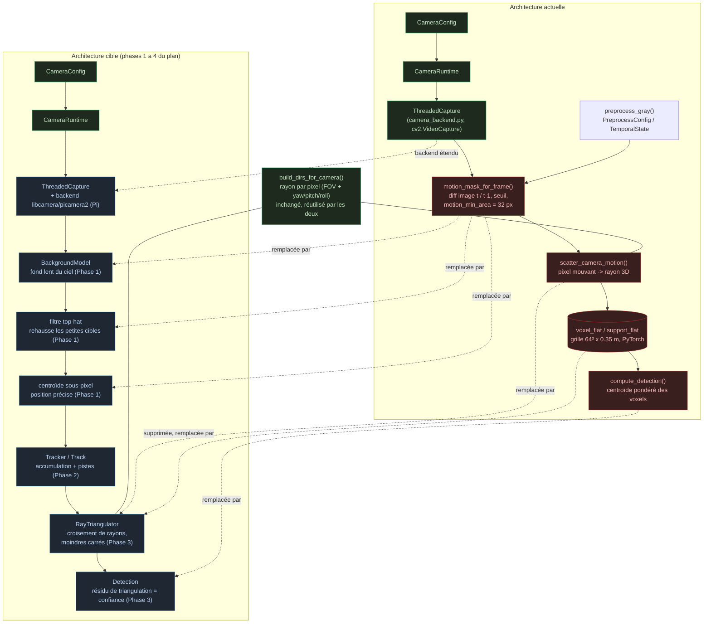

# Architecture d'implémentation

Ce fichier décrit l'organisation actuelle du code et la frontière d'intégration
entre le moteur de détection et l'interface.

## Organisation du dépôt

```text
Pavois/
  README.md
  PLAN.md
  documentation/
  frontend/
  pixeltovoxelprojector/
```

## Prototype de détection

Emplacement : `pixeltovoxelprojector/`

### `ray_voxel.cpp`

Implémentation C++ par lot.

Responsabilités :

- Lire les métadonnées JSON.
- Charger les images en niveaux de gris avec `stb_image`.
- Calculer le mouvement entre deux images.
- Générer les rayons depuis les pixels changés.
- Appliquer la rotation yaw/pitch/roll.
- Parcourir une grille voxel avec DDA.
- Accumuler la preuve de mouvement.
- Écrire `voxel_grid.bin`.
- Écrire `voxel_grid_meta.json`.

Commande :

```text
ray_voxel <metadata.json> <dossier_images> <sortie_voxel_bin>
```

Format binaire produit :

```text
int32 N
float32 voxel_size
float32 voxel_grid[N * N * N]
```

### `capture_single_camera.py`

Capture des images et produit les métadonnées pour le chemin C++.

Options importantes :

- `--frames`
- `--width`
- `--height`
- `--fov`
- `--yaw`
- `--pitch`
- `--roll`
- `--cam-x`, `--cam-y`, `--cam-z`
- `--grid-n`
- `--voxel-size`
- `--grid-center`
- `--gaussian`, `--bilateral-d`, `--temporal`

La sortie utilise de préférence le format JSON enveloppé :

```json
{
  "frames": [],
  "voxel_grid": {
    "N": 72,
    "voxel_size": 0.35,
    "grid_center": [0.0, 10.0, 5.0]
  }
}
```

### `realtime_voxel_preview.py`

Prévisualisation en direct avec OpenCV et PyTorch.

Responsabilités :

- Capturer des images depuis une webcam.
- Construire un masque de mouvement.
- Pré-calculer les directions de rayons.
- Accumuler les rayons dans un tenseur voxel PyTorch.
- Utiliser CUDA si disponible.
- Afficher l'image caméra annotée et les projections voxel.

Ce fichier est aujourd'hui le plus utile pour les essais interactifs, car il
expose beaucoup de paramètres de réglage.

### `setup.py` et `process_image.cpp`

Ces fichiers construisent une extension pybind11 nommée `process_image_cpp`. Ils
semblent hérités du projet pixel-vers-voxel original et ne constituent pas le
chemin principal du prototype PAVOIS actuel.

## Schéma de l'architecture du moteur de détection (actuel vs futur)

Le diagramme suivant montre les classes et fonctions principales de
`realtime_multi_voxel_preview.py`, et comment elles évoluent avec les phases du
[plan de détection de drones lointains](../plan-detection-drones.md). Les
flèches en pointillé relient un bloc actuel au bloc qui le remplace.



Légende :

- **Rouge** : code actuel qui sera remplacé ou supprimé (`motion_mask_for_frame`,
  `scatter_camera_motion`, la grille de voxels, `compute_detection`).
- **Vert** : code qui reste tel quel ou presque (`CameraConfig`, `CameraRuntime`,
  `build_dirs_for_camera`).
- **Bleu** : nouveaux blocs introduits par le plan (`BackgroundModel`, filtre
  top-hat, centroïde sous-pixel, `Tracker`, `RayTriangulator`, `Detection`,
  backend caméra Pi).

PyTorch (`import torch`, la grille `voxel_flat`/`support_flat`) disparaît avec
la suppression des voxels en Phase 3, ce qui permet le passage CPU-only visé en
Phase 4 sur Raspberry Pi.

Pour visualiser ce schéma : GitHub et l'extension VS Code « Markdown Preview
Mermaid Support » le rendent directement à l'ouverture du fichier. Pour
l'exporter en image, coller le bloc dans
[mermaid.live](https://mermaid.live) et exporter en PNG/SVG.

## Frontend

Emplacement : `frontend/`

Technologies :

- React
- TypeScript
- Vite
- Zustand
- Cesium
- Tailwind tooling

### `frontend/src/App.tsx`

Structure principale de l'application.

Vues :

- `live` : vue surveillance avec carte, panneau caméras, détails piste et
  alertes.
- `deploy` : vue de déploiement et couverture.
- `replay` : vue post-événement.

### `frontend/src/sim/pavoisSim.ts`

Source de données de simulation pour l'interface.

Contient :

- Liste des caméras.
- Pistes sous forme de waypoints.
- Alertes.
- Journal d'événements.
- Interpolation de position.
- Génération de traînée.
- Estimation de vitesse.
- Prédiction.
- Sélection des caméras détectrices.
- Heuristique de confiance.
- Polygone de couverture.

### `frontend/src/components/MapViewer.tsx`

Visualisation Cesium.

Responsabilités :

- Initialiser le viewer Cesium.
- Convertir la grille de simulation vers des coordonnées géographiques.
- Dessiner les secteurs de couverture.
- Dessiner les caméras.
- Dessiner les pistes, traînées, vecteurs de vitesse et prédictions.
- Dessiner les frustums de caméras ajoutées par l'utilisateur.
- Fournir des contrôles zoom, home et 2D/3D.

### `frontend/src/components/IsometricMap.tsx`

Vue tactique canvas.

Responsabilités :

- Dessiner la grille de simulation 24 par 24.
- Dessiner les cônes de couverture.
- Dessiner les pistes, prédictions et marqueurs caméra.
- Gérer les zones cliquables.

### `frontend/src/components/DeploymentView.tsx`

Tableau de déploiement et synthèse de couverture.

Calcule une aire approximative :

```text
aire = pi * portée^2 * (fov / 360)
```

Ce chiffre est utile pour la simulation UI. Il ne doit pas être présenté comme
un modèle de couverture validé.

### `frontend/src/components/ReplayView.tsx`

Replay post-événement.

Responsabilités :

- Rejouer les pistes simulées selon une barre de temps.
- Afficher les événements visibles jusqu'au temps courant.
- Afficher les badges de confiance des pistes.

## Gestion d'état

Stores Zustand actuels :

- `simStore.ts` : thème, vue, horloge de simulation, sélection, overlays et
  acquittement des alertes.
- `cameraStore.ts` : caméras géographiques ajoutées par l'utilisateur.
- `mapStore.ts` : référence Cesium et callback de clic carte.

## Couche manquante

Le dépôt ne contient pas encore de backend de production reliant le moteur de
détection à l'interface.

Architecture future proposée :

```text
moteur de détection
  -> extraction de mesures
  -> gestionnaire de pistes
  -> API backend
  -> flux WebSocket frontend
```

Exemple d'événement futur :

```json
{
  "type": "track_update",
  "track_id": "TRK-001",
  "timestamp": "2026-05-18T12:00:00Z",
  "position_enu_m": [12.4, 81.2, 24.0],
  "velocity_mps": [2.0, -1.1, 0.4],
  "confidence": 0.78,
  "supporting_cameras": ["CAM-01", "CAM-03"]
}
```

