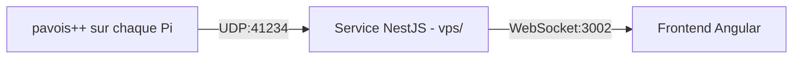

# Intégration UDP vers Frontend (WebSockets)

Ce document décrit l'architecture, le protocole de parsing et la sécurisation
du pont entre les détections UDP (Pi / `pavois++`) et le frontend
(`frontend-angular/`), via le service `vps/`.

> Fusionne l'ancien `UDP_INTEGRATION.md` et `UDP_INTEGRATION_REPORT.md`, tous
> deux à la racine du dépôt et partiellement obsolètes (références à
> l'ancien frontend React/Cesium, ports erronés). Vérifié contre le code
> actuel le 11/09/2026.

---

## 1. Vue d'ensemble de l'architecture

1. **Source (`pavois++`)** : chaque Pi émet ses détections et son attitude IMU
   via UDP, sans connexion.
2. **Passerelle (`vps/`, NestJS)** : écoute UDP, valide/parse, convertit en
   JSON et diffuse en WebSocket.
3. **Frontend (`frontend-angular/`)** : `RealtimeService` se connecte en
   WebSocket à la passerelle et reçoit les événements au fil de l'eau, avec
   reconnexion automatique en cas de coupure.

---

## 2. Format des messages UDP & événements WebSocket émis

### A. Détections 2D brutes (caméras)
* **Format UDP (CSV)** : `raw,cameraId,frameIndex,timestamp,x,y,size,confidence`
  suivi optionnellement de `heading,elevation,roll,fx,fy,cx,cy,fov,k1,k2,p1,p2,k3`
  puis de la pose rail calibrée `x,y,z,heading,elevation,roll`.
* `timestamp` est en microsecondes Unix. Pour les caméras CSI, il provient du
  `FrameWallClock` libcamera associé à l'image avant décodage MJPEG.
* **Exemple** : `raw,cam0,275,19128667926,551.93,638.21,2619,0.986`
* **Événement WS** : `"raw_detection"`

### B. Pistes GPS (triangulation)
* **Format UDP (CSV)** : `trackId,latitude,longitude,altitude,timestamp` (trackId commençant par `obj`)
* **Exemple** : `obj2,48.8260444,2.3659956,34.78,1782465675417840`
* **Événement WS** : `"track_update"`

### C. Attitude IMU (orientation live)
* **Format UDP (CSV)** : `att,cameraId,timestamp,heading_deg,elevation_deg,roll_deg,calib,valid`
* **Exemple** : `att,jean,1782465675417840,164.20,-1.50,0.30,3313,1`
* **`calib`** : 4 caractères `SGAM` (sys, gyro, accel, mag), niveau 0-3 ou `-` si inconnu.
  * BNO08x (`scripts/bno08x_bridge.py`) : seule la précision magnétomètre est connue, ex. `---3`.
* **`valid`** : `1` = angles frais ; `0` = lecture ratée, dernière pose connue renvoyée.
* **Rétro-compatibilité** : l'ancienne trame à 6 champs (sans `calib`/`valid`) reste acceptée.
* **Événements WS** : `"imu_update"` et `"camera_positions"` (liste complète, uniquement si `valid` = 1).
* Émis ~5 fois/seconde, y compris en échec de lecture (`valid` = 0).
* **Repli HTTP** : `POST /attitude`, mêmes champs en JSON.

### D. Aperçu caméra
* **Événement WS** : `"camera_preview"` (voir `preview.service.ts`) — miniatures JPEG ~2 fps, via `POST /preview` ou `/api/preview`.

### E. Messages génériques (fallback)
* Tout message UDP hors des formats ci-dessus.
* **Événement WS** : `"generic_udp"` — chaîne brute dans `raw`, JSON parsé dans `data` si possible.

### F. Pistes fusionnées 3D
* Un pipeline de fusion multi-caméras séparé (triangulation, Kalman) tourne sur le VPS.
  Voir [fusion-emplacement.md](fusion-emplacement.md) pour la décision d'architecture.

### G. Réglages à chaud des détecteurs
* **Pi → VPS (CSV)** : `cfg,cameraId,timestamp,version,width=…,height=…,clé=valeur,…`
  * Ce que le détecteur applique réellement, émis une fois par seconde et à chaque changement.
  * `version` vaut `0` tant qu'il suit son fichier de configuration.
* **VPS → Pi (CSV signé)** : `set,cameraId,version,clé=valeur,…` avec le jeu complet des réglages.
  * `set,cameraId,0` rend la main au fichier de configuration du Pi.
  * Le VPS renvoie la commande tant que la version annoncée diffère de celle voulue :
    une commande perdue ou un Pi qui redémarre se rattrapent en une seconde.
* **Réglages acceptés** : seuils de détection uniquement, listés avec leurs bornes dans
  `pavois++/src/config/live_tuning.cpp` (même table côté VPS dans `vps/src/tuning.params.ts`).
  Ni la taille d'image, ni la cadence, ni la pose ne se changent par cette voie.
* Un détecteur sans `UDP_HMAC_SECRET` refuse toute commande `set`.
* **Événement WS** : `"tuning_state"` (état complet du panneau « Réglages »).
* **API** : `GET /tuning`, `PUT /tuning/detector`, `PUT /tuning/fusion`,
  `POST /tuning/presets/:id/apply`, protégées par le même jeton que le reste de l'API.

---

## 3. Sécurisation

Contrôles appliqués dans `vps/src/access-control.ts` et `vps/src/events.gateway.ts` :

| Contrôle | Mécanisme | Échec |
|---|---|---|
| Liste blanche IP | `ALLOWED_IPS` (`.env`) ; toutes IP acceptées si non défini | close `4403 Forbidden IP` |
| Liste blanche Origin | `ALLOWED_ORIGINS` (`.env`) ; désactivé si non défini | close `4003 Forbidden Origin` |
| Connexions simultanées par IP | max 5 | close `4429 Too Many Connections` |
| Authentification par jeton | `WS_AUTH_TOKEN`, transmis en `?token=` ou cookie (`token`/`session_token`/`access_token`) | close `4001 Unauthorized` |
| Débit de messages entrants | max ~10 msg/s par client | close `4429 Rate Limit Exceeded` |
| Validation structurelle | type-check des messages entrants (JSON) | message ignoré |

**`WS_AUTH_TOKEN` n'a plus de valeur de repli** : `assertAuthTokenConfigured()`
fait échouer le démarrage du serveur si la variable est absente ou correspond
à une valeur d'exemple publiée dans le dépôt (`dev-pavois-token`,
`change-me`, `staging-token-change-me`). Un jeton secret réel doit être
défini avant tout déploiement (SCRUM-48).

Les routes HTTP équivalentes (`/attitude`, `/preview`, ...) utilisent le même
jeton via `Authorization: Bearer <token>` (`AuthTokenGuard`).

**Paquets UDP** : les trames émises par `pavois++` en production sont
signées HMAC-SHA256 (`UDP_HMAC_SECRET`, voir `pavois++/DEPLOYMENT_PI.md`) —
timestamp Unix ms (8 octets big-endian) + CSV signés, le VPS rejette toute
trame hors fenêtre anti-rejeu ou à la signature invalide.

---

## 4. Limites connues

* **Passage à l'échelle** : la liste des connexions WebSocket et la diffusion
  sont gérées en mémoire sur une seule instance NestJS. Pour plusieurs
  instances derrière un load balancer, il faudrait un adaptateur pub/sub
  (Redis) pour synchroniser la diffusion entre instances.
* **Agrégation** : aucun tampon d'agrégation côté passerelle — si le
  détecteur produit des détections à cadence élevée, chaque message est
  diffusé individuellement (pas de résumé périodique).
