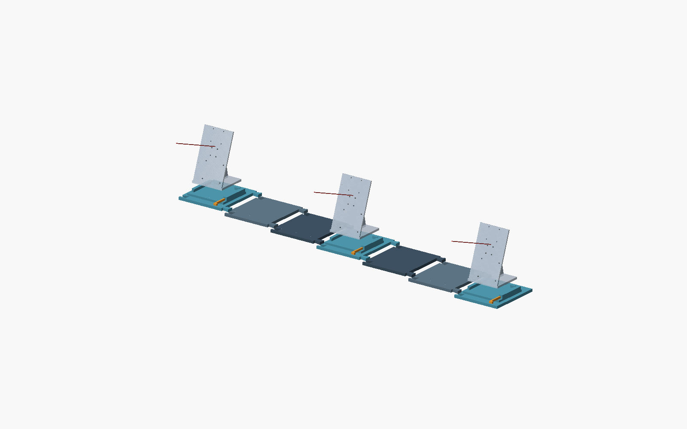
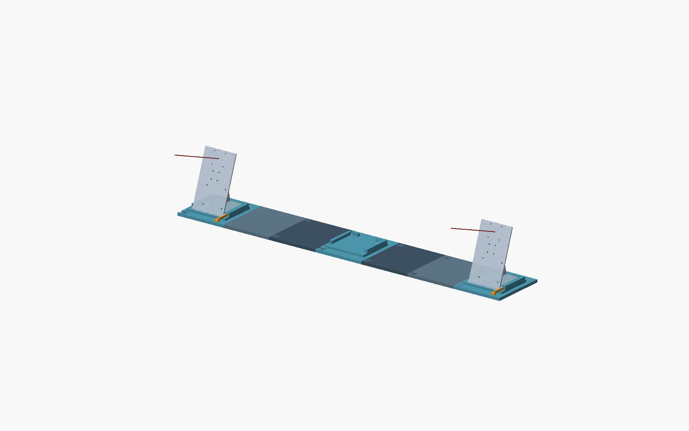
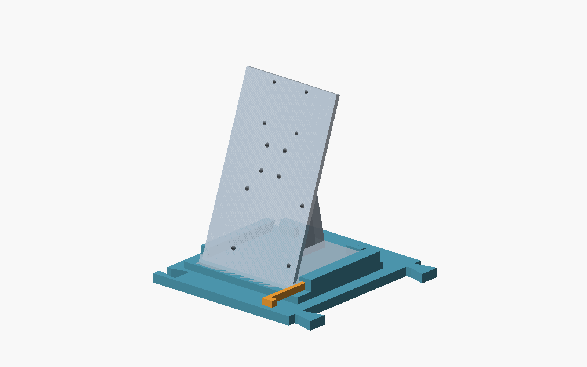

# Banc PAVOIS V0.2 — trois caméras au même niveau

Cette version remplace le banc à montant vertical : **les trois caméras sont
alignées à la même hauteur**, sur une base de 1 m. Les berceaux font partie de
la base. Les raccords s'emboîtent par le dessus, comme un puzzle ; aucune
clavette ni vis n'est nécessaire entre les tronçons.


**10 nouvelles pièces au total** : sept tronçons, dont trois avec berceau
intégré, et trois petites cales pour immobiliser les supports V2 existants.
Les cartes, Pi et IMU restent montés sur leurs supports. Pour deux caméras,
laisser le berceau central vide : aucune reconstruction de la base.

## Fichiers et paramètres

Ouvrir `modular_camera_rig.scad` dans OpenSCAD en conservant
`camera_mount_v2_pi25.scad` à côté. Les nouveaux STL et rendus sont dans
**`modular_rig_v02/`**. Les anciens fichiers V0.1 ne sont pas utilisés.

| Paramètre | Valeur livrée | Fonction |
|---|---:|---|
| `view` | `"assembly"` | Aussi `"exploded"`, `"part"`, `"cradle_detail"` |
| `camera_count` | 3 | 2 masque la caméra et la cale centrales ; le berceau demeure |
| `part` | `"camera_rail"` | Pièce seule à exporter avec `view="part"` |
| `rig_width` | 1000 mm | Largeur totale ; plage du prototype : 840–1050 mm |
| `fit` | 0,10 mm | Jeu par face des logements de raccord |
| `coupon_fit` | 0,10 mm | Jeu de l'éprouvette femelle |
| `show_mounts/axes/keys` | `true` | Affichage des références et des cales |

Les STL correspondent aux valeurs livrées. Régénérer les exports après chaque
modification. Le paramètre de surélévation et les pièces de montant ont été
supprimés.

## Pièces à imprimer

| STL | Quantité, 3 caméras | Usage |
|---|---:|---|
| `rail.stl` | 4 | Tronçon plat |
| `camera_rail.stl` | 2 | Berceaux gauche et central, intégrés au tronçon |
| `camera_rail_end.stl` | 1 | Berceau droit, sans raccord mâle sortant |
| `cradle_key.stl` | 3 | Une cale latérale par support V2 |
| `coupon_tongue.stl` | 1 pour les essais | Mâle commun aux trois éprouvettes |
| `coupon_socket_05/10/15.stl` | 1 de chaque pour les essais | Jeux 0,05 / 0,10 / 0,15 mm par face |

À deux caméras, seulement deux cales sont nécessaires : **9 pièces utilisées**
avec la même base à sept tronçons.

### Impression PLA sur A1 mini

Toutes les pièces s'impriment dans l'orientation des STL, fond posé sur le
plateau. Les plus grandes mesurent **162,86 × 160 × 24 mm**, dans la limite
prévue de 170 mm par axe.

- Point de départ : buse 0,4 mm, couches 0,20 mm, 5 parois, 5 couches pleines
  dessus/dessous, remplissage 20 % ; cales et éprouvettes à 100 %.
- Les rails plats et raccords puzzle n'ont pas de porte-à-faux suspendu.
  Les **lèvres des berceaux** peuvent demander des supports locaux ; inspecter
  le tranchage. Garder les surfaces d'appui propres.
- Vérifier que le brim tient aussi sur le plateau 180 mm. Utiliser le profil
  thermique correspondant à ton PLA.
- Imprimer d'abord les quatre éprouvettes. Choisir le logement qui s'emboîte
  verticalement à la main sans jeu latéral excessif et sans forcer.
- Répéter cinq fois. Ensuite seulement, imprimer un `camera_rail`, sa cale
  et un `rail` pour tester le vrai socle et les deux raccords espacés.

Le jeu et la tenue réelle dépendent de l'imprimante. Un raccord trop lâche
réduit la répétabilité ; un raccord trop serré peut déformer la base. La
calibration ne corrige pas une base qui bouge pendant la mesure.

## Montage simple



1. Poser le tronçon terminal avec berceau **à droite**, sur une table rigide
   et plane. Les supports caméra regarderont vers l'avant (−Y).
2. Ajouter les pièces en allant vers la gauche. Présenter les deux queues
   d'aronde au-dessus des logements du tronçon déjà posé, puis **descendre
   verticalement** jusqu'à ce que toute la pièce touche la table.
3. L'ordre final, de gauche à droite, est :
   **berceau — rail — rail — berceau — rail — rail — berceau terminal**.
   Les deux queues d'aronde de chaque raccord sont situées devant et derrière
   les berceaux : elles restent accessibles par le dessus.
4. Glisser chaque V2 depuis l'avant sous les lèvres de son berceau, jusqu'aux
   butées arrière. Insérer sa cale à droite, petite extrémité vers l'arrière,
   jusqu'au maintien du socle. Les vis existantes ne sont pas démontées.
5. Pour passer à deux caméras, retirer la cale et le V2 centraux ; le reste
   demeure en place.

Les queues d'aronde retiennent les pièces **dans le plan de la table**.
Elles ne les verrouillent pas verticalement : le démontage se fait en
soulevant un tronçon. Ne pas soulever ou transporter le banc chargé par une
extrémité. La table constitue la référence commune de hauteur.



## Positions nominales et vérifications

Base : **1000 × 160 mm**, environ 167 mm en profondeur avec les cales.
Prévoir de la place devant pour manipuler les supports et laisser du mou
aux câbles.

| Référence | Gauche | Centre | Droite |
|---|---:|---:|---:|
| X, centre nominal (mm) | −428,57 | 0 | +428,57 |
| Y, origine nominale V2 (mm) | 0 | 0 | 0 |
| Z, plan d'appui du V2 (mm) | 14 | 14 | 14 |
| Z, centre de carte nominal (mm) | **144** | **144** | **144** |

Le repère est local : X longe la base, Z monte depuis la table. Les supports
V2 conservent leur visée nominale à **20° vers le haut**, vers −Y. Être au même
niveau ne signifie pas que l'axe optique est horizontal.

Les centres de cartes indiqués sont des références du source V2, **pas les
centres optiques calibrés**. Les supports gris montrent le plastique existant ;
l'électronique et les câbles ne sont pas modélisés. Vérifier leur dégagement
sur la première pièce imprimée. Le source V2 est utilisé pour la référence,
car son ancien STL contient des petits fragments dégénérés.

Les rapports livrés contrôlent :

- **8 STL** : fermeture, orientation des faces, un seul solide, volume positif,
  dimensions inférieures à 170 mm et dessous sur le plateau ;
- les contacts du V2 et de sa cale, les raccords entre types de tronçons, et
  quelques positions d'insertion verticale dans `assembly_checks.json`.

Ces contrôles géométriques ne sont pas un essai mécanique. Après impression,
vérifier que la base reste plane avec les caméras équipées, que les raccords
restent serrés, puis comparer une cible fixe après cinq démontages/remontages.
Calibrer les caméras une fois le montage stable. La répétabilité reste à mesurer.



## Régénération

Avec Python 3, numpy, trimesh et OpenSCAD :

```powershell
python mounts/export_modular_rig.py
python mounts/check_modular_rig.py
```

L'exporteur accepte `--openscad`, `--width`, `--fit` et `--images-only`.
Le vérificateur d'assemblage décrit les dimensions nominales de la V0.2 ;
adapter ses positions avant de contrôler une autre largeur.

Aucune modification du logiciel de détection ni des supports V2 existants.
