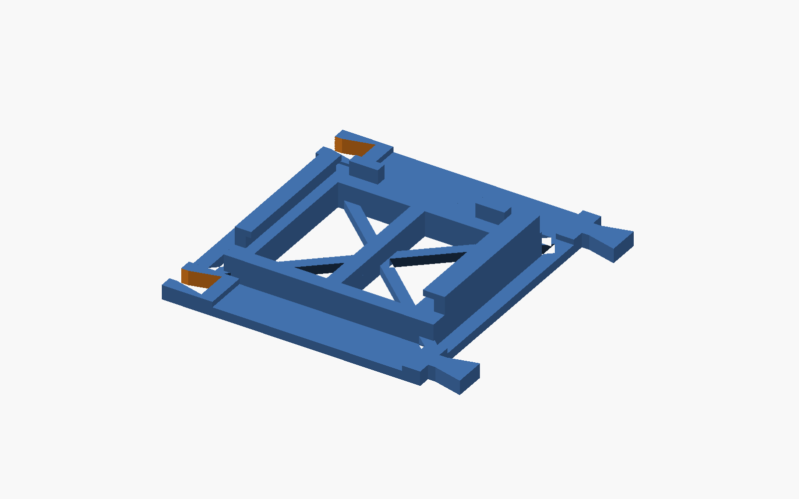
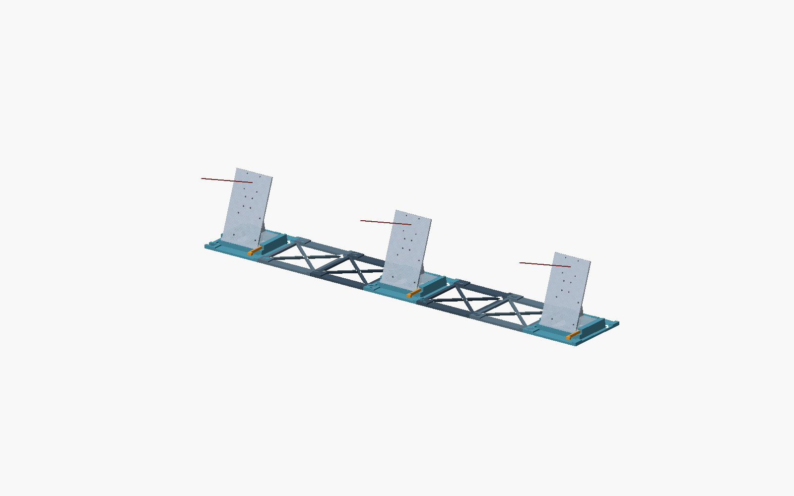

# PAVOIS V0.3 — version allégée, V0.2 conservée

La V3 remplace les grandes plaques par un **cadre avec diagonales** et des
appuis sous le socle. La V2, ses fichiers et son archive restent inchangés.



## Ce qui change

- Le fond plein de 8 mm devient un cadre de **5 mm** avec diagonales de **6 mm
  de large**. Les zones de raccord et les queues d'aronde gardent leurs 8 mm.
- Le fond du berceau est ouvert. Deux appuis latéraux, un appui central et
  deux traverses portent le socle, les butées et les lèvres.
- Les appuis montent depuis la table jusqu'au plan du socle : aucun grand
  fond n'est suspendu au-dessus des ouvertures.
- Les trois caméras restent au même niveau : **plan du socle à 14 mm**, centre
  de carte nominal à **144 mm**, inclinaison nominale V2 de **20°**.
- Largeur 1 m, dix nouvelles pièces à trois caméras, même montage par dessus.
  Les cales de socle et les éprouvettes sont identiques à celles de la V2.

## Gain mesuré sur le CAD

| Pièce | V2, volume solide | V3, volume solide | Réduction |
|---|---:|---:|---:|
| Camera rail | 271,46 cm³ | 142,56 cm³ | **47,5 %** |
| Camera rail terminal | 267,24 cm³ | 138,34 cm³ | **48,2 %** |
| Rail simple | 182,76 cm³ | 58,40 cm³ | **68,0 %** |

**Ces pourcentages ne sont pas des économies de filament tranché ni de temps.**
Le remplissage, les peaux, les parois, les supports et les trajets modifient
le résultat. Les ouvertures ajoutent des périmètres : le gain réel sera
différent. La durée de 3 h annoncée pour la V2 n'a pas été reproduite avec
tes réglages ; aucune durée V3 n'est certifiée ici.

Pour comparer correctement dans Bambu Studio, trancher les deux STL avec
**le même profil A1 mini, le même PLA, les mêmes parois, couches et remplissage**.
Comparer les grammes et la durée totale, supports compris. Ne pas réduire
simultanément le nombre de parois si l'objectif est de mesurer le gain du CAD.

## Fichiers et premier essai

- Nouveau source : **`modular_camera_rig_v03.scad`**.
- Nouveaux STL, vues et rapports : **`modular_rig_v03/`**.
- Source V2 inchangé : `modular_camera_rig.scad`.
- Pour le détail du montage et la calibration : [notice V2](README_MODULAR_RIG.md).

Ouvrir le source V3 dans OpenSCAD, avec `camera_mount_v2_pi25.scad` à côté.
Les vues `assembly`, `exploded`, `part` et `cradle_detail` sont conservées.
`camera_count=2` laisse le berceau central vide.

Nouveaux paramètres : `web_height=5` (plage 3–8 mm) et `web_width=6` (plage
4–10 mm). Le jeu `fit=0.10`, les dimensions d'interface et les paramètres de
largeur restent identiques. Les exports et rapports livrés utilisent les
valeurs par défaut ; modifier les paramètres impose de refaire les contrôles.

**Premier tirage conseillé : un `camera_rail.stl` V3**, avec ta cale V2.
Les raccords sont conçus pour s'accoupler aux rails V2. Tu peux donc essayer
une pièce V3 avec les autres pièces déjà imprimées en V2.

| STL V3 | Quantité pour trois caméras |
|---|---:|
| `rail.stl` | 4 |
| `camera_rail.stl` | 2 |
| `camera_rail_end.stl` | 1 |
| `cradle_key.stl` | 3, réutilisables depuis la V2 |

Conserver l'orientation des STL : nervures à plat sur le plateau. Les plus
grandes pièces restent dans **162,86 × 160 × 24 mm**. Les lèvres du berceau
gardent leurs petits surplombs ; vérifier leurs supports locaux dans le
trancheur. Inspecter aussi le premier calque, les surfaces d'appui et les
raccords après retrait du brim.

## Compromis et contrôles

La V3 enlève de la matière : sa rigidité n'est **pas démontrée équivalente à
celle de la V2**. Les diagonales relient le cadre, et les appuis transmettent
le poids à la table, mais cela ne constitue pas un calcul de résistance.
La base doit rester posée sur une table rigide ; ne pas la transporter chargée.

Les rapports vérifient les maillages, l'encombrement, les contacts du socle,
les raccords V3 et des assemblages mixtes **V2/V3 dans les deux sens**. Ils ne
remplacent pas l'essai d'ajustement, de flexion et de répétabilité.

Après impression : poser le vrai ensemble Pi/caméra/IMU, vérifier que tous
les appuis touchent la table et que le socle ne bascule pas. Comparer une
cible fixe après cinq montages, puis après une heure sous charge. Garder la
V2 comme référence. Calibrer les caméras lorsque le montage est stable.



## Régénération

Avec Python 3, numpy, trimesh et OpenSCAD installés :

```powershell
python mounts/export_modular_rig_v03.py
python mounts/check_modular_rig_v03.py
```

Le rapport `comparison_v2.json` compare les volumes avec la V2. Les contrôles
mixtes lisent le STL V2 de `modular_rig_v02/rail.stl`. Aucun outil V3 ne réécrit
les sources, STL ou rapports V2.
