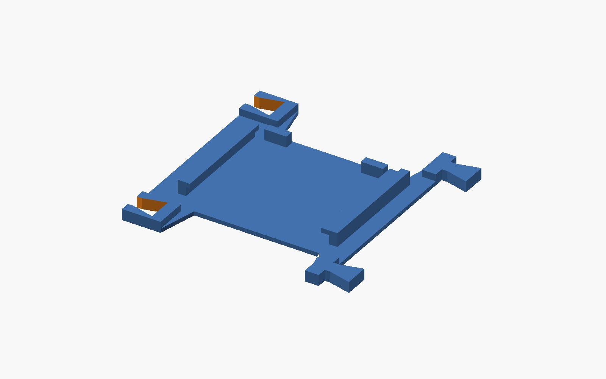
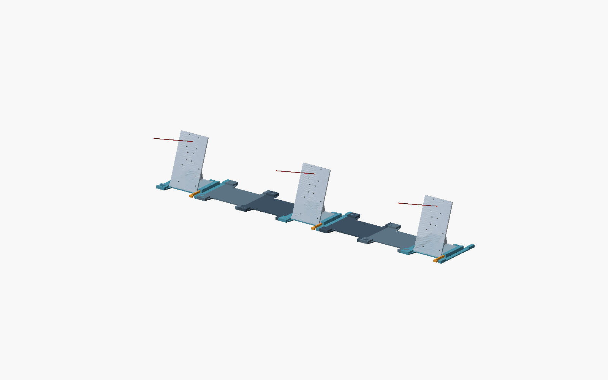

# PAVOIS V4 — optimisation du temps de tranchage estimé

Les versions V2 et V3 sont conservées. Cette version a été comparée dans
**Bambu Studio**, avec les mêmes paramètres pour les trois modèles. Le choix
porte sur la durée estimée et les mouvements générés, pas sur le volume CAD.



## Résultat du tranchage comparatif

Pièce : un `camera_rail`, posé sur son dessous. Bambu Studio **02.07.01.62**,
A1 mini buse 0,4 mm, Generic PLA, couche **0,20 mm**, **5 parois**, remplissage
**20 %**, supports normaux automatiques depuis le plateau, sans brim.

| Version | Temps total estimé | Couches | Commandes de mouvement XY | Filament estimé |
|---|---:|---:|---:|---:|
| V2 | 3 h 15 min 38 s | 120 | 58 838 | 130,20 g |
| V3 | 3 h 10 min 56 s | 120 | 113 359 | 107,68 g |
| **V4** | **1 h 52 min 45 s** | **65** | **50 949** | **63,61 g** |

Gain V4/V2 : **42,4 % de temps estimé**. La V4 supprime **55,1 %** des commandes
XY de la V3. Avec ce profil, la V3 double presque le temps consacré aux parois
(environ 84 min contre 41 min en V2) : ses ouvertures coûtent en contours et
en déplacements. Le résultat exact peut différer avec ton profil, notamment
le nombre de parois, le motif de remplissage et les supports.

Les commandes XY désignent les lignes G0/G1/G2/G3 contenant X ou Y, préparation
incluse ; ce n'est pas un comptage des pas moteurs. Les durées sont celles du
trancheur, **pas des impressions chronométrées**. Les preuves sont dans
`slicing_comparison.json`, les trois `*_slice_result.json` et les snapshots
`benchmark_machine/process/filament.json`.

## Conception retenue

- Base pleine **3 mm**, avec un seul contour extérieur et sans baies ni
  diagonales : davantage de trajets continus et moins de couches.
- Suppression du fond de berceau supplémentaire : le V2 repose directement
  sur la plaque. La pièce complète passe de **24 à 13 mm de haut**.
- Les bandes extérieures inutiles se resserrent autour du socle ; les zones
  de raccord restent à **8 mm**. Une première variante rectangulaire conservait
  plus de surface à imprimer et donnait environ 2 h 10 ; la forme retenue
  descend à 1 h 53 avec le même profil.
- Les lèvres, butées et la cale latérale conservent leur fonction. Les cales
  imprimées V2/V3 sont réutilisables, ainsi que les éprouvettes de raccord.

## Hauteur et compatibilité

**Les trois berceaux V4 sont au même niveau, mais 11 mm plus bas que V2/V3.**

| Référence nominale | V2/V3 | V4 |
|---|---:|---:|
| Plan d'appui du socle au-dessus de la table | 14 mm | **3 mm** |
| Centre de carte caméra | 144 mm | **133 mm** |
| Inclinaison nominale de visée | 20° | 20° |

Les positions X restent −428,57 / 0 / +428,57 mm pour une largeur totale de
1 m. Ce sont les références mécaniques du source, pas les centres optiques
calibrés.

Les raccords restent compatibles avec les rails V2/V3. Tu peux conserver des
rails simples anciens ; pour avoir les trois caméras à la même hauteur,
**utiliser trois berceaux V4**, ou prendre explicitement en compte les hauteurs
différentes lors d'un essai mixte. Ne pas réutiliser aveuglément une ancienne
calibration après changement des berceaux.

## Fichiers et impression

- Source : `modular_camera_rig_v04.scad`, avec `camera_mount_v2_pi25.scad` à côté.
- STL et vues : `modular_rig_v04/`.
- `camera_rail_sliced_A1mini.3mf` contient le tranchage de référence de la V4.
  L'ouvrir dans Bambu Studio pour inspecter les paramètres et les trajectoires ;
  ce n'est pas ton profil personnel automatiquement récupéré.
- `base_thickness=3` et `waisted_base=true` sont les valeurs comparées.
  Changer ces paramètres nécessite un nouveau tranchage et de nouveaux contrôles.
- Les vues `assembly`, `exploded`, `part`, `cradle_detail` et le choix
  `camera_count=2/3` sont conservés. À deux caméras, le berceau central reste vide.

| Pièce | Quantité pour trois caméras |
|---|---:|
| `rail.stl` | 4 |
| `camera_rail.stl` | 2 |
| `camera_rail_end.stl` | 1 |
| `cradle_key.stl` | 3 |

Toujours dix pièces. Dimensions maximales des nouveaux rails caméra :
**162,86 × 160 × 13 mm**. Conserver le dessous sur le plateau. Vérifier les
petites lèvres et leurs surplombs dans le trancheur. La comparaison active
les supports automatiques ; leur présence réelle dépend de l'analyse du
trancheur.

Montage de droite à gauche par descente verticale des queues d'aronde.
Ordre final : **berceau — rail — rail — berceau — rail — rail — berceau terminal**.
Introduire le support V2 depuis l'avant jusqu'aux butées arrière, puis sa cale
à droite. Les raccords ne verrouillent pas verticalement l'ensemble.

## Validation mécanique restante

La base de 3 mm repose sur une **table rigide et plane**. Elle peut être plus
souple hors de la table que la V2 : ne pas transporter le banc chargé par une
extrémité. Un gain d'impression ne démontre pas une rigidité équivalente.

Les contrôles livrés vérifient huit STL fermés, leur encombrement, les contacts
du socle, les emboîtements, quelques positions d'insertion et les interfaces
mixtes V2/V4 dans les deux sens. Ils ne remplacent pas un essai physique.

Commencer par un berceau, vérifier l'appui du vrai ensemble caméra/Pi/IMU,
l'absence de bascule et de jeu, puis répéter cinq démontages/remontages devant
une cible fixe. Vérifier aussi le maintien après une heure sous charge.



## Reproduire les calculs

Python 3, numpy, trimesh et OpenSCAD pour le CAD ; installation locale de Bambu
Studio pour le tranchage. Aucun script ne lance une impression.

```powershell
python mounts/export_modular_rig_v04.py
python mounts/check_modular_rig_v04.py
python mounts/benchmark_rig.py v2=mounts/modular_rig_v02/camera_rail.stl v3=mounts/modular_rig_v03/camera_rail.stl v4_final=mounts/modular_rig_v04/camera_rail.stl
python mounts/summarize_rig_benchmark.py
```

Le benchmark accepte `--walls`, `--infill` et `--output`. Le résumé livré est
défini pour le protocole ci-dessus (5 parois/20 %) ; adapter sa description si
le protocole change. Les profils hérités sont résolus en JSON complets avant
le tranchage, suivant l'interface CLI de
[Bambu Studio](https://github.com/bambulab/BambuStudio/wiki/Command-Line-Usage).

Les sources et archives V2/V3 n'ont pas été remplacées. Les résultats de V4
sont placés dans un dossier distinct.
