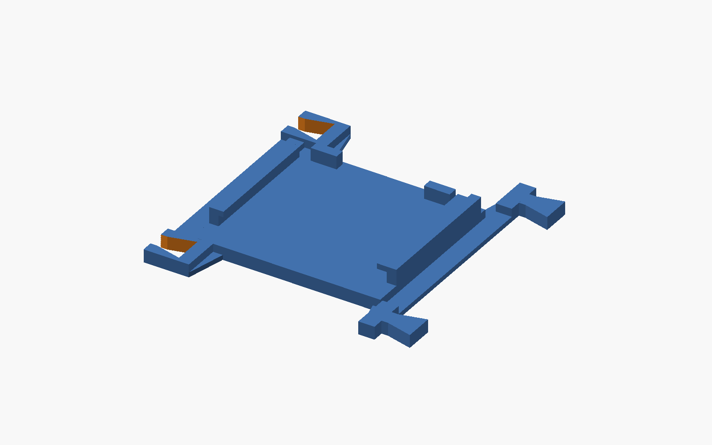
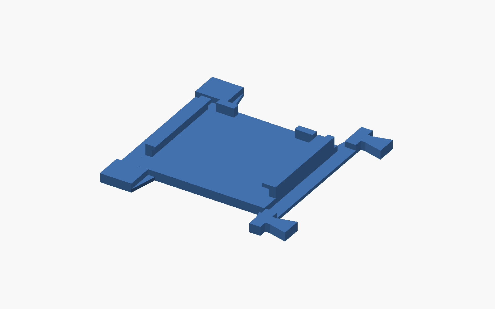
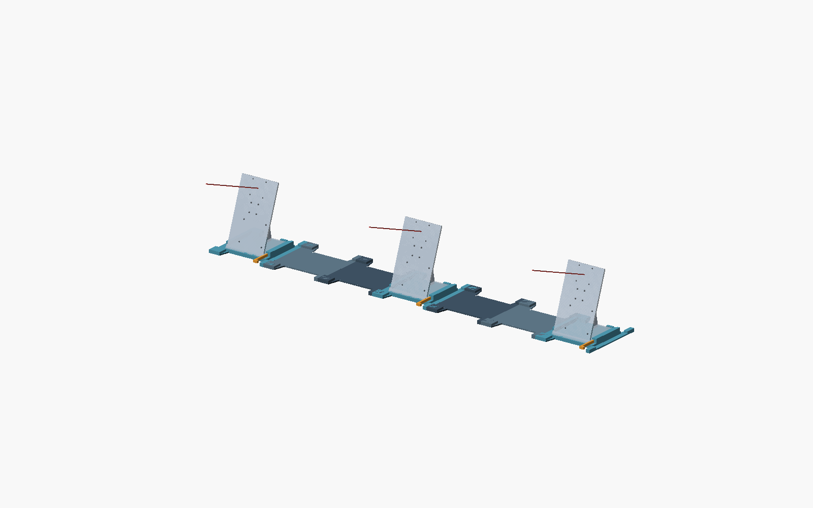

# PAVOIS V5 — appui relevé, supports automatiques

L’appui caméra reste à **8 mm**, au niveau des jonctions ; les glissières
et les butées conservent la correction de hauteur. Les trois caméras sont
au même niveau. Les anciennes versions sont conservées.

Les **supports manuels ont été retirés du source et des STL**. Un STL stocke
la géométrie, pas les options d’impression. Les projets **3MF** fournis
activent les supports **normaux automatiques**, avec « uniquement sur le
plateau » désactivé pour soutenir les lèvres depuis l’appui surélevé.
Si tu importes le STL seul, active ces options dans Bambu Studio.



## Pièces et fichiers

| Fichier dans modular_rig_v05 | Quantité pour trois caméras |
|---|---:|
| camera_end_left.stl — bord gauche fermé, mâle à droite | 1 |
| camera_rail.stl — centre, femelle à gauche et mâle à droite | 1 |
| camera_end_right.stl — femelle à gauche, bord droit fermé | 1 |
| rail.stl | 4 |
| cradle_key.stl | 3 |

L’ancien camera_rail_end.stl reste disponible comme copie de camera_end_right.stl :
ne pas l’imprimer en plus. Les extrémités gauche/droite désignent le repère
de la vue assemblée ; les trois caméras visent toujours dans le même sens.



Les rails simples et cales V4 sont réutilisables. Les fichiers *_clean.stl
sont désormais identiques aux STL caméra et restent disponibles pour les
scripts de contrôle. Pour deux caméras, laisser le berceau central vide
et utiliser deux cales.

Le dessous plat reste sur le plateau. Encombrement maximal :
**162,86 × 160 × 18 mm** (terminal : 142,86 × 160 × 18 mm).
Les douze STL exportés, copies de compatibilité comprises, sont fermés et
tiennent dans 170 × 170 × 170 mm.

## Projets Bambu Studio

Ouvrir camera_end_left_0p08mm.3mf, camera_rail_0p08mm.3mf ou
camera_end_right_0p08mm.3mf **comme projet**
pour récupérer les réglages. Ils reprennent le profil du fichier utilisateur
mounts/camera_rail_end.3mf, qui n’a pas été modifié, avec les supports
automatiques activés : A1 mini, buse 0,4 mm, Generic PLA, couche 0,08 mm,
première couche 0,20 mm, deux parois, remplissage 15 %.

| Pièce | Durée estimée | Filament estimé |
|---|---:|---:|
| Extrémité gauche | 2 h 54 min 29 s | 70,11 g |
| Berceau central | 2 h 57 min 24 s | 69,01 g |
| Extrémité droite | 2 h 50 min 39 s | 67,53 g |

Les durées viennent du trancheur, pas d’impressions chronométrées.
Elles ne sont pas directement comparables au benchmark V4 à 0,20 mm
et cinq parois. Vérifier l’aperçu après toute modification des réglages.

## Montage

1. Imprimer d’abord un berceau et le laisser refroidir.
2. Retirer les supports automatiques sous les lèvres et nettoyer les résidus
   sans forcer sur les glissières. L’appui doit rester plan.
3. Poser le banc sur une table rigide et plane. Emboîter verticalement les
   modules, de droite à gauche. Ordre final de gauche à droite : end_left —
   rail — rail — camera_rail — rail — rail — end_right.
4. Glisser le socle V2 depuis l’avant (−Y) jusqu’aux butées, puis insérer la
   cale à droite. Caméra, Pi et IMU restent sur leur support existant.
5. Vérifier le coulissement, les câbles, l’absence de bascule avec
   l’électronique et la répétabilité sur cinq démontages/remontages.

Utiliser trois berceaux V5 pour garder les trois caméras au même niveau :
les berceaux V4 restent 5 mm plus bas. Les raccords ne verrouillent pas
verticalement l’ensemble ; garder le banc posé sur la table.

## Références et contrôles

Pour une largeur de 1 m : X = −428,57 / 0 / +428,57 mm, Y = 0,
dessous des socles Z = 8 mm ; centre de carte Z = 138 mm et visée
théorique 20° vers le haut, direction −Y. Les références optiques
réelles seront déterminées par calibration.



verification.json vérifie les maillages et leur encombrement.
insertion_checks.json contrôle le mouvement continu du bas du support V2
sur 160 mm et reproduit le blocage V4. Le nouveau bord fermé gauche
est inclus dans ce contrôle.
support_toolpath_checks.json vérifie les réglages automatiques enregistrés
et les extrusions de support et d’interface dans les G-code fournis.
Les ajustements imprimés, le détachement et les câbles restent à tester.

Source : modular_camera_rig_v05.scad, avec camera_mount_v2_pi25.scad à côté.
Vues assembly, exploded, part, cradle_detail ; camera_count=2/3.
Largeur, jeu de raccord et épaisseur de base restent paramétrables.
Les contrôles livrés concernent les paramètres par défaut.

Depuis la racine du dépôt, avec Python, numpy, trimesh et OpenSCAD :

```powershell
python mounts/export_modular_rig_v05.py
python mounts/check_modular_rig_v05.py
```

Pour retrancher : Bambu Studio installé, benchmark_rig.py à côté du script
et projet utilisateur mounts/camera_rail_end.3mf présent (non dupliqué
dans l’archive).

```powershell
python mounts/slice_rig_v05.py
python mounts/check_support_paths_v05.py
```

Aucun script ne lance d’impression. Aucun logiciel de détection n’a été modifié.
