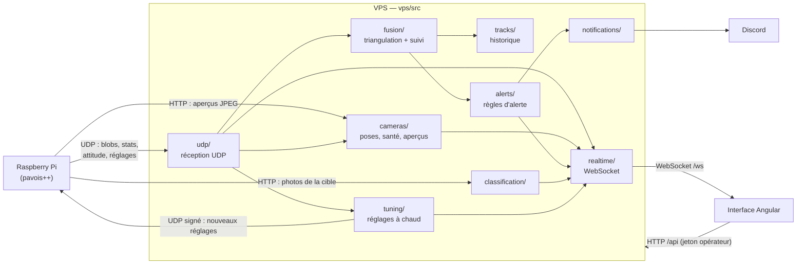

# PAVOIS — serveur VPS (NestJS)

Le VPS reçoit ce que voient les trois Raspberry Pi (jean, tanel, walid), en déduit la position 3D des cibles, les suit dans le temps, lève les alertes et pousse tout en direct vers l'interface Angular.

## Vue d'ensemble



## Organisation du code

Un dossier par fonctionnalité. Chaque dossier garde ensemble son contrôleur (routes HTTP), son service (logique), ses types et ses tests (`*.spec.ts` à côté du fichier testé).

| Dossier | Rôle | Fichiers principaux |
|---|---|---|
| `main.ts`, `app.module.ts` | Démarrage : variables d'environnement, sécurité HTTP (helmet), WebSocket, déclaration de tous les contrôleurs et services | |
| `auth/` | Jeton opérateur : vérification et garde des routes | `access-control.ts`, `auth.controller.ts` |
| `common/` | Code partagé par toutes les fonctionnalités | `http-body.ts` (format et taille maximale des corps de requête : JSON, JPEG brut) |
| `udp/` | Serveur UDP : lit chaque ligne envoyée par un Pi, l'aiguille vers le bon service, renvoie les réglages aux Pi | `udp.service.ts`, `udp-route.ts`, un analyseur par type de ligne (`udp-raw`, `udp-stats`, `udp-attitude`, `udp-config`) |
| `cameras/` | Position et cap de chaque caméra, état de santé calculé depuis ses statistiques, aperçus JPEG | `cameras.service.ts`, `camera-health.service.ts`, `preview.service.ts` |
| `fusion/` | Cœur du calcul : alignement dans le temps des blobs, triangulation, filtre de Kalman, classement par le mouvement | `fusion.service.ts`, puis un dossier par rôle : `alignment/`, `geometry/`, `triangulation/`, `tracking/`, `simulation/` |
| `tracks/` | Historique des positions de chaque piste, enregistré en JSONL, et verdict de l'opérateur sur une piste | `tracks.service.ts`, `jsonl-track.store.ts` |
| `alerts/` | Règles d'alerte (objet détecté, drone confirmé, caméra aveugle…), acquittement, purge des anciennes alertes | `alerts.service.ts`, `jsonl-alert.store.ts`, `alerts-clean-up.service.ts` |
| `notifications/` | Envoi des alertes sur Discord, avec file d'attente, limite de débit et nouvelles tentatives | `discord-notification.channel.ts`, `discord-formatter.ts` |
| `classification/` | Photos de la cible prises par chaque Pi, puis classifieur OpenCV (`classifier/classify_target.py`) | `classification.service.ts` |
| `tuning/` | Réglages du détecteur et de la fusion modifiables depuis le panneau, préréglages | `tuning.params.ts` (la table des réglages), `tuning.service.ts` |
| `realtime/` | Passerelle WebSocket : authentifie l'écran puis lui diffuse chaque événement | `events.gateway.ts` |
| `bench/` | Outils de test : banc sur rail, simulateur de détections (`SIMULATION_MODE`, jamais en production) | `rail-bench.ts`, `simulation.service.ts` |

Le stockage passe par une interface (`alert-store.interface.ts`, `track-store.interface.ts`) : les services ne savent pas que les données sont en JSONL, on peut changer de stockage sans les toucher.

## Le trajet d'une détection

1. Chaque Pi envoie en UDP une ligne `raw` par blob détecté. `udp/udp-route.ts` reconnaît la ligne, `udp/udp-raw.ts` la lit.
2. `udp/udp.service.ts` la passe à `fusion/fusion.service.ts` avec la pose de la caméra (`cameras/cameras.service.ts`).
3. La fusion ramène les blobs de toutes les caméras au même instant (`alignment/fusion-align.ts`), croise leurs rayons pour obtenir un point 3D (`triangulation/fusion-triangulate.ts`) et le donne au suivi multi-cibles (`tracking/fusion-tracker.ts`, filtre de Kalman dans `tracking/fusion-kalman.ts`). `tracking/fusion-classify.ts` juge si la trajectoire ressemble à un drone.
4. Chaque mise à jour de piste est diffusée à l'interface (`realtime/events.gateway.ts`), enregistrée (`tracks/tracks.service.ts`) et passée aux règles d'alerte (`alerts/alerts.service.ts`), qui préviennent Discord (`notifications/`).
5. Quand une cible passe à portée et que les trois caméras sont en ligne, `classification/` demande une photo à chaque Pi et lance le classifieur une fois toutes les photos reçues.

## Routes HTTP

Derrière nginx, l'interface les appelle sous `/api/…` (nginx retire le préfixe). Les routes de l'interface exigent le jeton opérateur.

| Route | Rôle |
|---|---|
| `GET /auth/verify` | Vérifie le jeton opérateur |
| `GET /cameras`, `PUT /cameras/:id/position` | Liste des caméras, position d'une caméra |
| `POST /attitude` | Cap d'une caméra |
| `POST /preview` | Aperçu JPEG envoyé par un Pi |
| `GET /fusion` | État courant de la fusion |
| `GET /tracks`, `PATCH /tracks/:id` | Historique des pistes, verdict sur une piste |
| `GET /alerts`, `POST /alerts/:id/acknowledge` | Alertes, acquittement |
| `POST /classification/capture` | Photo d'une cible envoyée par un Pi |
| `GET /tuning`, `PUT`/`DELETE /tuning/detector`, `PUT`/`DELETE /tuning/fusion` | Réglages à chaud |
| `POST /tuning/presets`, `DELETE /tuning/presets/:id`, `POST /tuning/presets/:id/apply` | Préréglages |
| `GET`/`POST`/`DELETE /bench/rail` | Banc sur rail |

L'interface ouvre le WebSocket sur `/ws`, que nginx transmet au serveur.

## Données

Dans `data/` (ou `ALERTS_DATA_DIR`) : `alerts.jsonl`, `camera-states.jsonl`, `tracks.jsonl`, plus `cameras.json` (`CAMERAS_FILE`) et `tuning.json` (`TUNING_FILE`). Les variables d'environnement sont décrites dans `.env.example`.

## Commandes

```bash
npm install
npm run start:dev    # développement, rechargement automatique
npm test             # tests unitaires
npm run test:e2e     # démarre toute l'application et teste les routes
npm run build        # compile dans dist/ (lancé par node dist/main.js)
```

Le déploiement (Docker, staging sur le VPS) est décrit dans [`../DEPLOYMENT.md`](../DEPLOYMENT.md).
